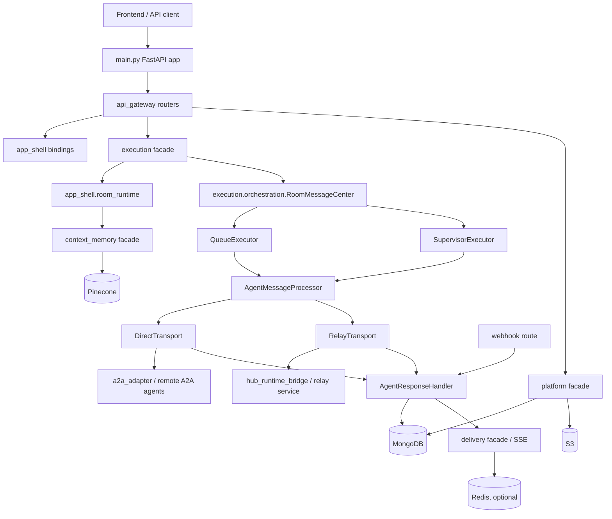

# System Architecture

This document describes the current architecture and core workflows of the
`multi-agents-backend` codebase. It is based on the repository state as of
2026-05-31 and focuses on the code that is currently present, not on older
design documents that may have existed previously.

## High-Level Shape

The backend is a FastAPI monolith that coordinates:

- A web app API for rooms, agents, messages, HITL, files, and SSE.
- A public/API-key gateway for agent discovery and direct agent calls.
- A Hub relay path for locally connected hub agents.
- A2A agent communication, including synchronous, streaming, and webhook-based
  long-running task updates.
- Context memory projection, search, and compaction.
- Cross-instance SSE delivery, cancellation, and background recovery jobs.

The application entry point is `main.py`. Dependency construction is centralized
in `container.py`, while request routers live under `api_gateway/routes`.

At runtime the system follows this broad layering:



## Runtime Entry Point

`main.py` creates the FastAPI app and owns process startup/shutdown through the
lifespan context manager.

Startup has three practical phases:

1. Infrastructure setup:
   - Load settings and auth configuration.
   - Connect MongoDB through `database.mongodb.mongodb`.
   - Connect Pinecone through `database.pinecone_db.pinecone_db`.
   - Build DAL/facade objects from `container.py`.
   - Bind route modules and app-shell runtime adapters.

2. Runtime guard and background services:
   - Start Delivery/SSE runtime.
   - Start app-shell Redis runtime services when `REDIS_URL` is configured.
   - Enforce multi-worker safety with `check_multi_worker_safety`.
   - Start background jobs after the guard passes.

3. Serving and normal shutdown:
   - Verify all required bindings in `_assert_startup_bindings_complete`.
   - Serve `/health` and `/api/v1/*`.
   - On shutdown, stop relay, jobs, leader locks, in-flight execution tasks,
     Delivery/SSE connections, Redis, and MongoDB.

The application router is mounted from `api_gateway.router` under the configured
API prefix, defaulting to `/api/v1`.

## Dependency Assembly

`container.py` is the main composition root. It creates strongly typed dependency
groups around protocol interfaces from `common.protocols`:

- `AgentDeps`
- `RoomDeps`
- `ContextMemoryDeps`
- `DeliveryDeps`
- `ExecutionDeps`
- `HubDeps`

The codebase is built around facade/protocol boundaries. Some current entry
points still pass through app-shell adapters, but the preferred direction is:

```text
route -> protocol/facade -> repository/DAL -> external service
```

The current compatibility shape is:

```text
route -> app-shell route owner -> facade -> repository/DAL
```

Examples:

- `app_shell.room_runtime.AppShellRoomCenter` delegates to `app_shell.room_runtime`, which is bound to
  `room.RoomFacade`.
- `app_shell.agent_runtime.AppShellAgentCenter` delegates to `app_shell.agent_service`, which is bound to
  `agent.AgentFacade`.
- `app_shell.relay_service` exposes relay route behavior while delegating
  runtime behavior into `hub_runtime_bridge.HubFacade`.

## Major Code Areas

### `api_gateway`

`api_gateway/router.py` registers all API route modules; the route modules are
thin FastAPI wrappers that parse requests, run auth checks, and delegate to
bound dependencies.

Important route groups:

- `room_routes.py`: room CRUD, room messages, active runs, `sendMessage`.
- `agent_routes.py`: agent registration, lookup, update, visibility, avatar.
- `agent_group_routes.py`: saved agent groups.
- `sse_routes.py`: room SSE stream, SSE status, message cancellation.
- `hitl_routes.py`: human-in-the-loop request and response APIs.
- `files_routes.py`: file upload for room message attachments.
- `discovery_routes.py`: API-key agent discovery.
- `platform_gateway_routes.py`: API-key gateway send/stream/card endpoints.
- `relay_routes.py`: hub daemon registration, event stream, publish, sync, status.
- `webhook_routes.py`: A2A task webhook callbacks.
- `a2a_task_routes.py`: long-running A2A task inspection.

Most frontend-facing routes use Clerk auth. Discovery, gateway, and relay routes
use API-key auth from `common.api_key_auth`.

### `common`

`common` holds cross-cutting primitives:

- `common.dto`: immutable data transfer objects used across module boundaries.
- `common.protocols`: structural interfaces for facades, repositories, delivery,
  execution, hub, platform, LLM, and DAL dependencies.
- `common.config.settings`: environment-backed settings.
- `common.errors`: typed domain/platform errors.
- `common.utils`: logging, time, A2A helpers, context utilities, and streaming
  helpers.
- `common.observability`: tracing and metrics helpers.

When adding new boundaries, prefer using `common.protocols` instead of importing
concrete runtime singletons.

### `agent`

`agent.AgentFacade` owns canonical agent registry behavior:

- Resolve and register A2A agent cards.
- Store agent metadata in MongoDB.
- Index agent descriptions in Pinecone.
- Match agents by semantic search and capability scoring.
- Respect visibility rules for public/private agents.
- Merge hub liveness into agent status when hub agents are involved.

Mongo persistence is implemented by `agent.repository.mongo.AgentMongoRepository`.
Route-facing app-shell owners access this through `app_shell.agent_service` and
`app_shell.agent_runtime.AppShellAgentCenter`.

### `room`

`room.RoomFacade` owns canonical room and message persistence behavior:

- Create/update/delete rooms.
- Resolve room membership from explicit agent IDs, saved groups, or all-agent
  seeds.
- Persist user and agent messages.
- Read room history and message threads.
- Verify room ownership and hub publish lineage.

Mongo persistence is implemented by `room.repository.mongo`.

### `execution`

`execution` owns orchestration after a user message has been accepted.

Key components:

- `ExecutionFacade`: external execution API used by routes. It accepts a
  `common.dto.ExecutionRequest`, delegates message creation to RoomCenter, and
  starts orchestration.
- `RoomMessageCenter`: orchestrates a single room user message. It handles
  idempotent claims, per-room locks, cancellation tokens, routing between
  queue and supervisor modes, and terminal processing status.
- `QueueExecutor`: sequentially processes pre-created agent messages for
  non-supervisor flows and explicit non-supervisor mention flows.
- `SupervisorExecutor`: adaptive supervisor loop for rooms with
  `extend_info.use_supervisor`.
- `AgentMessageProcessor`: transport router shared by queue and supervisor
  execution. It builds the A2A message, runs dispatch middleware, selects
  `direct` or `relay`, and returns a `ProcessingResult`.
- `DirectTransport`: sends work directly to remote A2A agents.
- `RelayTransport`: sends work through the hub relay path.
- `WebhookTransport`: handles inbound A2A webhook callbacks for long-running
  tasks.
- `AgentResponseHandler`: single place that normalizes agent events, persists
  task/artifact state, handles HITL states, and emits SSE/task updates.
- `TaskStateManager`: owns task state transitions and persistence for agent
  messages.

The main orchestration invariant is that `RoomMessageCenter` serializes
processing per room. It uses a process-local `asyncio.Lock`, and in multi-worker
mode this is supplemented by a Redis distributed lock configured at startup.

### `context_memory`

`context_memory.ContextMemoryFacade` owns room memory projection, assembly,
search, and compaction:

- `project_message_for_event`: updates room memory from persisted message
  history.
- `assemble_context`: builds supervisor or agent context within token budgets.
- `search_memory`: performs memory search using vector and keyword signals.
- `run_compaction`: compacts older turns using pointer-based full-content
  storage.
- `content_repository`: stores full content references for compacted turns.

The facade uses:

- MongoDB for room memory and stored content documents.
- Pinecone for memory search vectors.
- `LLMGatewayImpl` for summary/turn-note generation.
- `RoomHistoryReader` from `room.RoomFacade` for source message history.

App-shell adapters such as `app_shell.context_assembly_service`,
`app_shell.memory_search_service`, `app_shell.compaction_service`, and
`app_shell.memory_service` are bound to this facade in `main.py`.

### `delivery`

`delivery.DeliveryFacade` owns SSE delivery and cross-instance event fan-out.
Backend modules emit typed `common.dto.DeliveryEvent` objects; Delivery is the
only layer that translates those DTOs into frontend room SSE frames. The wire
shape is always:

```json
{"type": "event_name", "timestamp": "ISO-8601", "room_id": "room-id", "data": {}}
```

`ProcessingStatusEvent` supports the final status set (`queued`, `processing`,
`awaiting_input`, `completed`, `failed`, `canceled`, `rejected`,
`rate_limited`, `error`) and carries `details` as `dict | null`.

It is composed from:

- `SSETransportImpl`: local room connection management.
- `EventPublisherImpl`: emits frames/events and handles deduplication.
- `CrossInstanceEventBus`: Redis Pub/Sub based fan-out when Redis is enabled.
- `CancellationWatcher`: tracks cancellation state through Mongo change streams
  and Redis KV when available.
- `TerminalStatusDeduplicator`: prevents duplicate terminal status frames.

`app_shell.delivery_runtime.sse_manager` is the route-facing delivery manager
bound to the Delivery facade during startup. Routes call the manager, while the
runtime implementation lives in `delivery`. Delivery never calls back into
Execution or app-shell business services; lifecycle recording happens before
typed delivery events are emitted.

### `platform_module`

`platform_module.PlatformFacade` groups public platform-facing capabilities:

- `PlatformGateway`: API-key agent discovery, card masking, synchronous calls,
  and streaming calls.
- `PlatformDiscovery`: discovery service abstraction.
- `PlatformFileStorage`: file uploads and presigned URLs.
- `PlatformContentStorage`: binary/full-content storage used by context memory.
- Gateway/discovery/agent rate limiters backed by Mongo collections.

This module is used by:

- `/gateway/*` routes for external agent messaging.
- `/discovery/*` routes for external agent search.
- `/files/upload` for authenticated room file uploads.
- Context memory compaction content storage.

### `hub_runtime_bridge` and Relay

`hub_runtime_bridge.HubFacade` is the current runtime owner for hub-connected
local agents. `app_shell.relay_service.RelayService` is the app-shell surface
that constructs and delegates to the hub facade.

Hub relay responsibilities:

- Register hub daemons.
- Maintain hub liveness and heartbeat state.
- Provide an SSE event stream to hub daemons.
- Sync hub-owned agents into the agent registry.
- Dispatch user messages/cancel/reply commands to hub agents.
- Accept published hub agent responses.
- Journal internal responses and replay them if needed.
- Maintain task ownership leases for multi-worker safety.

When Redis Streams are available, relay events use streams for durable-ish hub
event delivery. Without streams, the facade falls back to in-memory/offline
queues for single-process/degraded operation.

### `a2a_adapter`

`a2a_adapter` isolates A2A protocol details:

- Resolve and validate AgentCards.
- Build outbound A2A messages and task requests.
- Translate internal messages/results to A2A-shaped payloads.
- Normalize task status and artifacts.
- Parse webhook stream response payloads.
- Convert inline binary artifacts to S3-backed references through bound storage.

Execution transports call this layer rather than building A2A payloads inline.

### `dal` and `database`

`dal` contains newer protocol-oriented adapters:

- `dal.mongo`: generic Mongo collection/DAL adapter.
- `dal.pinecone`: vector adapter.
- `dal.redis`: Redis KV, Pub/Sub, and related support.
- `dal.s3`: object storage adapter.

`database.mongodb.MongoDB` is the concrete Mongo service and still owns many
collection helpers, indexes, and compatibility methods used by app-shell
runtimes.

Important Mongo collections include:

- `agents`
- `rooms`
- `room_user_messages`
- `room_agent_messages`
- `room_quotes`
- `room_memories`
- `conversation_content`
- `user_memories`
- `agent_memories`
- `file_uploads`
- `api_keys`
- `hubs`
- `runs`
- `run_events`
- `cancelled_messages`
- `agent_requests`
- `discovery_api_requests`
- `gateway_api_requests`
- `agent_capability_issues`

Pinecone is used for agent matching and context memory search. S3 is used for
file uploads and converted binary artifacts.

### `app_shell`

`app_shell` contains route-facing runtime adapters and process-level service
facades. Some app-shell modules still contain business logic directly, while
others are thin adapters over canonical facades.

Examples:

- `app_shell.room_runtime`: room send-message preparation, target resolution,
  attachment resolution, supervisor preparation, and message parsing.
- `app_shell.agent_service`: route-facing adapter over `AgentFacade`.
- `app_shell.database_service`: app-shell database facade over
  `database.mongodb` and Pinecone.
- `app_shell.relay_service`: relay route surface over
  `hub_runtime_bridge`.
- `execution.dispatch.task_notifications`: terminal task update notifications.
- `app_shell.hitl_service`: HITL lifecycle and response handling.

### `jobs` and App-Shell Infrastructure

Background jobs start only after infrastructure and multi-worker safety checks
pass:

- `stale_task_checker`: recovers stale tasks, orphaned messages, stale HITL,
  and run watchdog events.
- `compaction_sweep`: runs context memory compaction for eligible rooms.
- `orphaned_upload_cleaner`: removes uploaded files that were never attached.
- `app_shell.agent_health_service`: periodic health/liveness support for agents.

App-shell Redis runtime modules contain Redis services, leader election, room
locks, relay streams, and event broker support. Leader election prevents
duplicate job execution in multi-worker deployments.

## Core Workflow: Frontend Room Message

The primary product workflow begins at `POST /api/v1/roomCenter/sendMessage`.

1. The frontend opens `/api/v1/sse/room/{room_id}/stream` to receive live
   room events.

2. The frontend posts a room message to `/roomCenter/sendMessage` with:
   - `room_id`
   - `message`
   - `client_request_id`
   - optional attachments or inline file IDs
   - optional target scope or mentioned agent IDs

3. `api_gateway.routes.room_routes.send_message`:
   - verifies room ownership,
   - extracts attachment references,
   - creates an `ExecutionRequest`,
   - calls `ExecutionFacade.execute`,
   - schedules `ExecutionFacade.start_orchestration` as a FastAPI background
     task if orchestration should start.

4. `ExecutionFacade.execute` delegates to `AppShellRoomCenter.send_message_to_room`,
   which reaches `app_shell.room_runtime.RoomServices.send_message_to_room`.

5. `RoomServices.send_message_to_room`:
   - validates the request and message size,
   - blocks new messages if HITL input is pending,
   - resolves and validates attachments,
   - loads the room and target scope,
   - persists the user message,
   - emits initial `processing` status,
   - creates a cancellation token,
   - initializes context memory if needed,
   - chooses a dispatch strategy:
     - explicit mentions,
     - room default/saved group,
     - all-agent matching,
     - supervisor if `room.extend_info.use_supervisor` is true,
   - either creates initial agent messages or marks the user message with
     supervisor preparation data.

6. `ExecutionFacade.start_orchestration` builds an `OrchestrationRequest` and
   calls `RoomMessageCenter.process_room_user_message`.

7. `RoomMessageCenter`:
   - claims the user message to prevent duplicate processing,
   - acquires a per-room lock,
   - refreshes the processing claim,
   - loads quoted context when present,
   - creates or reuses a cancellation token,
   - chooses one of two execution paths:
     - Supervisor path for `extend_info.supervisor`.
     - Queue path for pre-created agent messages.

8. Queue path:
   - Fetch agent messages related to the user message.
   - Process them sequentially through `QueueExecutor`.
   - Each item uses `AgentDispatcher` for agent assignment and
     `AgentMessageProcessor` for transport selection and dispatch.
   - On success, emit unified summary and terminal `completed` status.

9. Supervisor path:
   - Build agent registry and room config.
   - Assemble room/conversation context.
   - Run the adaptive `SupervisorExecutor` loop.
   - The supervisor decides when to delegate, ask for clarification, continue,
     synthesize, or finish.
   - Agent messages are created dynamically instead of being pre-generated.
   - Terminal status is emitted after synthesis or final failure/cancellation.

10. Agent responses flow into `AgentResponseHandler`, which:
    - persists artifact updates,
    - updates task state on `room_agent_messages`,
    - handles final responses, errors, cancellations, and HITL states,
    - emits SSE updates through `sse_manager`/Delivery,
    - delegates terminal task notifications through
      `execution.dispatch.task_notifications`.

## Agent Dispatch Workflow

Both queue and supervisor execution use `AgentMessageProcessor`.

1. Load current room memory from the database.
2. Ask `RoomServices.process_agent_message` to build the outbound A2A message.
3. Build a `DispatchContext`.
4. Run pre-dispatch middleware:
   - cloud health checks for direct cloud agents,
   - hub transport selection for hub-backed agents.
5. Select transport:
   - `direct`: call remote A2A agent directly.
   - `relay`: send a command to a connected hub agent.
6. Dispatch the message.
7. Run post-dispatch middleware.
8. Return `ProcessingResult` to the executor.

Direct dispatch can complete synchronously, stream artifacts, or pause for
webhook continuation depending on the agent/task behavior.

## A2A Webhook Workflow

Long-running A2A tasks report back through:

```text
POST /api/v1/webhooks/a2a/{message_id}
```

The route:

1. Extracts the notification token from `X-A2A-Notification-Token` or Bearer
   authorization.
2. Parses the request JSON.
3. Delegates to `WebhookTransport.handle_webhook`.
4. The transport validates the token, parses A2A stream response payloads, and
   sends normalized `AgentEvent` objects into `AgentResponseHandler`.

This keeps all final task state, artifact persistence, and SSE emission logic
in one response handler regardless of whether the response came from direct
transport, relay, or webhook.

## Hub Relay Workflow

Hub-connected local agents use API-key authenticated relay endpoints.

1. A hub daemon registers through `/relay/hub/register`.
2. It opens `/relay/hub/{hub_id}/events` as an SSE stream.
3. It periodically calls `/relay/hub/{hub_id}/heartbeat`.
4. It syncs available local agents through `/relay/hub/{hub_id}/agents/sync`.
5. When a room message targets a hub-backed agent, dispatch middleware selects
   `relay` transport.
6. `RelayTransport` sends a `HubDispatchCommand` through `RelayService` and
   `HubFacade`.
7. The hub daemon receives the event, performs local agent work, and publishes
   results to `/relay/hub/{hub_id}/publish`.
8. The publish path validates lineage/cancellation, journals internal response
   events, and routes them into the same `AgentResponseHandler` used by direct
   agents.

This design lets hub agents participate in the normal room execution pipeline
while keeping hub transport details isolated from queue/supervisor orchestration.

## Gateway and Discovery Workflow

The public API-key surface is separate from the frontend room workflow.

Discovery:

```text
POST /api/v1/discovery/agents
POST /api/v1/gateway/agents/discover
```

Messaging:

```text
POST /api/v1/gateway/agents/{agent_id}/message/send
POST /api/v1/gateway/agents/{agent_id}/message/stream
GET  /api/v1/gateway/agents/{agent_id}/card
```

The platform gateway:

1. Authenticates API keys.
2. Applies per-key and global rate limits.
3. Resolves visible/public agents.
4. Masks AgentCard URLs so clients call the gateway, not private backend URLs.
5. Checks per-agent rate limits.
6. Uses `AgentTransport` from `a2a_adapter` to call agents.
7. Returns A2A-shaped responses or SSE stream frames.

## SSE and Cancellation Workflow

Frontend SSE is room-scoped:

```text
GET /api/v1/sse/room/{room_id}/stream
```

Cancellation is message-scoped:

```text
POST /api/v1/sse/message/{message_id}/cancel
```

Cancellation flow:

1. Route verifies the message and room ownership.
2. `ExecutionFacade.cancel` persists cancellation in MongoDB.
3. Delivery/SSE cancellation state is updated and broadcast.
4. Pending HITL requests for the message are cancelled.
5. A terminal typed `ProcessingStatusEvent(status="canceled")` is emitted.
6. Best-effort remote agent task cleanup is attempted.
7. Executors observe cancellation tokens at checkpoints and stop gracefully.

In multi-worker mode, Redis Pub/Sub/KV and Mongo change streams are required so
typed SSE frames and cancellation state cross worker boundaries.

## HITL Workflow

HITL is used when an agent or supervisor needs user input before continuing.

Main responsibilities live in `app_shell.hitl_service` and execution adapters:

- Create HITL requests.
- Broadcast input-required state.
- Block new room messages while a pending request exists.
- Accept user responses through HITL routes.
- Resume paused continuation/orchestration paths.
- Cancel stale or superseded HITL requests.

`ExecutionFacade` exposes HITL operations through the `HITLManager` protocol so
routes do not need to know app-shell runtime internals.

## Context Memory Workflow

Room memory is updated and used across turns.

1. User and agent messages are persisted in MongoDB.
2. Context memory projection creates or updates room memory documents.
3. Before agent execution, context assembly builds a token-budgeted context
   for the supervisor or the target agent.
4. Memory search can retrieve relevant historical turns with vector and keyword
   scoring.
5. Compaction sweep or direct compaction turns old full-history content into
   compact references while preserving retrievable full content.

The design keeps current task context, recent conversation context, room summary,
memory search results, and quoted reply context separate so each can be bounded
and tested independently.

## Background Jobs

Background jobs are initialized from `main.py` after Redis/leader election setup.

- `agent_health_service`: health/liveness checks.
- `stale_task_checker`: expires stale task messages, recovers orphaned
  processing, handles stale HITL, and emits watchdog run events.
- `compaction_sweep`: runs context memory compaction for eligible rooms.
- `orphaned_upload_cleaner`: deletes unused uploaded files from object storage.

In multi-worker deployments, leader election is used to avoid duplicate job
execution.

## Deployment Modes

Single-process development:

- `uvicorn main:app`
- Redis is optional.
- SSE/cancellation/relay can operate in local or degraded modes.

Multi-worker production:

- Gunicorn-style multi-worker startup is allowed only when Redis-dependent
  services are connected.
- `check_multi_worker_safety` fails startup if Redis Pub/Sub, Redis KV, relay
  streams, app-shell Redis runtime, or cancellation change streams are missing.

This guard exists because without Redis:

- SSE broadcast is process-local.
- Background jobs would run in every worker.
- Room locks would not coordinate across workers.
- Relay messages could be lost across worker boundaries.

## Error and Recovery Model

The codebase uses several recovery mechanisms:

- User-message processing claims prevent duplicate orchestration.
- Recovery requests can reclaim stale processing messages.
- Per-room locks prevent concurrent room execution.
- Queue cleanup cancels remaining descendants when execution exits early.
- Cancellation state is persisted and broadcast.
- `runs` and `run_events` provide lifecycle tracking and startup healing.
- Hub response journaling and task ownership leases support replay and
  multi-worker safety for relay responses.
- Stale task checker handles expired, orphaned, and stuck task states.

The normal terminal states seen by clients are:

- `completed`
- `failed`
- `canceled`
- `rejected`
- `rate_limited`
- `error`

## Current Architectural Tensions

The current codebase has a mixed architecture:

- Newer modules use explicit facades, protocol interfaces, DTOs, and container
  construction.
- Some app-shell modules still use singleton-style process runtime objects.
- `app_shell.database_service` and `database.mongodb` still expose broad APIs.
- Some route modules bind dependencies via module-level globals during startup.
- Compatibility layers are intentionally kept so the repo can migrate in phases
  without breaking existing route behavior.

When making new changes, prefer the newer shape:

```text
route -> protocol/facade -> repository/DAL -> external service
```

Avoid adding new direct dependencies on broad app-shell runtime singletons
unless the surrounding module already requires that path.

## Testing and Verification

The repository uses `pytest` and `ruff`.

Common commands:

```sh
uv run pytest -q
uv run --with ruff ruff check .
git diff --check
```

Focused tests are organized by module and workflow:

- `tests/test_api_*`: route and API behavior.
- `tests/test_agent_*`: agent registry, matching, facade behavior.
- `tests/test_room_*`: room facade and room membership.
- `tests/test_context_memory_*`: memory projection, assembly, compaction, search.
- `tests/test_delivery_*`: SSE, event bus, cancellation, delivery protocols.
- `tests/test_execution_*` and related orchestration tests: execution flows.
- `tests/test_hub_runtime_bridge_*`: hub relay behavior.
- `tests/test_platform_*`: gateway, files, rate limits, platform protocols.
- `tests/test_service_*`: app-shell runtime compatibility and behavior.

For architecture-sensitive changes, run the closest focused tests first, then
the full suite before merging.
