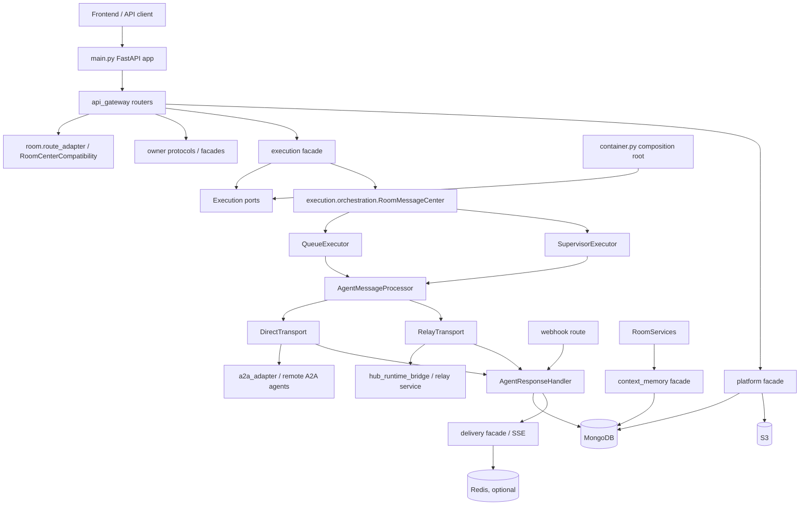

# System Architecture

This document describes the current architecture and core workflows of the
`multi-agents-backend` codebase. It is based on the repository state as of
2026-06-26 and focuses on the code that is currently present, not on older
design documents that may have existed previously.

## High-Level Shape

The backend is a FastAPI monolith that coordinates:

- A web app API for rooms, agents, messages, HITL, files, and SSE.
- A public/API-key gateway for agent discovery and direct agent calls.
- A Hub relay path for locally connected hub agents.
- A2A agent communication, including synchronous, streaming, and webhook-based
  long-running task updates.
- Context memory projection, search, and compaction.
- Cross-instance SSE delivery, cancellation, and background recovery jobs.

The application entry point is `main.py`. Dependency construction is centralized
in `container.py`, while request routers live under `api_gateway/routes`.

At runtime the system follows this broad layering:



## Runtime Entry Point

`main.py` creates the FastAPI app, configures process logging, installs
middleware, mounts `api_gateway.router`, and delegates runtime assembly to
container-owned entrypoints:

- `create_application_runtime(settings)`
- `startup_runtime(app, runtime)`
- `validate_runtime_bindings(app, runtime)`
- `shutdown_runtime(app, runtime)`

Startup has three practical phases:

1. Infrastructure setup:
   - Load settings and auth configuration.
   - `container.py` builds `MongoDAL`, Redis, object-storage
     adapters, facades, repositories, route dependencies, and owner-module
     runtime adapters.

2. Runtime guard and background services:
   - Start Delivery/SSE runtime.
   - Probe DAL Redis KV and Streams runtime services when `REDIS_URL` is configured.
   - Enforce multi-worker safety with `check_multi_worker_safety`.
   - Start background jobs after the guard passes.

3. Serving and normal shutdown:
   - Verify all required bindings in `validate_runtime_bindings`.
   - Serve `/health` and `/api/v1/*`.
   - On shutdown, stop relay, jobs, leader locks, in-flight execution tasks,
     Delivery/SSE connections, Redis, and MongoDB.

The application router is mounted from `api_gateway.router` under the configured
API prefix, defaulting to `/api/v1`.

## Dependency Assembly

`container.py` is the main composition root. It creates strongly typed dependency
groups around protocol interfaces from `common.protocols`:

- `AgentDeps`
- `RoomDeps`
- `ContextMemoryDeps`
- `DeliveryDeps`
- `ExecutionDeps`
- `HubDeps`

The codebase is built around facade/protocol boundaries.

Runtime composition now follows:

```text
route -> protocol/facade -> repository/DAL -> external service
```

Examples:

- Room CRUD, membership, message persistence helpers, and route-shaped room
  behavior live in `room.compat.runtime`, `room.route_adapter`, and
  `room.membership_source`.
- Agent route compatibility is owned by `agent.route_adapter.AgentRouteAdapter`
  and `agent.service.AgentService`, both constructed directly by `container.py`
  over `agent.AgentFacade`.
- Relay route behavior lives in `hub_runtime_bridge.compat.relay_service`;
  relay behavior is owned by `hub_runtime_bridge.HubFacade` and HubRuntimeBridge
  adapters.
- A2A compatibility-shaped runtime behavior lives in
  `a2a_adapter.runtime_service`. A2A SDK transport/coercion work stays in
  `a2a_adapter`, while task-tracking persistence lives in Execution ports.

Execution is intentionally independent from removed-package compatibility
objects.
`container.py` wires owner modules such as `a2a_adapter.runtime_service`,
`room.compat.runtime`, Delivery/SSE, room memory, Delivery task notifier, and
`dal.runtime_store` objects into focused execution ports. Files under
`execution/` do not accept broad compatibility-store aggregates. Queue,
supervisor, dispatch, HITL, cancellation, and webhook resume paths receive only
the methods they call through execution-owned protocols in `execution/ports.py`.

Agent dependency assembly is also container-owned. `container.py` constructs
`AgentService`, `AgentRouteAdapter`, `AgentMatcher`, `AgentSelectionService`,
`AgentResolverService`, `AgentHealthService`, `AgentLivenessService`, and
`AgentInspectionService` from `agent/`; `APIGatewayDeps` receives these
Agent-owned protocol implementations directly. Agent runtime behavior is owned
by `agent/`.

## Major Code Areas

### `api_gateway`

`api_gateway/router.py` registers all API route modules; the route modules are
thin FastAPI wrappers that parse requests, run auth checks, and delegate to
bound dependencies.

Important route groups:

- `room_routes.py`: room CRUD, room messages, active runs, `sendMessage`.
- `agent_routes.py`: agent registration, lookup, update, visibility, avatar.
- `agent_group_routes.py`: saved agent groups.
- `sse_routes.py`: room SSE stream, SSE status, message cancellation.
- `hitl_routes.py`: human-in-the-loop request and response APIs.
- `files_routes.py`: file upload for room message attachments.
- `discovery_routes.py`: API-key agent discovery.
- `platform_gateway_routes.py`: API-key gateway send/stream/card endpoints.
- `relay_routes.py`: hub daemon registration, event stream, publish, sync, status.
- `webhook_routes.py`: A2A task webhook callbacks.
- `a2a_task_routes.py`: long-running A2A task inspection.

Most frontend-facing routes use Clerk auth. Discovery, gateway, and relay routes
use API-key auth from `common.api_key_auth`.

### `common`

`common` holds cross-cutting primitives:

- `common.dto`: immutable data transfer objects used across module boundaries.
- `common.protocols`: structural interfaces for facades, repositories, delivery,
  execution, hub, platform, LLM, and DAL dependencies.
- `common.config.settings`: environment-backed settings.
- `common.errors`: typed domain/platform errors.
- `common.utils`: logging, time, A2A helpers, context utilities, and streaming
  helpers.
- `common.observability`: tracing and metrics helpers.

When adding new boundaries, prefer using `common.protocols` instead of importing
concrete runtime singletons.

- `common.protocols.runtime_store_protocols` is now a leaf-package contract
  surface. It exposes common-owned runtime DTOs from
  `common.dto.runtime_store`; runtime-store adapters convert those DTOs to
  legacy `models.*` instances before calling focused persistence stores, so
  legacy models no longer cross the `common.protocols` boundary.
- Runtime-store aggregate ports are assembled in `container.py` and remain
  legacy-model shaped where production consumers still require those models.
  New common protocols should stay DTO-shaped.

#### Runtime Configuration

Runtime application code reads environment-backed configuration through
`common/config/settings.py`. Raw `os.getenv()`, `os.environ.get()`, and
`os.environ[...]` reads are reserved for the canonical settings module; the
config unification gate in `tests/test_config_unification_gate.py` scans tracked
production Python files and fails on new raw env reads outside that file.

The gate intentionally excludes `tests/`, `scripts/`, and `docs/`: tests may
set env vars to verify settings loading, while scripts run outside the app
runtime. `SERVER_SOFTWARE` is exposed as the live `Settings.is_gunicorn`
property because it is server-injected runtime metadata, not user application
configuration.

#### A2A Inline File Dispatch Policy

Under the active attachment policy, user-uploaded files sent to agents are
dispatched as A2A `FileContent.bytes`. Presigned/platform storage URIs remain
internal to Hybro for storage, retrieval, and artifact refresh behavior; they
are not sent to agents for user-upload dispatch.

`A2A_INLINE_FILE_MAX_RAW_BYTES` limits one raw file before base64 encoding.
`A2A_INLINE_MESSAGE_MAX_ENCODED_BYTES` limits aggregate encoded file bytes in
one outbound A2A message. Attachment preflight failures create failed agent
tasks before transport dispatch in both queue and supervisor execution paths,
so validation failures are persisted and surfaced without attempting direct or
relay transport.

### `llm_gateway`

`llm_gateway` owns all LLM provider SDK access and LLM model routing. Provider
adapters under `llm_gateway/providers/` are the only LLM code that imports
OpenAI, Google GenAI, or Bedrock runtime SDKs. The public gateway layer resolves
logical model names through `ModelRegistryImpl`, applies centralized retry and
timeout policy through `LLMGatewayConfig`, and exposes text, structured JSON,
embedding, and streaming operations through protocols in `common.protocols`.
`LLMGatewayConfig.from_settings()` reads typed `LLM_GATEWAY_*` policy fields;
`ModelRegistryImpl` remains responsible for mapping logical routes to concrete
provider model IDs.

Focused workflow services under `llm_gateway/services/` wrap prompt workflows
without importing domain models:

- `SupervisorLLMService`: supervisor JSON/text/stream calls through the
  `supervisor_model` logical route, or Bedrock through the configured Bedrock
  supervisor route.
- `EmbeddingLLMService`: an independent, optional embedding gateway capability
  through `embedding_model`. Agent matching and Context Memory have no runtime
  embedding consumers; future features must opt in explicitly.
- `DiscoveryLLMService`: discovery query expansion.
- `SummaryLLMService`: streaming synthesis of multi-agent responses (system prompt includes shared markdown formatting rules from `common/prompts/markdown_response_format.py`).
- `AgentSelectionLLMService`, `MessageParserLLMService`, `RoomMemoryLLMService`,
  and `DebateLLMService`: DTO-backed workflows used directly by runtime modules
  or tested as focused LLM capabilities.

`container.py` constructs one `LLMGatewayImpl` during runtime startup and binds
focused services into production consumers. Runtime modules now depend on
focused LLM services or gateway capability protocols instead of provider-named
compatibility facades.

### `agent`

`agent.AgentFacade` owns canonical agent registry behavior:

- Resolve and register A2A agent cards.
- Store agent metadata in MongoDB.
- Maintain the weighted Mongo text index for searchable agent fields.
- Match agents with Mongo text search plus an application fallback for Latin
  words and CJK ideographs.
- Respect visibility rules for public/private agents.
- Merge hub liveness into agent status when hub agents are involved.

Mongo persistence is implemented by `agent.repository.mongo.AgentMongoRepository`.
Route-facing compatibility, legacy request/response translation, resolver
selection, health/liveness, capability-issue exclusion, and inspection workflows
now live under `agent/`. API gateway dependencies receive Agent-owned protocol
implementations directly from `container.py`.

### `room`

`room.RoomFacade` owns canonical room and message persistence behavior:

- Create/update/delete rooms.
- Resolve room membership from explicit agent IDs, saved groups, or all-agent
  seeds.
- Persist user and agent messages.
- Read room history and message threads.
- Verify room ownership and hub publish lineage.

Mongo persistence is implemented by `room.repository.mongo`.

### `execution`

`execution` owns orchestration after a user message has been accepted.

Key components:

- `ExecutionFacade`: external execution API used by routes. It accepts a
  `common.dto.ExecutionRequest`, delegates message creation to RoomCenter, and
  starts orchestration.
- `execution.events.emit_room_processing_status`: compatibility entrypoint for
  room-message processing status. It normalizes legacy string `details` into the
  typed processing-status payload before lifecycle recording and Delivery
  emission.
- `RoomMessageCenter`: orchestrates a single room user message. It handles
  idempotent claims, per-room locks, cancellation tokens, routing between
  queue and supervisor modes, and terminal processing status.
- `execution.orchestration.dispatch_strategy`: owns dispatch strategy selection
  after room agent selection.
- `execution.ports`: owns the narrow type contracts used inside Execution for
  room runtime, delivery/SSE, rate limit, memory, resolver, health, and
  notification collaborators. Where execution invokes a collaborator method,
  the port must use named parameters and execution-owned result protocols
  instead of `*args`/`**kwargs` catch-all signatures.
- `QueueExecutor`: sequentially processes pre-created agent messages for
  non-supervisor flows and explicit non-supervisor mention flows.
- `SupervisorExecutor`: adaptive supervisor loop for rooms with
  `extend_info.use_supervisor`.
- `AgentMessageProcessor`: transport router shared by queue and supervisor
  execution. It builds the A2A message, runs dispatch middleware, selects
  `direct` or `relay`, and returns a `ProcessingResult`.
- `DirectTransport`: sends work directly to remote A2A agents.
- `RelayTransport`: sends work through the hub relay path.
- `WebhookTransport`: handles inbound A2A webhook callbacks for long-running
  tasks.
- `AgentResponseHandler`: single place that normalizes agent events, persists
  task/artifact state, handles HITL states, and emits SSE/task updates.
  Handler-owned task notifications use the explicit
  `TaskNotificationStorePort` for idempotency and message/room reads, keeping
  task-state persistence writers write-only.
- `TaskStateManager`: owns task state transitions and persistence for agent
  messages.

The main orchestration invariant is that `RoomMessageCenter` serializes
processing per room. It uses a process-local `asyncio.Lock`, and in multi-worker
mode this is supplemented by a Redis distributed lock configured at startup.

Execution also defines a durable orchestration run-state foundation. The
versioned `OrchestrationRunState` model, pure reducer transitions, and
`OrchestrationRunStore` contract support optimistic state writes, append-only
events, recovery queries, and envelope reconstruction. Public run lifecycle
projection accepts an explicit public `RunState`, is idempotent by causation id,
and remains behind the existing run dual-write feature gate. A projection with
a new causation id records that binding even when the public head is already at
the requested active state; repeated processing projections use `RUN_RESUMED`
rather than emitting another start event. Mapping orchestration-specific
statuses into public run states is performed by the state-driven supervisor loop
while legacy supervisor execution remains available for requests that do not
activate the versioned runtime.

Versioned supervisor requests can also carry an explicit candidate scope from
the API boundary into a lightweight orchestration envelope. Scope normalization
rejects unknown, inaccessible, or inconsistent agent selections before planner
execution. The versioned planner action schema and pure action validator enforce
candidate membership, step-budget, required-target, and prior-output rules while
the existing supervisor loop remains the default runtime path. Lightweight v2
envelope activation and state-driven execution are disabled by default behind
`EXECUTION_ORCHESTRATION_V2`; candidate-scope validation still applies before
the feature gate so disabled requests safely retain the legacy runtime path.
`FEATURE_ORCHESTRATION_V2` remains accepted as a deployment migration alias,
with the new environment variable taking precedence. Pending legacy
clarifications resume before a new v2 envelope can be created.

The orchestration boundary also defines deterministic planner context and agent
result ingestion. `build_orchestration_planner_context` projects quoted content,
candidate metadata, step budget, and durable run state into an immutable
planner-facing payload; `RoomSupervisorPlannerAdapter` parses and validates the
next action through the supervisor service's public planner boundary and the
existing action contract. Agent terminal responses can
be normalized into `AgentResultRead` records and projected by the pure,
replay-safe `AgentResultIngestor` when an orchestration ingestion service is
bound. Sparse or identical terminal replays preserve richer output and do not
advance the run-state version. The state-driven supervisor loop consumes these
boundaries to plan, reduce, persist, and resume each versioned step.

HITL records, execution DTOs, delivery events, live SSE frames, and catch-up
responses preserve optional `orchestration_run_id` and
`orchestration_schema_version` links without changing legacy payloads. Supervisor
HITL requests propagate these links from the orchestration state, and grouped
cancellation or expiry terminalizes each pending sibling while retaining its
own linkage metadata. This contract remains compatible with legacy HITL records
that do not contain orchestration fields.

For activated v2 envelopes, `RoomMessageCenter` routes execution through
`SupervisorExecutor.run_v2`. Each planner action is reduced into optimistic,
versioned run state before the next side effect. The loop recovers persisted
delegations and grouped HITL waits, enforces cancellation and step budgets, and
projects terminal outcomes without duplicating dispatch or HITL creation.
Durable run-store queries and the stale-task checker can claim and resume stale
sidecar runs after process interruption. A processing-claim heartbeat prevents
recovery from preempting live turns, optimistic write conflicts exit cleanly for
the winning writer to continue, and deterministic supervisor HITL artifacts can
finish materializing from an `INGESTING` checkpoint without re-planning. Legacy
supervisor requests continue to use the existing loop.

The v2 planner receives a bounded resource catalog for user attachments and
generated projections. Resource references are explicit: planner targets select
context, artifact, or attachment refs, dispatch validates those refs against the
run state and Agent Card input modes, and only selected payloads are materialized
for the target Agent. PDF text projection is size-bounded and injected as
selected context, while raw attachments remain behind an explicit-ref-only
forwarding policy. The resource provider and projection service are assembled in
`container.py`; failure recovery and retry policy remain separate orchestration
concerns.

### Execution Control Plane

Execution is the authoritative orchestration control plane for supervisor runs.
Planner output is business-level only; Execution binds resources against Agent
cards, creates dispatch intents, interprets Agent results, records shadow
observations, creates HITL pauses, resumes existing A2A continuations, and marks
terminal run state.

The persisted `OrchestrationRunState.goal` is the durable goal for the loop. On
each iteration the planner compares that goal with the bounded state-context
projection of facts, artifacts, agent outputs, and open questions. It either
chooses the next business action or declares the goal complete. Completion is
LLM-judged; Execution only enforces mechanical blockers such as pending HITL,
active dispatches, unresolved questions, and open runtime failures. Legacy
`synthesize` decisions are normalized to `complete`.

`complete` is not itself a terminal side effect. Execution first runs final
synthesis, streams the user-facing response, and only then persists the run as
completed. Synthesis is therefore a presentation action owned by Execution, not
an independent planner termination decision.

The loop emits non-persistent processing-status details for progress review,
planning, continued delegation, result evaluation, goal re-checking, goal
completion, and final synthesis. The frontend projects these details into work
logs without adding a second durable orchestration state model.

Every planner `required_resource_ref` is materialized into a required context,
artifact, or attachment dispatch ref before the agent call. Resolution failure
is a dispatch failure and must not be reclassified as a business-level
`input-required` response from the external agent.

Selected canonical artifacts are materialized from their stored A2A parts into
transport-neutral resource payloads. The room runtime then compiles each payload
for the target Agent Card: structured JSON becomes an A2A `DataPart` when the
agent accepts `application/json`, text becomes a `TextPart`, and compatible file
content remains a `FilePart`. When a structured target modality is unavailable,
JSON may be serialized as bounded text. Planner selection therefore operates on
semantic resources rather than depending on the source agent's original part
format, and selected artifact content is not replaced by a truncated task-text
preview.

Room modules persist messages and emit room events but do not decide next
orchestration steps. A2A adapters and `DirectTransport` perform protocol
conversion, send/stream/cancel, and normalized result production only.
`HITLService` owns HITL request/response lifecycle CAS and persistence;
`ExecutionFacade` records HITL answers onto orchestration runs and resumes
Execution.

An external A2A `input-required` state is not automatically user-facing HITL.
Execution first performs a bounded, silent recovery using information that was
not already delivered to that A2A task. Original dispatch refs and previously
attempted content fingerprints cannot be replayed as new evidence. An explicit
continuation result with material output resumes the loop; a push continuation
pauses for its callback. If no new information exists, the blocking reply still
requires input, or a blocking reply has neither state nor output, Execution
preserves `awaiting_input` and upgrades it through `HITLService`. This recovery
does not return to the planner or consume the remaining orchestration budget.

Internal dispatch prompts are private Execution/adapter data. Agent-originated
HITL status messages pass through a bounded public-text sanitizer; safe concrete
questions may be projected to the HITL request, while internal markers,
oversized text, and control content fall back to a generic public prompt.

### `context_memory`

`context_memory.ContextMemoryFacade` owns room memory projection, assembly,
search, and compaction:

- `project_message_for_event`: updates room memory from persisted message
  history.
- `assemble_context`: builds supervisor or agent context within token budgets.
- `search_memory`: performs Mongo keyword search with temporal decay. It keeps
  raw keyword scores stable across widening result windows, hydrates content in
  a second phase, and re-queries from the first window so TTL deletion cannot
  shift an offset past surviving candidates. Results expose explicit
  `keyword_score`, `relevance_score`, and `temporal_decay_factor` fields.
- `run_compaction`: compacts older turns using pointer-based full-content
  storage.
- `content_repository`: stores full content references for compacted turns.

The facade uses:

- MongoDB for room memory and stored content documents.
- MongoDB text search for relevant compacted turns.
- `LLMGatewayImpl` and focused gateway services for summary,
  chat-context generation, and turn-note extraction.
- `RoomHistoryReader` from `room.RoomFacade` for source message history.

`container.py` creates the facade before execution orchestration, registers
`ContextMemoryEventHandler` with Delivery's internal `message_committed` event,
and exposes the facade through `ContextMemoryDeps.context_memory_runtime` for
supervisor and agent context assembly. Frontdoor user-message persistence and
execution response paths publish local-only `MessageCommitted` events only after
the message write succeeds; user-message commits wait for local handler
completion before preflight continues. Delivery records handler failures in a
bounded in-memory dead-letter buffer and sends a best-effort Redis dead-letter
notification rather than propagating failures to the message writer, so this
wait establishes local ordering but does not guarantee projection success. User
commit events carry `room_agent_set` so event projection can clean raw
`<@id|name>` mentions with canonical room agent names before appending
attachment descriptions. Agent commit events carry `agent_name` and
`was_successful` metadata so event projection preserves the old direct-memory
turn shape. ContextMemory reloads the persisted message by `message_id`,
projects it idempotently, and runs compaction only after a successful new
projection.
### ContextMemory Runtime Ownership

`context_memory/` owns room memory projection, legacy chat-context route
compatibility, memory search, turn indexing, compaction, content expansion,
context assembly, and route/runtime adapters that expose memory-facing behavior.
`ContextMemoryFacade` is the canonical runtime object for Room, Execution,
background compaction, and event-driven projection. API Gateway memory routes use
`context_memory.compat.runtime.ContextMemoryRouteCenter`, which adapts legacy
chat-context request/response models without importing removed-package modules.

The former application-shell ContextMemory service files have been removed.
Startup wiring in `container.py` constructs ContextMemory repositories, facade,
and compatibility adapters directly. The preserved event path remains:
`MessageCommitted -> ContextMemoryEventHandler -> ContextMemoryFacade.project_message_for_event`,
with compaction triggered through ContextMemory-owned facade methods.
Legacy turn-selection and context metric logging helpers live in
`context_memory.legacy_assembly`. Route compatibility uses
`ContextMemoryRouteCenter` with a store-backed `ContextMemoryChatAdapter`, while
execution room-memory compatibility uses the facade-backed
`ContextMemoryRoomMemoryAdapter` instead of removed-package memory service
objects.

### `delivery`

`delivery.DeliveryFacade` owns SSE delivery and cross-instance event fan-out.
Backend modules emit typed `common.dto.DeliveryEvent` objects; Delivery is the
only layer that translates those DTOs into frontend room SSE frames. The wire
shape is always:

```json
{"type": "event_name", "timestamp": "ISO-8601", "room_id": "room-id", "data": {}}
```

`ProcessingStatusEvent` supports the final status set (`queued`, `processing`,
`awaiting_input`, `completed`, `failed`, `canceled`, `rejected`,
`rate_limited`, `error`) and carries `details` as `dict | null`.
Legacy room-runtime callers may pass string details only through Execution's
room processing-status helper; Delivery receives typed DTO fields.

It is composed from:

- `SSETransportImpl`: local room connection management.
- `EventPublisherImpl`: emits frames/events and handles deduplication.
- `TaskUpdateNotifier`: execution-facing task update publisher that resolves
  final agent display fields and delegates to `DeliveryFacade.send_task_update`.
- `CrossInstanceEventBus`: Redis Pub/Sub based fan-out when Redis is enabled.
- `CancellationWatcher`: tracks cancellation state through Mongo change streams
  and Redis KV when available.
- `TerminalStatusDeduplicator`: prevents duplicate terminal status frames.

Delivery is exposed to SSE routes as `common.protocols.SSERouteTransport`
through `APIGatewayDeps.sse_transport` and the `get_sse_transport` FastAPI
provider. Routes call the delivery transport, while the runtime implementation
lives in `delivery`. Delivery never calls back into Execution or removed-package
business services; lifecycle recording happens before typed delivery events are
emitted.

### `platform_module`

`platform_module.PlatformFacade` groups public platform-facing capabilities:

- `PlatformGateway`: API-key agent discovery, card masking, synchronous calls,
  and streaming calls.
- `PlatformDiscovery`: discovery service abstraction.
- `PlatformFileStorage`: file uploads and presigned URLs.
- `PlatformContentStorage`: binary/full-content storage used by context memory.
- `PlatformObjectStorage`: SDK-free compatibility adapter over
  `ObjectStorageDAL` for uploaded-object reads, writes, presigned URLs, public
  URLs, metadata, and prefix cleanup. Its presigned URL cache is bounded and
  TTL-swept so alternate object-storage DALs do not need to implement their own
  cache to avoid duplicate signing work safely.
- `PlatformAgentAvatarManager`: avatar upload/public URL persistence for the
  agent avatar route, backed by the same `PlatformObjectStorage` adapter.
- Gateway/discovery/agent rate limiters backed by Mongo collections.

This module is used by:

- `/gateway/*` routes for external agent messaging.
- `/discovery/*` routes for external agent search.
- `/files/upload` for authenticated room file uploads.
- Context memory compaction content storage.

### `hub_runtime_bridge` and Relay

`hub_runtime_bridge.HubFacade` owns hub connection management, relay dispatch,
agent sync, liveness, offline queue behavior, task ownership, and internal hub
response routing. `hub_runtime_bridge.compat.relay_service.RelayService`
provides the legacy relay method surface for APIKey/request adaptation and
delegates Hub behavior through facade public methods. Its runtime binding uses
`RelayHubStore` under HubRuntimeBridge ownership, `HubMongoRepository`,
`AgentRepository`, and the `RelayOfflineFailureAdapter` instead of the broad
legacy Mongo/database singletons. Route-facing Delivery transport state is no
longer part of `RelayService` construction; offline failures enter Delivery
through `RelayOfflineFailureAdapter`, and stream/leader bindings are
owner-protocol pass-throughs rather than Redis runtime concrete dependencies.
Relay transport binding is stored once and exposed through the legacy
`relay_transport` compatibility accessor rather than duplicated private
transport state.

Hub relay responsibilities:

- Register hub daemons.
- Maintain hub liveness and heartbeat state.
- Provide an SSE event stream to hub daemons.
- Sync hub-owned agents into the agent registry.
- Dispatch user messages/cancel/reply commands to hub agents.
- Accept published hub agent responses.
- Journal internal responses and replay them if needed.
- Maintain task ownership leases for multi-worker safety.
- Own legacy hub publish authorization and cancellation-reader adapters used by
  relay publish processing; HubRuntimeBridge compat wiring injects these
  adapters into `HubFacade` instead of querying room/agent message state
  directly.
- Own legacy relay lifecycle adapter behavior for hub registration,
  owner/room authorization, heartbeat validation, hub status aggregation, and
  disconnect bookkeeping. HubRuntimeBridge keeps relay compatibility method
  names and delegates these operations to its adapters.

When Redis Streams are available, relay events use streams for durable-ish hub
event delivery through `hub_runtime_bridge.transport.RelayStreamService`, which
consumes DAL `RedisStreams` rows and optional DAL `RedisKV` heartbeat state.
Redis stream and heartbeat failures are logged and degrade to empty reads,
missing entry ids, or dead liveness checks so the facade can fall back to
in-memory/offline queues for single-process/degraded operation.

### `a2a_adapter`

`a2a_adapter` isolates A2A protocol details:

- Resolve and validate AgentCards.
- Own all production imports of the upstream A2A SDK.
- Build outbound A2A send, stream, cancellation, HITL, and task-fetch requests.
- Remote task reads are exposed to Execution through
  `a2a_adapter.remote_task_reader.RemoteTaskReader`, which delegates SDK calls
  to `a2a_adapter.remote_task`.
- Translate internal common models to SDK payloads and normalize SDK responses
  back to SDK-free dictionaries or `common.types` models.
- Own A2A output-mode negotiation and response/task coercion helpers used by
  owner-module runtime services.
- Normalize task status and artifacts.
- Inbound A2A streaming `artifact-update` control flags treat explicit `null`
  for `append` and `lastChunk` the same as omitted values at the shared
  `TaskArtifactUpdateEvent` model boundary; other artifact fields remain
  strictly validated.
- Parse webhook stream response payloads.
- Probe inspection and dry-send flows without leaking SDK clients into owner
  services.
- Convert inline binary artifacts to S3-backed references through bound storage.
- Own Docker host fallback for backend-initiated agent endpoint calls. Owner
  modules such as `agent.health`, `agent.resolver`, Execution jobs, and legacy
  transport compatibility paths must call adapter helpers instead of opening
  direct `httpx` or A2A SDK clients against agent URLs.
- Keep registered `agent_card.url` values unchanged during fallback. The
  adapter may retry `localhost`, `127.0.0.1`, `::1`, or `0.0.0.0` URLs through
  `host.docker.internal` for connection-style failures, but that rewrite is
  request-local and must not be persisted back to agent registration state.

Owner services, jobs, execution transports, and room runtime code use
`common.types`, plain DTO dictionaries, and adapter facades instead of importing
`a2a.*` directly. `tests/test_phase9_cleanup_gate.py` enforces that boundary by
failing on direct A2A SDK imports and SDK-shaped adapter helper usage outside
`a2a_adapter/` and tests.

### `dal` and `database`

`dal` owns production database, object-storage, and Redis adapter access.
Business modules use module-scoped repositories built from `MongoDAL` and
`ObjectStorageDAL`. Adapters:

- `dal.mongo`: generic Mongo collection/DAL adapter.
- `dal.redis`: Redis KV, Pub/Sub, Streams, leader election, and room
  distributed locking support.
- `dal.s3`: object storage adapter and the sole runtime owner of S3-compatible
  SDK calls.
- `dal.index_registry`: startup index registration across modules.

Platform-facing file/content services depend on `ObjectStorageDAL` or the
`PlatformObjectStorage` compatibility adapter instead of importing SDK clients.
`PlatformAgentAvatarManager` also uses the platform object-storage adapter for
avatar bytes and persists the resulting public URL through the agent repository.
Production startup passes `PlatformObjectStorage` directly into runtime
consumers through object-storage-named injection points where they still
require the legacy upload/presign surface.
`PlatformObjectStorage` in `platform_module.object_storage` is the only
SDK-free object-storage compatibility adapter used by runtime code and tests.
AWS SDK imports are confined to `dal/s3/`;
the only provider-specific exception is `llm_gateway/providers/bedrock_provider.py`
importing `aioboto3` for Bedrock until that provider's SDK access moves behind
a dedicated transport.
Startup also configures A2A artifact storage once with the platform object
storage adapter, S3 bucket name, and maximum file size. Direct execution
transports call the shared A2A conversion helper and must not partially rebind
artifact storage at runtime, because doing so would discard bucket and size
settings from startup.
Tracked A2A terminal message/task persistence treats artifact upload conversion
as best-effort: conversion failures are logged, but the terminal task update is
still written so remote agent completion is not lost due to object-storage
transient failures.

The legacy runtime database files `database/mongodb.py`,
the former vector database module, `database/repository.py`, the retired
`database/migration/` scripts, and the former application-shell database service
have been removed. Production startup wiring in `container.py` uses `MongoDAL`,
DAL-backed repositories, and narrow owner adapters directly.

Important Mongo collections include:

- `agents`
- `rooms`
- `room_user_messages`
- `room_agent_messages`
- `room_quotes`
- `room_memories`
- `conversation_content`
- `user_memories`
- `agent_memories`
- `cancelled_messages`
- `runs`
- `file_uploads`
- `api_keys`
- `hubs`
- `runs`
- `run_events`
- `cancelled_messages`
- `agent_requests`
- `discovery_api_requests`
- `gateway_api_requests`
- `agent_capability_issues`

Mongo text indexes support Agent lexical matching and Context Memory keyword
retrieval. S3 is used for file uploads and converted binary artifacts.

### Application Shell

The application shell is now a composition concept, not a Python package.
Startup, lifespan, dependency assembly, validation, health binding, and
shutdown are owned by `main.py` and `container.py`. Runtime behavior is created
from owner modules and injected through protocols, facades, repositories, or
ports.

The former application-shell package directory has been deleted. New code must
not introduce that package, import path, singleton registry, or compatibility
shim.

A2A-facing API routes bind narrow readers from `common.protocols`:
`A2ATaskStatusReader` for task inspection, `RoomRouteReader` for room ownership
checks, and `SSEStateReader` for SSE status and cancellation lookup. These
replace the older combined room compatibility reader in route modules while
leaving legacy room protocol shims available for non-route migration work.

### `jobs` and Runtime Infrastructure

Background jobs start only after infrastructure and multi-worker safety checks
pass:

- `stale_task_checker`: recovers stale tasks, orphaned messages, stale HITL,
  and run watchdog events.
- `compaction_sweep`: runs context memory compaction for eligible rooms.
- `orphaned_upload_cleaner`: removes uploaded files that were never attached.
- `agent.health.AgentHealthService`: periodic health/liveness support for
  agents.

Redis runtime primitives live under `dal.redis`: KV and Streams expose
`is_connected` health and use bounded Redis connection timeouts, leader election
accepts explicit TTL overrides, and room distributed locking preserves the
`True`/`False`/`None` acquire result used by Execution to distinguish acquisition,
contention, and Redis degradation.
Leader election prevents duplicate job execution in multi-worker deployments.

## Core Workflow: Frontend Room Message

The primary product workflow begins at `POST /api/v1/roomCenter/sendMessage`.

1. The frontend opens `/api/v1/sse/room/{room_id}/stream` to receive live
   room events.

2. The frontend posts a room message to `/roomCenter/sendMessage` with:
   - `room_id`
   - `message`
   - `client_request_id`
   - optional attachments or inline file IDs
   - optional target scope or mentioned agent IDs

3. `api_gateway.routes.room_routes.send_message`:
   - verifies room ownership,
   - extracts attachment references,
   - creates an `ExecutionRequest`,
   - calls `ExecutionFacade.execute`,
   - schedules `ExecutionFacade.start_orchestration` as a FastAPI background
     task if orchestration should start.

4. `ExecutionFacade.execute` owns execution preflight:
   - checks pending HITL requests before persistence,
   - checks active runs before persistence,
   - delegates room persistence to the room route/runtime port,
   - emits preflight `processing` status immediately after the user message is
     persisted so the frontend has a cancellable `message_id`,
   - asks the room route/runtime port to run message preflight before Execution
     starts orchestration,
   - emits terminal preflight status when a persisted room response completes
     before orchestration starts.

5. `RoomServices.send_message_to_room`:
   - validates the request and message size,
   - resolves and validates attachments,
   - loads the room and target scope,
   - persists the user message,
   - returns preflight outcome metadata for Execution-owned processing-status
     emission,
   - creates a cancellation token,
   - initializes context memory if needed,
   - chooses a dispatch strategy:
     - explicit mentions,
     - room default/saved group,
     - all-agent matching,
     - supervisor if `room.extend_info.use_supervisor` is true,
   - either creates initial agent messages or marks the user message with
     supervisor preparation data.

6. `ExecutionFacade.start_orchestration` builds an `OrchestrationRequest` and
   calls `RoomMessageCenter.process_room_user_message`.

7. `RoomMessageCenter`:
   - claims the user message to prevent duplicate processing,
   - acquires a per-room lock,
   - refreshes the processing claim,
   - loads quoted context when present,
   - creates or reuses a cancellation token,
   - chooses one of two execution paths:
     - Supervisor path for `extend_info.supervisor`.
     - Queue path for pre-created agent messages.

8. Queue path:
   - Fetch agent messages related to the user message.
   - Process them sequentially through `QueueExecutor`.
   - Each item uses `AgentDispatcher` for agent assignment and
     `AgentMessageProcessor` for transport selection and dispatch.
   - On success, emit unified summary and terminal `completed` status.

9. Supervisor path:
   - Build agent registry and room config.
   - Assemble room/conversation context.
   - Run the adaptive `SupervisorExecutor` loop.
   - The supervisor compares the persisted goal with accumulated context and
     decides whether to delegate, ask for clarification, fail, or complete.
   - Execution performs final synthesis after `complete` and marks the run
     terminal only after the user-facing response has been streamed.
   - Agent messages are created dynamically instead of being pre-generated.
   - Terminal status is emitted after synthesis or final failure/cancellation.

10. Agent responses flow into `AgentResponseHandler`, which:
    - public-projects remote A2A task/event payloads before persistence,
      Delivery/SSE, lifecycle emission, or orchestration ingestion,
    - treats Hub terminal `processing_status` close-out as a terminal agent
      result only after the same state-aware projection used by response/error
      events; raw details are not persisted, emitted, or ingested,
    - broadcasts nonterminal artifact updates without persisting them,
    - updates task state on `room_agent_messages`,
    - handles final responses, errors, cancellations, and HITL states,
    - emits SSE updates through Delivery,
    - delegates terminal task notifications through
      `execution.dispatch.task_notifications`.

## Agent Dispatch Workflow

Both queue and supervisor execution use `AgentMessageProcessor`.

1. Load current room memory from the database.
2. Ask `RoomServices.process_agent_message` to build the outbound A2A message.
3. Build a `DispatchContext`.
4. Run pre-dispatch middleware:
   - cloud health checks for direct cloud agents,
   - hub transport selection for hub-backed agents.
5. Select transport:
   - `direct`: call remote A2A agent directly.
   - `relay`: send a command to a connected hub agent.
6. Dispatch the message.
7. Run post-dispatch middleware.
8. Return `ProcessingResult` to the executor.

Direct dispatch can complete synchronously, stream artifacts, or pause for
webhook continuation depending on the agent/task behavior.

## A2A Webhook Workflow

Long-running A2A tasks report back through:

```text
POST /api/v1/webhooks/a2a/{message_id}
```

The route:

1. Extracts the notification token from `X-A2A-Notification-Token` or Bearer
   authorization.
2. Parses the request JSON.
3. Delegates to `WebhookTransport.handle_webhook`.
4. The transport validates the token, parses A2A stream response payloads, and
   sends normalized `AgentEvent` objects into `AgentResponseHandler`.

This keeps all final task state, artifact persistence, and SSE emission logic
in one response handler regardless of whether the response came from direct
transport, relay, or webhook.

Task lifecycle data access for A2A task submission, webhook token validation,
cancellation persistence, HITL lifecycle, task notification persistence, webhook
response handling, and stale-task cleanup is routed through focused runtime-store
ports assembled in `container.py`. The runtime-store repository aggregate backs those
ports with module repositories and `MongoDAL` collections, but production
bindings use scoped `dal.runtime_store.parts` surfaces or focused startup
adapters wherever a narrower port is sufficient. Relay route registration, hub
status, and liveness use explicit repository-backed owner adapters. Remaining
runtime-store aggregate use is limited to documented compatibility shims rather
than new production business owners.

Task notification persistence is a distinct execution port. `ResponseTaskWriter`
remains limited to task-state writes, while `TaskNotificationStorePort` supplies
the idempotency update plus message, room, and client-request-id reads needed by
`execution.dispatch.task_notifications`.

**Agent display text:** Public A2A task projections never expose remote
`Task.history`. For a completed task, agent-role `TextPart` content from
`TaskStatus.message` is extracted into Hybro's explicit public `message_text`
channel before the original status message is removed; structured completed
artifacts remain a separate public output channel and can be displayed beside
that text. Terminal task SSE prefers the persisted `message_text`, including
when the returned artifact contains only `DataPart` or `FilePart` content; a
legacy message whose stored text is still equal to its dispatch seed falls back
to extracted artifact text. Streaming text that should survive reconnect is materialized as a
completed `response` artifact before terminal persistence and delivery. Status
messages for other roles or states, failure details, interactive prompts,
noncompleted artifact/message content, and inline `file.bytes` are not persisted
or emitted; file artifacts must be converted to
addressable URIs or dropped from public projection. List/section markdown repair runs only in the
frontend remark plugin pipeline
(`hybro-frontend/src/lib/markdown/conversation-remark-plugins.ts`) at Streamdown
render time. Hybro-controlled LLM paths (supervisor synthesis,
`SummaryLLMService`) append `HYBRO_MARKDOWN_RESPONSE_FORMAT` so synthesis uses
`###` section headers; third-party agent text is still stored as-is. Backend
terminal helpers in `common/utils/a2a_helpers.py`
(`prepare_terminal_agent_content`, `resolve_terminal_sse_content`,
`sync_artifact_dicts_to_canonical_text`) resolve canonical text from artifacts
and align artifact payloads without transforming markdown. Terminal resolution is
owned by `update_task_state_on_message`; streaming text parts collapse to a
single canonical text part while file/data parts are preserved. SSE terminal
`content` is authoritative for display text; `parts` carries only non-text
payloads.

Supervisor delegation publishes the exact task sent across the external-agent
boundary as `extend_info.public_dispatch_text`, alongside the short
`public_task_label`. This field contains the dispatched task after reference
projection, but not private planner reasoning or separately transported resource
payload bodies. It reuses the existing room-message `extend_info` document and
does not add a persistence model.

## Hub Relay Workflow

Hub-connected local agents use API-key authenticated relay endpoints.

1. A hub daemon registers through `/relay/hub/register`.
2. It opens `/relay/hub/{hub_id}/events` as an SSE stream.
3. It periodically calls `/relay/hub/{hub_id}/heartbeat`.
4. It syncs available local agents through `/relay/hub/{hub_id}/agents/sync`.
5. When a room message targets a hub-backed agent, dispatch middleware selects
   `relay` transport.
6. `RelayTransport` sends a `HubDispatchCommand` through `RelayService` and
   `HubFacade`.
7. The hub daemon receives the event, performs local agent work, and publishes
   results to `/relay/hub/{hub_id}/publish`.
8. The publish path validates lineage/cancellation, journals internal response
   events, and routes them into the same `AgentResponseHandler` used by direct
   agents.

This design lets hub agents participate in the normal room execution pipeline
while keeping hub transport details isolated from queue/supervisor orchestration.

## Gateway and Discovery Workflow

The public API-key surface is separate from the frontend room workflow.

Discovery:

```text
POST /api/v1/discovery/agents
POST /api/v1/gateway/agents/discover
```

Messaging:

```text
POST /api/v1/gateway/agents/{agent_id}/message/send
POST /api/v1/gateway/agents/{agent_id}/message/stream
GET  /api/v1/gateway/agents/{agent_id}/card
```

The platform gateway:

1. Authenticates API keys.
2. Applies per-key and global rate limits.
3. Resolves visible/public agents.
4. Masks AgentCard URLs so clients call the gateway, not private backend URLs.
5. Checks per-agent rate limits.
6. Uses `AgentTransport` from `a2a_adapter` to call agents.
7. Returns A2A-shaped responses or SSE stream frames.

## SSE and Cancellation Workflow

Frontend SSE is room-scoped:

```text
GET /api/v1/sse/room/{room_id}/stream
```

Cancellation is message-scoped:

```text
POST /api/v1/sse/message/{message_id}/cancel
```

Cancellation flow:

1. Route verifies the message and room ownership.
2. `ExecutionFacade.cancel` persists cancellation in MongoDB.
3. Delivery/SSE cancellation state is updated and broadcast.
4. Pending HITL requests for the message are cancelled.
5. Any paused orchestration sidecar is terminalized as canceled; pending HITL
   ids, continuations, and open-question state are cleared.
6. A terminal typed `ProcessingStatusEvent(status="canceled")` is emitted.
7. Best-effort remote agent task cleanup is attempted.
8. Executors observe cancellation tokens at checkpoints and stop gracefully.

In multi-worker mode, Redis Pub/Sub/KV and Mongo change streams are required so
typed SSE frames and cancellation state cross worker boundaries.

For turn-correlated execution paths, emitters should include `client_request_id`
when available and resolve it from message lineage when the event source does not
provide it directly.

## HITL Workflow

HITL is used when an agent or supervisor needs user input before continuing.

Main responsibilities live in `execution.hitl.service`, constructed by
`execution.hitl.factory.create_hitl_service` and passed through Execution
facade/port wiring:

- Create HITL requests.
- Broadcast input-required state.
- Block new room messages while a pending request exists.
- Accept user responses through HITL routes.
- Resume paused continuation/orchestration paths.
- Cancel stale or superseded HITL requests.
- Emit HITL request/response frames with `related_message_id` for resume
  correlation when available.

`ExecutionFacade` exposes HITL operations through the `HITLManager` protocol so
routes do not need to know runtime implementation internals.

HITL storage is exposed through a focused startup adapter over the HITL, message,
and task lifecycle runtime-store parts instead of raw `database_service`, Mongo
access, or the full repository-store aggregate. `HITLService` uses store ports
for request creation, CAS/fenced updates, group routing claims, continuation
persistence, and stale processing iteration.

### HITL Lifecycle Consistency

HITL is a durable backend lifecycle object, not a transient streaming-only UI
state. When backend execution determines that an A2A `input-required` request
cannot be satisfied silently, it must create or reuse a pending HITL request and
project that request onto exactly one display agent message before emitting live
SSE. The projection sets the agent message
task state to `input-required` and writes `hitl_request_id`, prompt metadata, A2A
task/context ids, group metadata, and clears any stale HITL answer. It does not
copy HITL lifecycle status into agent message metadata; the durable HITL request
document remains the source of truth for pending, responded, canceled, and
expired states.

Remote agent input prompts may be used only through the bounded public HITL
projection. Orchestration run state keeps request identity, source, agent, A2A
task/context ids, and a safe public prompt or fallback; it does not duplicate
raw remote prompts into observations, blockers, failures, or private task
payloads. A delegation outcome in an interactive state is blocked, never
fulfilled, and a terminal result without material text, artifacts, facts, or
required-output evidence is not sufficient to mark a legacy delegation
fulfilled.

For orchestration-linked agent HITL, an unchanged `input-required` prompt after
the user's reply is a no-progress signal rather than a new HITL round. The reply
is recorded as a canonical run fact, the repeated prompt is recorded in the
decision log, and control returns to Execution for re-planning. A genuinely new
agent question may still create a follow-up HITL request. This prevents an
external agent from producing an unbounded chain of identical pending requests
while preserving legitimate multi-round clarification.

The frontend treats `hitl_request` and `hitl_response` as durable lifecycle
events keyed by `room_id`, `request_id`, and `message_id`. `client_request_id` is
included when resolvable, is persisted on the HITL request as best-effort
metadata, and helps attach processing logs to the current turn, but it is not
required to apply a HITL request. This differs from streaming task/content events
such as `processing_status`, `task_update`, and `agent_response_partial`, which
remain strictly turn-correlated.

Refresh and reconnect recovery must use
`GET /api/v1/rooms/{room_id}/hitl/pending` and apply the same frontend
projection as live `hitl_request` SSE. This keeps the UI consistent whether the
user stays on the page, refreshes after the HITL is created, or reconnects after
missing an SSE frame.

Before rolling out the pending agent HITL unique partial indexes, run
`uv run python scripts/check_pending_hitl_unique_index_readiness.py` from the
backend directory against the target database. The script exits non-zero and
prints duplicate pending `(room_id, display_message_id)` or
`(room_id, continuation_message_id)` groups that must be resolved before index
creation.

## Context Memory Workflow

Room memory is updated and used across turns.

1. User and agent messages are persisted in MongoDB.
2. Frontdoor user-message persistence and execution response paths publish
   `MessageCommitted(room_id, message_id, message_type, agent_id?,
   room_agent_set?, agent_name?, was_successful?)` through Delivery's internal
   event publisher with Redis fan-out disabled.
   User commits request `wait_for_local_handlers=True`; agent commits keep the
   default asynchronous local-handler behavior. Waiting means the local handler
   task has completed; handler failures are captured in Delivery's bounded
   in-memory dead-letter buffer with best-effort Redis notification.
3. `ContextMemoryEventHandler` consumes `message_committed`, reloads the
   persisted message through `RoomHistoryReader`, and calls
   `project_message_for_event`.
4. Projection is idempotent by `turn_id == "message:{message_id}"`; duplicate
   hits do not add another turn.
5. ContextMemory runs `run_compaction(room_id)` after a new projection, while
   duplicate/missing/empty/mismatched messages skip compaction.
6. Before agent execution, context assembly builds a token-budgeted context for
   the supervisor or the target agent.
7. Memory search can retrieve relevant historical turns with keyword scoring
   and temporal decay.
8. The compaction sweep still handles periodic compaction for eligible rooms.

The design keeps current task context, recent conversation context, room summary,
memory search results, and quoted reply context separate so each can be bounded
and tested independently.

Memory search is provided by `ContextMemoryFacade` through the injected
context-memory runtime protocol. Legacy search response consumers call
`ContextMemoryFacade.legacy_search` directly. Keyword search and two-stage
content hydration go through the context-memory content repository.

An optional provider-neutral `extensions.vector_store.VectorStore` protocol is
available for future features. It has no factory, default implementation,
container binding, application state, or current runtime consumer.

## Background Jobs

Background jobs are initialized by the container runtime after Redis/leader
election setup.

- `agent_health_service`: health/liveness checks.
- `stale_task_checker`: expires stale task messages, recovers orphaned
  processing, handles stale HITL, and emits watchdog run events.
- `compaction_sweep`: runs context memory compaction for eligible rooms.
- `orphaned_upload_cleaner`: deletes unused uploaded files from object storage.

In multi-worker deployments, leader election is used to avoid duplicate job
execution.

## Deployment Modes

Single-process development:

- `uvicorn main:app`
- Redis is optional.
- SSE/cancellation/relay can operate in local or degraded modes.

Multi-worker production:

- Gunicorn-style multi-worker startup is allowed only when Redis-dependent
  services are connected.
- `check_multi_worker_safety` fails startup if Redis Pub/Sub, Redis KV, relay
  streams, DAL Redis runtime, or cancellation change streams are missing.

This guard exists because without Redis:

- SSE broadcast is process-local.
- Background jobs would run in every worker.
- Room locks would not coordinate across workers.
- Relay messages could be lost across worker boundaries.

## Error and Recovery Model

The codebase uses several recovery mechanisms:

- User-message processing claims prevent duplicate orchestration.
- Recovery requests can reclaim stale processing messages.
- Per-room locks prevent concurrent room execution.
- Queue cleanup cancels remaining descendants when execution exits early.
- Cancellation state is persisted and broadcast.
- `runs` and `run_events` provide lifecycle tracking and startup healing.
- Hub response journaling and task ownership leases support replay and
  multi-worker safety for relay responses.
- Stale task checker handles expired, orphaned, and stuck task states.

The normal terminal states seen by clients are:

- `completed`
- `failed`
- `canceled`
- `rejected`
- `rate_limited`
- `error`

## Accepted Architecture State

- API gateway dependencies are injected through `app.state.api_gateway_deps`.
- ContextMemory projection is event-driven through `MessageCommitted`.
- `common` remains a leaf package and exposes only DTOs, protocols, auth,
  config, errors, observability, and utilities.
- Domain modules depend on owner protocols, facades, repositories, or ports for
  business behavior.
- Removed-package compatibility surfaces must not be reintroduced.

## API Route Protocol Ownership

API route handlers remain thin adapters: they parse HTTP input, resolve injected
dependencies, call route-facing protocols, and format compatible responses.
Route owner contracts are declared in `common.protocols`, `agent.protocols`,
`room.protocols`, and `context_memory.protocols`. API Gateway route modules do
not import runtime implementation packages; they receive owner protocols through
`APIGatewayDeps`.

API Gateway route modules are thin HTTP adapters. Business dependencies for
routes and API viewsets are assembled once during application startup into
`APIGatewayDeps` and stored on `app.state.api_gateway_deps`; provider functions
in `api_gateway.dependencies` expose those objects through FastAPI `Depends`;
route-owned SSE streaming uses the `sse_transport` provider rather than an
application-level manager dependency.
Route modules must not own mutable dependency globals or `bind_*` startup
functions, and route-level scalar configuration such as discovery defaults is
passed through the same runtime dependency context rather than imported from
global settings.

## Testing and Verification

The repository uses `pytest` and `ruff`.

Common commands:

```sh
uv run pytest -q
uv run --with ruff ruff check .
git diff --check
```

Focused tests are organized by module and workflow:

- `tests/test_api_*`: route and API behavior.
- `tests/test_agent_*`: agent registry, matching, facade behavior.
- `tests/test_room_*`: room facade and room membership.
- `tests/test_context_memory_*`: memory projection, assembly, compaction, search.
- `tests/test_delivery_*`: SSE, event bus, cancellation, delivery protocols.
- `tests/test_execution_*` and related orchestration tests: execution flows.
- `tests/test_hub_runtime_bridge_*`: hub relay behavior.
- `tests/test_platform_*`: gateway, files, rate limits, platform protocols.
- `tests/test_service_*`: service-level runtime compatibility and behavior.

For architecture-sensitive changes, run the closest focused tests first, then
the full suite before merging.
