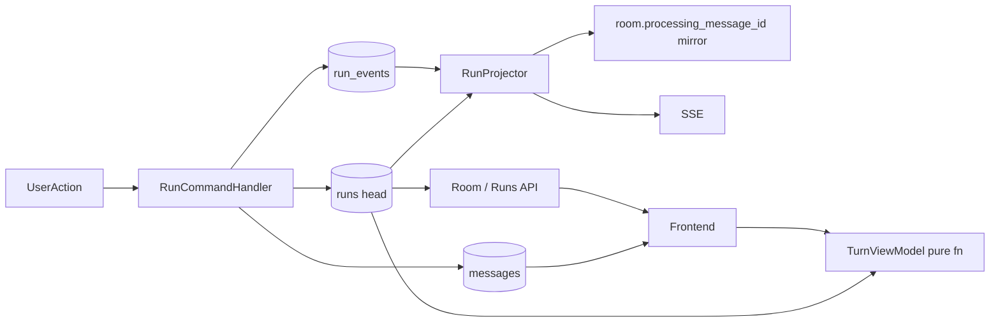
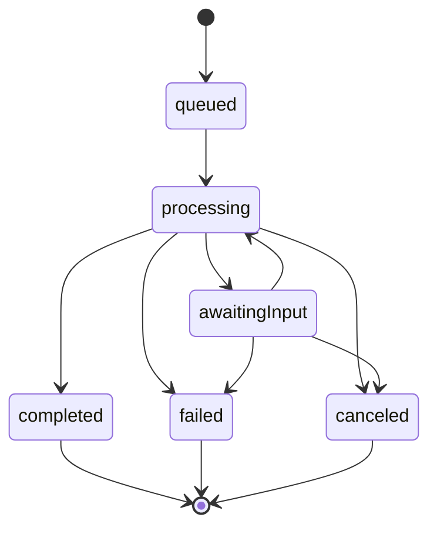

# Run + Message Graph Lifecycle Refactor Design

> **Status:** **Phase A / C / D lifecycle authority cleanup (shipped 2026-04)** — shadow dual-write + projector-owned room mirror (default path), optional **`run_event` SSE**, run watchdog, migration script for indexes, message graph fields on `RoomMessage`, and removal of obsolete `send_processing_status` task-plumbing flags. Remaining major work is reducer/idempotency matrix hardening, transactions by deployment topology, and observability export wiring.  
> **Date:** 2026-04-28 (updated 2026-04-29)  
> **Owners:** Backend + Frontend platform  
> **Scope:** `multi-agents-backend` + `hybro-frontend`  
> **Filename note:** Path retains `EVENT_SOURCED_*` for history; content is **run-event-sourced** lifecycle, not persisted Turn events.  
> **Alignment:** `docs/TURN_MODEL_ANALYSIS.md` (endgame: Run + Message graph + derived `TurnViewModel`) · **`docs/ARCHITECTURE.md`** (short orientation)

---

## Implementation checklist (execute in order)

Use this as the PR sequence; each item should land with tests + metrics where noted. **Shipped** items are marked `[x]`; **partial** `[~]`; **deferred** `[ ]`. Open backlog is also grouped under **Remaining work by track** (below).

1. **[x] Schema:** Mongo collections `runs`, `run_events`, Pydantic models (`models/run.py`), indexes via `create_run_lifecycle_indexes()` (`database/mongodb.py`), startup in `main.py`. **v1 slice:** `run_id == trigger_message_id` (orchestration run per user message). Sparse compound idempotency index for `(room_id, client_request_id, agent_id)` per §N.2 exists in index creation; multi-leg fan-out **wiring** still deferred.
2. **[~] Reducer:** `services/run_reducer.py` — `ensure_transition_allowed`, `RunTransitionError`, `next_state_for_terminal_event` (illegal-transition guard used by `RunCommandHandler`). **Not** a standalone `apply_run_event(state, event) -> state` reducer over full event types; tests in `tests/test_run_reducer.py`.
3. **[x] Command handler:** `services/run_command_handler.py` (`RunCommandHandler`) appends `run_events` and updates `runs` head from unified lifecycle status semantics. `services/run_lifecycle_service.py` is a **thin facade** delegating to the handler.
4. **[x] Dual-write (Phase A full path coverage):** Lifecycle transitions from dispatch/HITL/task terminal+interactive edges route through `RunCommandHandler` via the unified lifecycle emission path (`send_processing_status` in SSE manager and mapped task-state notifications).
5. **[x] Mirror authority:** lifecycle persist path projects mirror via `services/run_projector.sync_room_processing_mirror(room_id)` applying §N.1. `modules/RoomMessageCenter.py` terminal/lock paths also sync via projector.
6. **[~] SSE:** **`processing_status`** remains the primary client envelope. Optional **`run_event`** broadcast **after** successful persist when **`FEATURE_RUN_EVENT_SSE=1`** (`services/sse_services.py`). Frontend: **`NEXT_PUBLIC_FEATURE_RUN_EVENT_SSE=1`** → terminal `run_event` subtypes trigger `reconcileWithDb` (`hybro-frontend` SSE dispatcher).
7. **[x] API (reconcile):** **Option A** — `active_runs` embedded on **`POST /api/v1/roomCenter/inquiryRoomSetting`** response (`RoomCenterRoomSettingResponse`). Dedicated **`POST /api/v1/roomCenter/inquiryActiveRuns`** for lightweight poll (`RoomCenterActiveRunsResponse`). **Not** `GET /api/v1/rooms/:roomId/runs` (spec alternative deferred).
8. **[~] Shadow metrics:** Optional **log sampling** when **`FEATURE_RUN_PARITY_LOG=1`** — `run_projector` logs current vs desired mirror when they differ. **Not** Prometheus counters / dashboard (§10) yet.
9. **[x] Frontend (Phase B/C path):** Restore / safety-net paths use **`active_runs`** and call **`inquiryActiveRuns`** where needed (`hybro-frontend`: `useProcessingRestore`, `useRoomSSEConnection`, `lib/api/room.ts`).
10. **[x] Frontend:** Reconnect/restore processing authority is runs-first (`active_runs` + reconcile); `run_event` terminal reconciliation is integrated.
11. **[x] Phase C:** Competing room-level lifecycle authority removed; processing transitions use centralized lifecycle methods and room UI reads use narrow selectors (`useRoomProcessing` + per-flag selectors) instead of broad flag objects.
12. **[x] Watchdog:** `jobs/stale_task_checker.py` step **`_fail_stale_runs`**: **`find_stale_non_terminal_runs`** → **`append_run_timeout_failure`** → mirror sync → lifecycle failed status emission. Gated by **`FEATURE_RUN_WATCHDOG`** (default on), **`RUN_WATCHDOG_STALE_MINUTES`** (default `90`). Distinct from older “stuck `processing_message_id`” cleanup in the same job.
13. **[x] Phase D:** `processing_message_id` demoted to projector-derived legacy mirror; lifecycle authority is run-based.
14. **[x] Docs:** **`docs/ARCHITECTURE.md`** + this file track rollout truth.
15. **[x] Ops migration:** `scripts/migrations/run_run_lifecycle_indexes.py` + `scripts/migrations/README.md` — idempotent index ensure for deploys without relying on app startup alone.
16. **[~] Message graph:** `models/room.py` — **`parent_message_id`**, **`run_id`** on **`RoomMessage`** (optional fields). Backfill from `turn_id` / population on write paths still **deferred** (see §5.4).

---

## Remaining work by track (ownership)

Use this table for planning and PR scoping; cross-check with §8 unchecked items and code before claiming done.

| Track | What is left | Primary surfaces |
|-------|----------------|------------------|
| **1. Backend hardening** | Full `apply_run_event`-style reducer over event types (today: `ensure_transition_allowed` + terminal mapping only in `services/run_reducer.py`). Idempotency / ordering test matrix (duplicate `event_id`, `seq` gaps, per-agent `(room_id, client_request_id, agent_id)`). Mongo multi-document transactions per §N.3 where replica set allows; fallback ordering verified. **Prometheus/Otel export** for counters in `services/run_metrics.py` (in-process only today). Optional **`run_active_by_room`** gauge and **`frontend_reconcile_processing_clear_total`** if still desired. Grep gate: no direct `runs` / `run_events` writes outside `run_command_handler.py`. Multi-leg fan-out **wiring** for §N.2. Optional **`GET /api/v1/rooms/:roomId/runs`** (§7.1 Option B). | `services/run_command_handler.py`, `services/run_reducer.py`, `database/mongodb.py`, `services/sse_services.py` |
| **2. Frontend** | §8 Phase B: reconcile path that **always** pulls room snapshot with `active_runs` for every client/code path (not only restore/SSE hooks). Optional follow-up: tie optimistic spinner only to `client_request_id` until first ack. | `hybro-frontend/src/hooks/room/*`, `hybro-frontend/src/hooks/room/processing-lifecycle.ts`, room UI store |
| **3. Message graph** | Backfill historical rows (`turn_id` → `parent_message_id` where semantics match). Populate **`parent_message_id`** / **`run_id`** on **all** message write paths. Retire residual **`turn_id`** on execution paths per `docs/TURN_MODEL_ANALYSIS.md` (orchestration → `run_id` + graph). | `models/room.py`, `services/room_services.py`, `services/database_service.py`, `modules/*Executor*.py`, `modules/RoomMessageCenter.py` |
| **4. Docs / integrators** | Published deprecation for integrators still treating **`processing_message_id`** or room-only busy as source of truth; point to **`active_runs`** + **`inquiryActiveRuns`**. | This doc, `docs/ARCHITECTURE.md`, external changelog if applicable |

---

## 1. Problem statement

Lifecycle is split across multiple write authorities:

| Authority | Role today | Problem |
|-----------|------------|---------|
| `room.processing_message_id` | Room-level “busy” | Cleared inconsistently on early returns / missing SSE |
| Task / agent SSE events | Streaming progress | Best-effort; not a single FSM |
| Frontend `processing` flag | UX spinner | Can diverge from backend |
| Turn projection `composerState.isProcessing` | Per-turn UI | Aggregates multiple agents poorly; stale vs room |
| Placeholders in message store | Optimistic UI | Not reconciled to a single run terminal |

**Goal:** One persisted **Run** lifecycle + message graph; UI **TurnViewModel** is pure derivation; SSE is notification; **HTTP snapshot reconcile** is mandatory on ambiguity.

---

## 2. Target model (canonical)

| Primitive | Persisted? | Owns |
|-----------|------------|------|
| **Run** | Yes | Execution lifecycle, cancel/retry/HITL wait, per-agent work unit |
| **Message** (`parent_message_id`, optional `run_id`) | Yes | Content + conversation graph |
| **TurnViewModel** | **No** | Chat grouping (“user prompt + rail + slots”) |

**Non-goals**

- No persisted `turn_events` as source of truth (aligned with removal described in `TURN_MODEL_ANALYSIS.md`).
- No AG-UI wire-format mandate in v1 (internal model first; protocol alignment later).

### 2.1 Prerequisites (Phase 0)

Do **not** start **Phase A dual-write** until the chat stabilization work described in `docs/TURN_MODEL_ANALYSIS.md` (and `hybro-frontend/PLAN-turn-store-single-writer.md` where applicable) is **shipped and stable**. Run migration assumes trustworthy message IDs, single-writer semantics, and processing-related SSE; otherwise dual-write parity metrics will be noisy and hard to interpret.

---

## Normative v1 decisions (gaps closed)

These choices remove ambiguity from design review (multi-run mirror, idempotency, transactions, SSE ownership, parse-failure runs, replay).

### N.1 Multi-run vs `processing_message_id` (single-valued field)

- **Busy source of truth:** `active_runs[]` on the room snapshot (§7.1). Clients must not infer global busy from `processing_message_id` alone when multiple runs can be active.
- **Legacy mirror rule (single algorithm):** Let **S** = non-terminal runs for `room_id`. If **S** is empty, set `processing_message_id` to **`null`**. Otherwise let **C** = `{ r in S | r.trigger_message_id != null }`. If **C** is empty (only proactive / null-trigger runs), set mirror to **`null`** in v1 (**truth remains `active_runs`**). If **C** is non-empty, set mirror to **`trigger_message_id` of the run in C with earliest `created_at`**, tie-break **`run_id` ascending (lexicographic)**.
- **Rationale:** Deterministic and backward-compatible for single-run rooms; multi-agent UI keys off `active_runs`.

### N.2 Fan-out and idempotency keys

`(room_id, client_request_id)` is **not** unique across runs when one POST fans out to multiple agents.

**v1:**

- **Per-agent execution run:** enforce idempotency with a **sparse compound unique index** on `(room_id, client_request_id, agent_id)` where `agent_id` is non-null (same POST + same agent leg = same run).
- **Orchestration-only leg** (parse/selection before agent ids exist): either **omit** a separate shell run in v1 and attach `client_request_id` only to agent runs, **or** introduce at most one shell run per `(room_id, client_request_id)` with `agent_id: null` and `parent_run_id: null`—**pick one approach in the first implementing PR** and document it in code (`RunCommandHandler` module docstring).
- **Parent linkage:** use `parent_run_id` on child runs when a shell orchestration run exists.

### N.3 Transaction ordering (dual-write)

- **Preferred:** one **MongoDB multi-document transaction** per lifecycle step: append `run_event(s)` → update `runs` head → update `room.processing_message_id` (mirror) → **commit** → then emit SSE (after commit).
- **Ops note:** multi-document transactions require a **replica set** (not standalone `mongod` in some dev setups). Document or script dev clusters accordingly; where transactions are unavailable, use **§N.3** fallback ordering only.
- **If a path cannot use a transaction:** strict order **(1)** persist `run_events` + `runs`, **(2)** mirror + legacy-compatible `processing_status` SSE. If **(2)** fails after **(1)** committed, a **projector repair** pass (cron, next room read, or explicit reconcile job) must re-derive mirror from `runs`—never leave runs terminal while mirror implies busy without a follow-up write.

### N.4 `seq` / replay

- **Server:** only `RunCommandHandler` assigns monotonic `seq`; duplicate `seq` insert is rejected.
- **Client / SSE consumer:** track expected next `seq` per `run_id`; buffer transient out-of-order delivery (suggested caps: **gap ≤ 64** or **≤ 5s** wall clock—tune in code). If gaps persist, **HTTP snapshot reconcile** (§7.1).

### N.5 Parse failure and “no run”

- **No persisted user message** (fail before persist): **no `runs` row** in v1; HTTP error + client optimistic rollback.
- **User message persisted**, then failure on parse/selection/dispatch: append **`run_failed`** on the run(s) tied to `trigger_message_id = user_message.message_id` (and per-agent runs as applicable), then apply terminal mirror rules.

### N.6 SSE and room mutation consolidation

**As implemented (2026-04):** `services/sse_services.py` → **`SSEManager.send_processing_status`**:

- **Dual-write:** `RunCommandHandler.record_processing_status` runs for every path (kill-switch **`FEATURE_RUN_DUAL_WRITE`**).
- **Mirror:** lifecycle status emission always projects room mirror via **`sync_room_processing_mirror(room_id)`** after persist (§N.1). Legacy direct room writes in this path were removed.
- **`run_event` SSE:** If **`FEATURE_RUN_EVENT_SSE`** is on and the handler returns a payload, broadcast **`run_event`** **before** the usual **`processing_status`** SSE (both after DB commit of the run row).

**Current state:** non-SSE task notification call sites no longer carry an opt-in `send_processing_status` boolean; mapped task states emit lifecycle status unconditionally through the same writer path. Continue guarding against direct room mirror writes outside projector sync points.

### N.7 HTTP authorization

`active_runs` on room GET and any dedicated runs listing endpoint must use the **same room membership / auth** as existing room and message APIs.

---

## 3. Architecture



*Note:* `RunCommandHandler` persists `run_events` and the materialized `runs` head. **`RunProjector`** (`run_projector.py`) recomputes **`processing_message_id`** from active runs (§N.1); it does **not** emit SSE by itself — **`SSEManager`** emits **`processing_status`** and optional **`run_event`** after persistence.

---

## 4. Run FSM (normative)

**States:** `queued` → `processing` → (`awaiting_input` ↔ `processing`) → **terminal** `completed | failed | canceled`

Rules:

1. **Monotonic:** No transition from a terminal state.
2. **Terminal finality:** `completed`, `failed`, `canceled` are immutable.
3. **Idempotency:** Same `event_id` applied twice is a no-op (ack success, do not bump `seq` twice).
4. **Seq ordering:** `seq` is strictly increasing per `run_id` (server-assigned only). Consumers apply events in `seq` order; see **§N.4** for client buffer caps and reconcile-on-gap.
5. **Liveness:** Every run that reaches `queued` or `processing` must eventually receive a terminal event (success, explicit failure, cancel, or watchdog timeout).



---

## 5. Data contracts (implement these shapes)

### 5.1 Resolved product defaults (was “open decisions”)

| Topic | Decision for v1 |
|-------|------------------|
| Storage | **MongoDB** collections `runs`, `run_events` (consistent with existing backend) |
| Projection | **Synchronous** projector in-process after append (same request / worker); async projector only if profiling demands it later |
| Terminal conflicts | **First terminal wins**; later terminal events for same `run_id` are stored but ignored by reducer (audit log only) |
| Retention | **90 days** raw `run_events` then compact (e.g. tombstone / archive collection or truncated tail replay from `runs.seq` watermark—**v1** may defer compaction automation; cap collection growth operationally first) |

### 5.2 `runs` document (materialized head state)

Minimum fields (extend as needed for agents/HITL):

```json
{
  "run_id": "uuid",
  "room_id": "string",
  "agent_id": "string | null",
  "parent_run_id": "uuid | null",
  "trigger_message_id": "uuid | null",
  "parent_message_id": "uuid | null",
  "client_request_id": "string | null",
  "state": "queued | processing | awaiting_input | completed | failed | canceled",
  "seq": 0,
  "error_code": "string | null",
  "error_message": "string | null",
  "created_at": "iso8601",
  "started_at": "iso8601 | null",
  "ended_at": "iso8601 | null",
  "updated_at": "iso8601"
}
```

**Indexes:** `{ room_id: 1, state: 1, updated_at: -1 }`, `{ run_id: 1 }` unique, sparse compound **`{ room_id: 1, client_request_id: 1, agent_id: 1 }`** for per-agent leg idempotency (§N.2). If a shell orchestration run `(agent_id: null)` is used, add **`{ room_id: 1, client_request_id: 1 }` partial** unique with `agent_id: null` only—mutually exclusive with “no shell” mode; implement one.

### 5.3 `run_events` document (append-only)

```json
{
  "event_id": "uuid",
  "run_id": "uuid",
  "room_id": "string",
  "seq": 1,
  "type": "run_created | run_started | run_awaiting_input | run_resumed | run_completed | run_failed | run_canceled",
  "payload": {},
  "correlation_id": "string | null",
  "causation_id": "string | null",
  "ts": "iso8601"
}
```

**Indexes:** `{ run_id: 1, seq: 1 }` unique, `{ event_id: 1 }` unique.

### 5.4 Message graph (incremental toward full graph)

**v1:** `RoomMessage` / `RoomAgentMessage` in **`models/room.py`** include optional:

- `parent_message_id: str | null` — parent in conversation graph (nullable for root / proactive).
- `run_id: str | null` — optional link from message to producing run.

**Backfill / write-path population:** not all insert paths set these yet. Migration: existing `RoomAgentMessage.turn_id` (“root user message”) can be copied to `parent_message_id` where semantics match; document per-field mapping in a dedicated migration when ready (see `TURN_MODEL_ANALYSIS.md` §6.2).

---

## 6. Backend design

### 6.1 `RunCommandHandler` (single writer)

**Responsibilities**

1. Validate transition against current `runs.state` via **`ensure_transition_allowed`** (`run_reducer.py`).
2. Insert `run_events` row with next `seq` (duplicate `seq` / `event_id` → no-op or skip per handler logic).
3. Update `runs` head document.
4. **Mirror / SSE:** caller orchestrates — **`sse_services`** calls **`sync_room_processing_mirror`** after persist; **`RunLifecycleService`** is a **facade** that forwards **`record_processing_status`** to this handler only.

**Forbidden (target):** Any other module writing `run_events` or mutating `runs.state` directly. **Today:** grep for `runs_collection` / `run_events_collection` outside **`run_command_handler.py`** before claiming exclusivity.

### 6.2 `processing_message_id` mirror (Phase A–C)

| Phase | Behavior |
|-------|----------|
| A | Projector updates mirror per **§N.1** (deterministic `trigger_message_id` when multiple active runs); clears when **no** active runs |
| B–C | Legacy clients may still read this field; server maintains it for compatibility/rollback while **new** clients use `active_runs` |
| D | Optional: remove field or make read-only computed in API layer |

### 6.3 Failure safety

- **Post-persist errors:** Any path that today clears “processing” must append `run_failed` (or `run_canceled`) on the associated run(s).
- **Partial multi-agent:** If one agent run fails, others continue unless product rule says otherwise; UI aggregates in `TurnViewModel`.
- **Watchdog:** Implemented in **`stale_task_checker`** — non-terminal runs with **`updated_at`** older than **`RUN_WATCHDOG_STALE_MINUTES`** → **`append_run_timeout_failure`** (`error_code: RUN_TIMEOUT`). Gated by **`FEATURE_RUN_WATCHDOG`**.

### 6.4 Idempotency

- Client sends `client_request_id` (already used in Hybro).
- **Per-agent leg:** `find` by `(room_id, client_request_id, agent_id)` before creating a new run; if present, return existing `run_id` (no second `run_created`).
- **Shell run (if enabled):** at most one `(room_id, client_request_id)` with `agent_id null` per §N.2.
- **`event_id`:** duplicate `event_id` is always a no-op at append (§4 rule 3).

---

## 7. API & SSE (contracts)

### 7.1 HTTP — minimum for reconcile

**Authorization:** same as room/message access (§N.7).

**As implemented (Hybro Room Center):** extend **`POST /api/v1/roomCenter/inquiryRoomSetting`** with the same `active_runs` array shape below. Add **`POST /api/v1/roomCenter/inquiryActiveRuns`** (body includes `room_id`) for targeted refresh without full room setting. See `services/room_services.py` (`inquiry_room_setting`, `inquiry_active_runs`), `api/room_center.py`, `models/response.py` (`ActiveRunRef`, `RoomCenterActiveRunsResponse`).

**Option A (preferred):** Extend existing room snapshot payload with:

```json
{
  "active_runs": [
    {
      "run_id": "...",
      "state": "processing",
      "trigger_message_id": "...",
      "agent_id": "...",
      "seq": 12,
      "updated_at": "..."
    }
  ]
}
```

**Option B (spec):** `GET /api/v1/rooms/:roomId/runs?states=queued,processing,awaiting_input` — not implemented; Room Center POSTs are the current contract.

Clients **must** reconcile processing UI from this snapshot on: load, reconnect, SSE gap detection, and after uncorrelated events.

### 7.2 SSE — event envelope (persisted first, then emit)

**Backend wire:** `SSEManager.broadcast_to_room(..., "run_event", data)` where `data` includes `event_id`, `run_id`, `seq`, `type` (e.g. `run_failed`), `payload`, `correlation_id`. Emitted only when **`FEATURE_RUN_EVENT_SSE=1`** and the handler returns a post-append payload. Outer SSE frame still uses top-level **`type": "run_event"`** (see `hybro-frontend/src/lib/types/sse.ts`).

Example payload shape (inside `data`):

```json
{
  "event_id": "uuid",
  "run_id": "uuid",
  "seq": 13,
  "type": "run_completed",
  "payload": {},
  "correlation_id": "string | null"
}
```

Rules:

- Emit **only** after DB commit of `run_events` (same request as `record_processing_status`).
- Frontend: optional **`NEXT_PUBLIC_FEATURE_RUN_EVENT_SSE=1`** — on terminal `run_*` types, trigger **`reconcileWithDb`**; dedupe by `event_id` if you extend the store later.
- Primary UX path remains **`processing_status`**; `run_event` is additive for observability / stricter clients.

### 7.3 Mapping from current SSE

| Today (conceptual) | Run layer |
|--------------------|-----------|
| `processing_status` + message id | Primary client signal; drives **`RunCommandHandler`**. Mirror is projector-derived via `sync_room_processing_mirror`. **Truth** for multi-run busy = **`active_runs`** (§N.1). |
| `run_event` (optional) | Additive envelope after append when **`FEATURE_RUN_EVENT_SSE`**; clients may reconcile on terminal types. |
| Task / slot streaming | Can remain separate; **run** still owns terminal |

**v1 compatibility:** **`processing_status`** remains required for all clients; **`run_event`** is optional.

---

## 8. Migration phases (definition of done)

### Phase A — Shadow dual-write

- [x] All targeted lifecycle transitions append run events + update `runs` through the unified lifecycle status path (SSE manager + task/HITL notification mappings + watchdog timeout path).
- [x] **Shadow** append + `runs` head update for transitions on that path via **`RunCommandHandler`** (`services/run_command_handler.py`), invoked from **`run_lifecycle_service`** facade and **`sse_services`**. Kill-switch: **`FEATURE_RUN_DUAL_WRITE=0`** disables persistence (default on when unset).
- [x] **`processing_message_id` from projector** — mirror derives via **`sync_room_processing_mirror`** after each relevant lifecycle status emission (and post-lock/terminal in **`RoomMessageCenter`**).
- [~] Parity **logging** — **`FEATURE_RUN_PARITY_LOG=1`** samples drift (see `run_projector`). Dashboard counters (§10) still **[ ]**.

**DoD:** 7+ days parity ≥ 99.9% in staging; zero unexplained mismatches in P1 triage.

### Phase B — Read switch (feature flag)

- [x] Frontend flagged paths were migrated to **`active_runs`** / **`inquiryActiveRuns`** and are now default in restore/safety-net call sites.
- [x] Room setting inquiry returns **`active_runs`** from `get_active_runs_by_room_id` (non-terminal `runs` for room).
- [x] Reconcile path **always** fetches room snapshot with runs for **all** clients / code paths (load/hydration, SSE reconnect + safety-net, and terminal `run_event` reconciliation all funnel through room snapshot + `active_runs` truth).

**DoD:** No stuck processing in scripted failure matrix (§9 E2E).

### Phase C — Remove duplicate frontend authority

- [x] Single selector + centralized transitions: lifecycle methods (`startProcessing` / `stopProcessing`) are the only transition authority; room UI consumers use narrow selectors instead of broad room flag objects.
- [x] Optional UX follow-up: optimistic **display** is now pinned to the pending `client_request_id` and cleared on first matching `run_event` ack (`correlation_id`), preventing cross-turn optimistic bleed.

**DoD (met):** Code search for active `setProcessing(` calls in room hooks/SSE handlers shows no competing paths (comments only). Optional optimistic-display follow-up is also implemented; remaining work is in backend/message-graph/docs tracks.

### Phase D — Legacy cleanup

- [x] Stop relying on legacy `send_processing_status` task-plumbing flags (`AgentEvent.send_processing_status`, notify call-site booleans).
- [x] Demote room-only lifecycle authority to projector-derived compatibility mirror (`processing_message_id`).
- [ ] Document deprecation notes for external integrators still consuming room-only processing semantics.

---

## 9. Testing strategy (required)

### Backend unit

- Reducer: every allowed edge + representative illegal edges — **partial** coverage in **`tests/test_run_reducer.py`**; expand toward full matrix.
- Projector: §N.1 ordering — **`tests/test_run_projector.py`**.
- Idempotency: duplicate `event_id`.
- Ordering: permute `seq` delivery where buffer applies.
- `client_request_id` + `agent_id` collision: second submit returns same **per-agent** `run_id` (§6.4, §N.2).

### Backend integration

- `send_message_to_room` early returns (e.g. scope validation): assert `run_failed` and cleared mirror.
- Multi-run: two agents, one fails, one completes → **no** non-terminal runs remain → mirror `null`; `active_runs` empty; assert **§N.1** mirror pick when both briefly active (earliest `created_at`, tie-break `run_id`).

### Frontend

- Lifecycle-read default path: no active runs → no spinner; missed terminal SSE → reconcile clears within T seconds.
- Optional `run_event` enabled: terminal `run_event` triggers reconcile without regressions.
- Pagination: trigger message missing from store does not leave processing true if API says no active runs.

### E2E matrix (automate where feasible)

1. Parse failure before dispatch (no persisted message → no run, §N.5)  
2. Selection failure after user message persist (`all_agents` / scope)  
3. Mid-run queue failure  
4. SSE disconnect / reconnect during processing  
5. HITL: `awaiting_input` → resume → complete  
6. Cancel in-flight run  
7. Duplicate POST same `client_request_id` (assert same **per-agent** `run_id` when `agent_id` fixed; shell mode per §N.2 if enabled)

---

## 10. Observability

Counters / logs:

- `run_event_append_total`, `run_transition_errors_total`
- `run_active_by_room` gauge
- `parity_legacy_processing_vs_run_mismatch_total`
- `run_watchdog_forced_failure_total`
- `frontend_reconcile_processing_clear_total`

**As implemented now:** lightweight in-process counters exist in `services/run_metrics.py` and are incremented by `RunCommandHandler`, `run_projector`, and `stale_task_checker`. Prometheus/Otel export wiring is still pending.

**SLO targets (initial):**

- P99 projector apply latency `< 50ms` in API process (adjust when measured).
- Watchdog max staleness = `SLA + 2m`.

---

## 11. Feature flags

| Flag | Where | Purpose |
|------|--------|---------|
| `FEATURE_RUN_DUAL_WRITE` | **Backend** env | Persist `runs` / `run_events` from the **`processing_status`** lifecycle hook. **`0` / `false` / `no` / `off`** disables writes; default **on** when unset. |
| `FEATURE_RUN_PROJECTOR_MIRROR` | **Removed (Phase D cleanup)** | Mirror projection is always on in active lifecycle paths; variable no longer controls runtime behavior. |
| `FEATURE_RUN_EVENT_SSE` | **Backend** env | **`1` / `true` / `on`** — emit extra **`run_event`** SSE after each successful append. Default **off**. |
| `FEATURE_RUN_PARITY_LOG` | **Backend** env | Set to **`1`** to log mirror drift (current vs desired) in **`run_projector`**. |
| `FEATURE_RUN_WATCHDOG` | **Backend** env | **`0` / `false` / `off`** disables stale-run timeout in **`stale_task_checker`**; default **on** when unset. |
| `RUN_WATCHDOG_STALE_MINUTES` | **Backend** env | Non-terminal run **`updated_at`** age before watchdog fails it (default **90**). |
| `FEATURE_RUN_LIFECYCLE_READ` | **Spec / server** (reserved) | Future: gate `active_runs` in JSON for old clients — **not** used on API today; field is always returned when implemented paths exist. |
| `NEXT_PUBLIC_FEATURE_RUN_LIFECYCLE_READ` | **Removed (Phase D cleanup)** | Restore/safety-net read path uses `active_runs` by default. |
| `NEXT_PUBLIC_FEATURE_RUN_EVENT_SSE` | **`hybro-frontend`** | **`1`** = handle **`run_event`** terminal types (reconcile). Must align rollout with **`FEATURE_RUN_EVENT_SSE`** on the API. |
| `FEATURE_RUN_SINGLE_AUTHORITY` | **Reserved / currently unused** | Kept as a reserved gate for emergency rollout control; selector/lifecycle consolidation is already shipped. |

**Deploy:** run **`scripts/migrations/run_run_lifecycle_indexes.py`** once per environment (see **`scripts/migrations/README.md`**) so indexes exist before turning on high-traffic flags.

Rollout: indexes → shadow (default on) → optional `run_event` SSE (backend + frontend flags together) → reducer/idempotency + transaction hardening + observability export.

---

## 12. Risks & mitigations

| Risk | Mitigation |
|------|------------|
| Transaction scope bugs | Single handler; integration tests per exit branch |
| Mongo growth | Retention + compaction (§5.1) |
| Client lag | Mandatory reconcile API |
| Team parallel work | Checker: grep CI for writes outside `RunCommandHandler` |

---

## 13. Rollback

- **Frontend:** unset **`NEXT_PUBLIC_FEATURE_RUN_EVENT_SSE`** to ignore **`run_event`** payloads (primary lifecycle still follows `processing_status` + HTTP reconcile).
- **Backend shadow:** set **`FEATURE_RUN_DUAL_WRITE=0`** to stop persisting `runs` / `run_events` (SSE still emits `processing_status`; mirror behavior follows current projector-based path).
- **Projector mirror rollback:** no runtime toggle in active path; use code rollback (or revert commit) if you must restore legacy direct mirror writes.
- **`run_event` SSE:** set **`FEATURE_RUN_EVENT_SSE=0`** on API.
- Persisted run data remains available even if optional `run_event` SSE is disabled.

---

## 14. Codebase touchpoints (non-exhaustive; grep before implementing)

**Backend:** `services/room_services.py`, `services/sse_services.py` (`send_processing_status`, §N.6), `services/run_command_handler.py`, `services/run_projector.py`, `services/run_reducer.py`, `services/run_lifecycle_service.py` (facade), `services/database_service.py` (`find_stale_non_terminal_runs`, …), `jobs/stale_task_checker.py` (`_fail_stale_runs`), `database/mongodb.py` (`get_active_runs_by_room_id`, `find_stale_non_terminal_runs`, `create_run_lifecycle_indexes`), `scripts/migrations/*`, `modules/QueueExecutor.py`, `modules/SupervisorExecutor.py`, `modules/WorkflowCenter.py`, `modules/RoomMessageCenter.py`, `modules/agent_response_handler.py`, `services/task_notification_service.py`, `models/room.py`, `models/run.py`.

**Frontend:** `hooks/room/useProcessingRestore.ts`, `hooks/room/useRoomSSEConnection.ts`, `hooks/room/sse-handlers/index.ts` (`run_event`), `lib/api/room.ts` (`inquiryActiveRuns`), `lib/types/response.ts`, `components/turn/OrchestraTurn.tsx`, `stores/message-store/*`, `lib/types/sse.ts`, `hooks/turn/useMessageStoreSync.ts`, `lib/room-timeline/build-turns.ts`.

---

## 15. Summary

| Concern | Owner |
|---------|--------|
| Execution lifecycle | **Run** + `run_events` |
| Conversation shape | **Message** + `parent_message_id` / optional `run_id` |
| Chat grouping / rail | **TurnViewModel** (derived) |
| Best-effort updates | SSE (`processing_status` + optional `run_event`) |
| Truth when unsure | **HTTP snapshot** + transition guard / future full reducer |

**Normative v1** (§N.*) remains the contract for **remaining** work: reducer/idempotency hardening, Mongo transactions where replica set allows, Prometheus-style metrics (§10). The shipped slice is **SSE-shadow + projector mirror authority + optional `run_event` + watchdog + index migration + API/frontend read path + frontend selector/lifecycle consolidation**.

---

## 16. As implemented (v1 slice, 2026-04 — updated)

| Layer | Behavior |
|-------|----------|
| **Write (shadow)** | `RunCommandHandler` persists from unified lifecycle status emission path (SSE manager, mapped task notifications, watchdog timeout). **`FEATURE_RUN_DUAL_WRITE`** gates writes. |
| **Mirror** | Projector-derived via **`sync_room_processing_mirror`** in lifecycle status emission and RoomMessageCenter terminal/lock sync points. |
| **SSE** | Always **`processing_status`**. Optional **`run_event`** when **`FEATURE_RUN_EVENT_SSE`**. |
| **Watchdog** | **`stale_task_checker._fail_stale_runs`**: non-terminal **`updated_at`** older than **`RUN_WATCHDOG_STALE_MINUTES`** → **`append_run_timeout_failure`** + lifecycle failed status emission. |
| **Read** | `get_active_runs_by_room_id` → `active_runs` on room setting + `inquiryActiveRuns`. |
| **Indexes / ops** | `scripts/migrations/run_run_lifecycle_indexes.py` (+ README); `main.py` still calls **`create_run_lifecycle_indexes`** on startup. |
| **Tests (backend)** | `tests/test_api_room_center.py` (`TestInquiryActiveRuns`), `tests/test_flow_contracts.py`, `tests/test_run_lifecycle_service.py`, `tests/test_run_reducer.py`, `tests/test_run_projector.py`. |
| **Tests (frontend)** | `hybro-frontend`: `tests/unit/hooks/room-lifecycle.test.ts`, `tests/unit/lib/room-api.test.ts`, MSW handlers for `inquiryActiveRuns`. |

**Next PRs:** follow **Remaining work by track** above — typical order: **(1)** backend reducer/idempotency + transactions + metrics export, **(2)** frontend reconcile-all-paths (Phase B), **(3)** message graph backfill + write-path population, **(4)** integrator docs.
