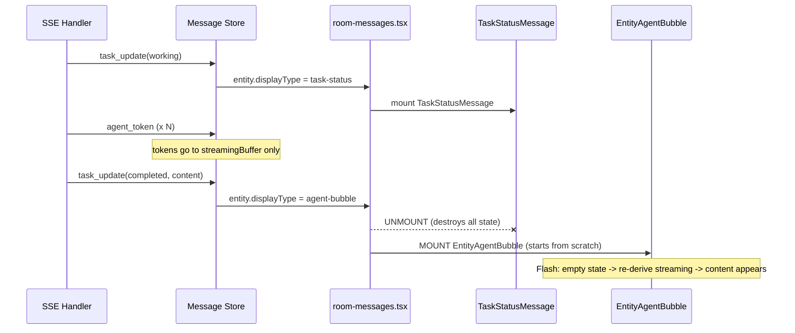

# Streaming Message Rendering Redesign

> **Status: All Phases complete (1–4)** | Addresses the recurring "one-token-per-line" and component-remount flash during agent message streaming, then completes the unification so all agent messages use a single component for their entire lifecycle.

**Supersedes**: Portions of `TOKEN_STREAMING_DESIGN.md` (Sections 4-7, rendering pipeline)
**Superseded by**: `REMOVE_AGENT_TOKEN_DESIGN.md` (Phases 2-3 of REMOVE doc now complete; all dead code deleted)

> ### Post-migration status (after `REMOVE_AGENT_TOKEN_DESIGN.md` Phases 2-3 + Phase 4 unification)
>
> This document's **Phases 1, 2, 2.5, 3, and 4 are all completed**. The `agent_token` removal migration and `TaskStatusMessage` unification are fully implemented:
>
> - **§3.2 (dual state stores)**: The `streamingBuffer` ↔ Zustand timing mismatch is eliminated — `streamingBuffer` is deleted.
> - **§3.4 (artifact-streaming bypass)**: No longer a "bypass" — artifact streaming is now the **only** path for all agents.
> - **§4.2 (derivePhase)**: The `isBufferStreaming` / `streamingText` / `isRevealing` parameters are replaced by `entity.artifacts[].isStreaming` (from `append && !last_chunk`). The REVEALING phase is dropped (Option A per REMOVE doc §4.8). The function is now a two-tier pure function: Tier 1 uses `taskStatus` as authoritative, Tier 2 infers from content signals.
> - **§4.3 (displayType switching)**: `resolveDisplayType` simplified to 2-line function — all agent messages return `'agent-bubble'`. `DisplayType` reduced to `'user-bubble' | 'agent-bubble'`. No more `'task-status'` value.
> - **§4.5 (phase transitions)**: `streamingBuffer.finalize()` references are replaced by `last_chunk=true` → `isStreaming=false`.
> - **§4.7 (retained infrastructure)**: `streaming-buffer.ts`, `useStreamingContent.ts`, `typewriter.ts`, `streaming-cursor.tsx`, and `task-status-message.tsx` are **deleted**.
> - **§8 (open questions)**: Q1, Q2, Q3, Q4 are answered by the migration. See REMOVE doc §4.5, §4.8, and Open Question #5.
>
> **Phase 4** of this doc is now complete. `TaskStatusMessage` is deleted; all agent phases render within `AgentMessageBubbleInner`.

---

## 1. Problem Statement

When an agent message streams in, users see a brief flash of malformed content -- typically one token per line in a very tall bubble -- before the display settles into its correct form. This has persisted through multiple fix attempts because it stems from structural design flaws, not isolated bugs.

The flash manifests in three distinct scenarios:

1. **Component remount flash**: A message entity's `displayType` changes from `task-status` to `agent-bubble` mid-lifecycle, causing React to unmount `TaskStatusMessage` and mount `EntityAgentBubble`. The new component starts with empty state and must re-derive streaming context from scratch, producing a visible discontinuity.

2. **Dual-renderer content mismatch**: The same raw content string is routed to either `LinkifiedContent` (interprets `\n` as `<br>`) or `MarkdownContent`/Streamdown (interprets `\n` as markdown whitespace). When content passes through the wrong renderer, or when normalization is missing during a phase transition, the layout breaks.

3. **Artifact-streaming one-word-per-line**: Some agents (notably Ollama via A2A adapter) stream content through `artifact_update` SSE events rather than `agent_token` events. Each artifact update appends a new text "part" containing a single token. The artifact merge logic was blindly appending these as separate `ArtifactPart` entries, and each rendered as a separate `<p>` element — producing one word per line. Additionally, the `showIndicator` logic only checked `entity.content` (which stays empty for artifact-based agents), keeping the typing indicator visible even after artifact content arrived.

### Why incremental fixes keep failing

Each fix addresses one symptom (normalize here, guard there) but the underlying design produces new edge cases because:

- Two independent state stores (`streamingBuffer` via rAF + Zustand via synchronous dispatch) update on different timing, creating 1-frame inconsistency windows.
- The `displayType` transition causes a full React tree teardown/rebuild, losing all accumulated component state (refs, animation progress, streaming text cache).
- Content normalization is applied at various ad-hoc points rather than being an explicit contract between data producers and renderers.
- Agents use different SSE event patterns: some stream via `agent_token`, others via `artifact_update`. The rendering pipeline assumed a single content delivery path.

---

## 2. Industry Context

The class of problems is well-documented as **FOIM (Flash of Incomplete Markdown)** -- the streaming equivalent of FOUC (Flash of Unstyled Content).

### How leading products solve it

| Product / Library | Strategy |
|---|---|
| **Streamdown** (Vercel, already in our stack) | Streaming-aware markdown parser with `remend` preprocessor that auto-completes unterminated syntax. Handles arbitrary token chunks without layout shifts when used in `streaming` mode. |
| **ChatGPT / OpenAI Codex** | Newline-delimited streaming: buffer until a complete line before rendering. Single component renders all message phases. |
| **Google Chrome team** | Official guidance: use a streaming markdown parser that calls `appendChild()` incrementally; never re-parse entire content on each chunk. |
| **Vercel AI SDK (`useChat`)** | Single hook manages the full message lifecycle. One growing string, one renderer (Streamdown). No component switching mid-stream. |
| **Streak Engineering** | Buffer incomplete markdown constructs client-side; shorten link syntax to reduce FOIM window. |

### The universal principle

> **One message, one component instance, one renderer for its entire lifecycle.**

No production chat UI switches the React component tree mid-stream for the same logical message.

---

## 3. Current Architecture (What's Wrong)

### 3.1 Message lifecycle with component switching



**Problem**: The unmount/mount destroys component state (streaming refs, animation progress, last-known preview text). The newly mounted `EntityAgentBubble` sees full `entity.content` with no streaming context, producing a raw-content flash before the typewriter kicks in.

### 3.2 Dual state stores with timing mismatch

```
streamingBuffer.finalize(messageId)  // synchronous: clears buffer maps
                                      // rAF pending: React re-render not yet triggered
store.upsertMessage({ content })     // synchronous: Zustand dispatches immediately
                                      // React sees: entity.content = full text
                                      //             streamingBuffer.isStreaming = false
                                      //             streamingBuffer.get = '' (already cleared)
                                      // Result: 1-frame gap with full content, no streaming context
```

### 3.3 Dual renderers with implicit content contract

```
AgentMessageBubbleInner
  ├─ renderStreamingPreviewAsPlainText = true
  │   └─ LinkifiedContent: splits on \n → <br> (one-token-per-line if not normalized)
  └─ renderStreamingPreviewAsPlainText = false
      └─ MarkdownContent/Streamdown: \n = markdown whitespace (safe)
```

The choice of renderer is driven by `isStreaming || isRevealing`, but the content string doesn't carry metadata about which normalization it expects. Ad-hoc `.replace(/\s+/g, ' ')` calls are the only defense.

### 3.4 Artifact-streaming agents bypass the content pipeline

```
artifact_update SSE event (Ollama)
  ├─ mergeArtifacts(append=true): parts=[{text:"The"}, {text:" Sun"}, {text:" is"}, ...]
  ├─ entity.content stays empty (content comes from artifacts, not entity.content)
  ├─ showIndicator checks only entity.content → stays true (typing indicator persists)
  └─ ArtifactList → ArtifactRenderer → PartRenderer: each part = separate <p> element
     → one word per line
```

Agents using the A2A artifact protocol (like Ollama) stream content as `artifact_update` events with `append=true`. Each event adds a new `ArtifactPart` with `kind: 'text'` containing a single token. This completely bypasses `streamingBuffer`, `useStreamingContent`, and the `entity.content` field, making all the Phase 1-2 streaming fixes invisible to these agents.

---

## 4. Proposed Design

### 4.1 Design principles

1. **One message, one component, entire lifecycle** -- A single component instance handles all phases from "working" indicator through streaming to final static display. No `displayType` switching causes remounts.

2. **Streamdown for all agent content** -- Use Streamdown in `streaming` mode during token arrival and typewriter reveal, and `static` mode for final display. Eliminate the `LinkifiedContent` fallback for agent messages entirely.

3. **Single source of streaming truth** -- Derive all streaming state from one place. Eliminate timing gaps between independent stores.

4. **Explicit content contracts** -- Each renderer declares what input format it expects. Transformations happen once, at the boundary.

### 4.2 Unified agent message component

Replace the current two-component dispatch (`TaskStatusMessage` / `EntityAgentBubble`) with a single `AgentMessage` component that renders all phases internally:

```
AgentMessage (single component, never remounts)
  ├─ Phase: WAITING    → typing indicator / task-status card (inline)
  ├─ Phase: STREAMING  → Streamdown(mode=streaming) with line-buffered tokens
  ├─ Phase: REVEALING  → Streamdown(mode=streaming) with typewriter-fed content
  └─ Phase: STATIC     → Streamdown(mode=static) with full entity.content
```

#### Phase derivation (pure function, no external state)

```typescript
type RenderPhase = 'waiting' | 'streaming' | 'revealing' | 'static'

function derivePhase(
  entity: MessageEntity,
  isBufferStreaming: boolean,
  streamingText: string,
  isRevealing: boolean,
): RenderPhase {
  // Entity has final content and nothing is animating
  if (entity.content && !isBufferStreaming && !isRevealing) return 'static'

  // Typewriter is actively revealing
  if (isRevealing) return 'revealing'

  // Buffer has displayable content
  if (isBufferStreaming && streamingText.trim()) return 'streaming'

  // Everything else: waiting for first content
  return 'waiting'
}
```

**Important ordering note**: The `static` check runs first to catch the common case (fully loaded messages). The `isRevealing` parameter is set synchronously during render via the existing `prevIsStreaming` ref pattern (see `EntityAgentBubble` lines 651-660) before `derivePhase` is called. This means on the transition frame where streaming just ended and `entity.content` arrives, `isRevealing` is already `true`, so `derivePhase` returns `revealing` rather than `static`. The typewriter reveal is never skipped.

#### Rendering by phase

```
WAITING:
  ┌──────────────────────────────────────────┐
  │ [Agent Avatar] Agent Name                │
  │ [Spinner] Working on your request...     │
  │ [Clock] 3s elapsed                       │
  └──────────────────────────────────────────┘
  (Embed task metadata: stepNumber, totalSteps, statusMessage, taskContent)

STREAMING / REVEALING:
  ┌──────────────────────────────────────────┐
  │ [Agent Avatar] Agent Name                │
  │                                          │
  │ <Streamdown mode="streaming">            │
  │   {content}                              │
  │ </Streamdown>                            │
  │                                          │
  └──────────────────────────────────────────┘
  (content = streamingText for STREAMING, entity.content.slice(0, n) for REVEALING)

STATIC:
  ┌──────────────────────────────────────────┐
  │ [Agent Avatar] Agent Name                │
  │                                          │
  │ <Streamdown mode="static">              │
  │   {entity.content}                       │
  │ </Streamdown>                            │
  │                                          │
  │ [Artifacts if any]                       │
  └──────────────────────────────────────────┘
```

### 4.3 Eliminate displayType switching for streaming messages

Modify `resolveDisplayType` so that an agent message that will receive streaming tokens is **always** resolved as `agent-bubble` from the moment it's created:

```typescript
// Current: ephemeral + taskStatus(WORKING) → 'task-status'
// Proposed: ephemeral + taskStatus(WORKING) → 'agent-bubble'
//           (the AgentMessage component renders task status UI internally)

export function resolveDisplayType(msg: { ... }): DisplayType {
  if (msg.messageType === 'user') return 'user-bubble'

  // Agent messages always render as agent-bubble.
  // Task metadata (status, errors, HITL) is rendered *within* the agent bubble.
  // TaskStatusMessage is reserved for standalone task-only entities (no message content expected).
  if (msg.isEphemeral) return 'agent-bubble'
  if (!msg.taskStatus) return 'agent-bubble'

  const isTerminal = ['completed', 'failed', 'rejected', 'canceled'].includes(msg.taskStatus)
  const hasContent = !!msg.content?.trim()
  const hasArtifacts = !!msg.artifacts && msg.artifacts.length > 0

  if (isTerminal && (hasContent || hasArtifacts)) return 'agent-bubble'

  // Terminal states WITHOUT content (failed, rejected, canceled with only an error
  // string, or completed with empty content) render as task-status cards because
  // the agent bubble has no meaningful content to display.
  if (isTerminal && !hasContent && !hasArtifacts) return 'task-status'

  // Non-terminal interactive states where no streaming is expected
  // (standalone task cards like auth-required, input-required)
  if (msg.taskStatus === 'input_required' || msg.taskStatus === 'auth_required') {
    return 'task-status'
  }

  // Working/submitted: render as agent-bubble so the unified component handles it
  return 'agent-bubble'
}
```

### 4.4 Feed Streamdown directly (eliminate LinkifiedContent for agents)

The `LinkifiedContent` component was introduced as a workaround for Streamdown's inability to handle single-token chunks from local models. Streamdown has since been improved with its `remend` preprocessor. The line-buffering in `streamingBuffer.deriveRenderableText()` already ensures tokens are delivered in complete-line chunks.

With these two safeguards, Streamdown in `streaming` mode can handle the buffered content directly:

```typescript
// Before: two renderers with normalization workaround
{renderStreamingPreviewAsPlainText ? (
  <LinkifiedContent content={displayContent.replace(/\s+/g, ' ').trimStart()} />
) : (
  <MarkdownContent content={displayContent} isStreaming={isStreaming} />
)}

// After: single renderer for all phases
<MarkdownContent
  content={displayContent}
  isStreaming={phase === 'streaming' || phase === 'revealing'}
/>
```

If Streamdown still produces one-token-per-line for certain models, the fix belongs inside `deriveRenderableText` (buffer more aggressively) rather than at the renderer boundary. This maintains the single-renderer invariant.

### 4.5 Smooth phase transitions (no flash)

The key to eliminating flash is that **all phase transitions happen within the same mounted component instance**. React state (refs, animation progress, cached text) is preserved across transitions:

```
WAITING → STREAMING:
  streamingText goes from '' to first complete line.
  derivePhase returns 'streaming'.
  Streamdown(mode=streaming) mounts with initial content.
  No unmount/remount. Component state preserved.

STREAMING → REVEALING:
  streamingBuffer.finalize() clears buffer.
  entity.content arrives with full text.
  Component detects streaming→done transition (existing prevIsStreaming ref logic).
  Sets isRevealing=true, starts typewriter from last-known streaming length.
  Streamdown stays mounted, mode stays 'streaming', content grows via slice.

REVEALING → STATIC:
  revealedChars reaches entity.content.length.
  isRevealing=false.
  derivePhase returns 'static'.
  Streamdown switches to mode='static'. Single re-render, no flash.
```

### 4.6 Task metadata display within the agent bubble

The `WAITING` phase renders task metadata (step indicator, elapsed time, status message) inline within the agent bubble chrome. This replaces what `TaskStatusMessage` currently shows for `WORKING`/`SUBMITTED` states.

The component needs a local `elapsed` timer (1-second interval via `useEffect`, cleared on phase transition out of `WAITING`) and access to `entity.taskCreatedAt` for the initial value. This replicates the timer logic currently in `TaskStatusMessage` (lines 228-234 of `task-status-message.tsx`).

```typescript
// Inside the unified AgentMessage component
{phase === 'waiting' && (
  <div className="flex items-start gap-2">
    <Loader2 className="w-4 h-4 animate-spin mt-0.5 shrink-0" />
    <span className="text-sm shimmer-text">
      {entity.taskStatusMessage || entity.taskContent || 'Working on your request...'}
    </span>
  </div>
)}
```

`TaskStatusMessage` continues to exist for truly standalone task states that don't involve message content: `input_required` (HITL panel handles this), `auth_required`, and terminal failure states without streaming (`failed`, `rejected`, `canceled` where no `agent_token` events were sent). **Phase 4 (§5 Phase 4) eliminates this component entirely — all these states render as phase-conditional sections within `AgentMessageBubbleInner`.**

### 4.7 Retained infrastructure

> **Post-migration note**: After `REMOVE_AGENT_TOKEN_DESIGN.md` Phases 2-3 implementation, `streaming-buffer.ts`, `useStreamingContent.ts`, `typewriter.ts`, and `streaming-cursor.tsx` are **deleted**. The current streaming infrastructure is:

| Module | Role |
|---|---|
| `message-store/upsert.ts` | `mergeArtifacts` + `mergeTextParts` — core artifact accumulation and text concatenation |
| `part-renderer.tsx` | `TextPartView` renders streaming text via `MarkdownContent` with `isStreaming` prop |
| `artifact-renderer.tsx` | Suppresses card chrome for `-stream` text-only artifacts; threads `isStreaming` to parts |
| `markdown-content.tsx` | Streamdown wrapper (`MarkdownContent`) — used for both main content and artifact text parts |

---

## 5. Migration Plan

### Phase 1: Unify the agent message component ✅ DONE

**Files changed**: `message-bubble.tsx`, `room-messages.tsx`, `resolve-display-type.ts`, `useRoomWebhook.ts`

1. ~~Add a `WAITING` phase to `EntityAgentBubble` that renders inline task status (spinner, elapsed time, status message) when `entity.content` is empty and no streaming is active.~~ Done.
2. ~~Update `resolveDisplayType` to return `agent-bubble` for `WORKING`/`SUBMITTED` task states (instead of `task-status`).~~ Done.
3. ~~Update `MemoizedMessage` in `room-messages.tsx` to pass task metadata props to `EntityAgentBubble`.~~ Done.
4. ~~Update the processing placeholder guard in `useRoomWebhook.ts` (line 473): the `hasTaskEntities` check currently filters by `displayType === 'task-status'`. Since `WORKING` entities now resolve as `agent-bubble`, change this to filter by `e.taskStatus && PENDING_STATES.includes(e.taskStatus)` to avoid creating duplicate placeholders.~~ Done.

**Result**: Messages no longer switch between `TaskStatusMessage` and `EntityAgentBubble`. The component-remount flash is eliminated.

**Side-effect simplification**: The guard in `useRoomWebhook.ts` that skips non-terminal `task_update` upserts during active streaming was added to prevent `displayType` from flipping back to `task-status`. With `WORKING` now resolving as `agent-bubble`, the displayType flip no longer happens.

### Phase 2: Feed Streamdown directly for all phases ✅ DONE

**Files changed**: `message-bubble.tsx`

1. ~~Remove the `renderStreamingPreviewAsPlainText` prop and the `LinkifiedContent` branch from `AgentMessageBubbleInner`.~~ Done.
2. ~~Pass all `displayContent` through `MarkdownContent` with `isStreaming` set appropriately per phase.~~ Done. `isStreaming` is now `isStreaming || isRevealing` so Streamdown uses streaming mode during both live streaming and typewriter reveal.
3. ~~Remove the `.replace(/\s+/g, ' ').trimStart()` normalization (no longer needed -- Streamdown handles whitespace natively).~~ Done.

**Result**: Single renderer for all content. Eliminates the dual-renderer content contract issue entirely.

### Phase 2.5: Fix artifact-streaming one-word-per-line ✅ DONE

**Files changed**: `message-store/upsert.ts`, `message-bubble.tsx`, `useRoomWebhook.ts`

Discovered that the "one-token-per-line" bug persisted for Ollama because it streams content via `artifact_update` SSE events rather than `agent_token`. This is an entirely different code path that was missed by Phases 1 and 2.

**Root cause analysis** (via diagnostic logging):
- Ollama's SSE event flow: `processing_status` → `task_submitted(working)` → `artifact_update` × N → `task_update(completed)`. No `agent_token` events are sent.
- Each `artifact_update` appends a new text `ArtifactPart` containing a single token/word.
- `mergeArtifacts` (in `upsert.ts`) appended these as separate parts: `[{text:"The"}, {text:" Sun"}, {text:" is"}, ...]`.
- `PartRenderer` → `TextPartView` renders each part as a separate `<p className="whitespace-pre-wrap">` element, producing one word per line.
- The `showIndicator` logic in `EntityAgentBubble` only checked `entity.content` (empty for artifact agents), keeping the typing indicator visible even after artifact content arrived below.

**Changes**:

1. **`src/stores/message-store/upsert.ts`** — Added `mergeTextParts()` helper. When appending artifact parts during streaming, consecutive text parts are concatenated into a single part instead of creating separate elements:
   ```typescript
   function mergeTextParts(existing, incoming) {
     const result = [...existing]
     for (const part of incoming) {
       const last = result[result.length - 1]
       if (part.kind === 'text' && last?.kind === 'text') {
         result[result.length - 1] = { ...last, text: (last.text || '') + (part.text || '') }
       } else {
         result.push(part)
       }
     }
     return result
   }
   ```

2. **`src/components/message-bubble.tsx`** — Updated `showIndicator` to account for artifact-based content:
   ```typescript
   const hasArtifactContent = (entity.artifacts?.length ?? 0) > 0
   const showIndicator =
     ((!isStreaming && !isRevealing && !entity.content) ||
     (isStreaming && !streamingPreviewText.trim())) &&
     !hasArtifactContent
   ```

3. **`src/hooks/useRoomWebhook.ts`** — (Done in earlier fix) The `agent_token` handler now proactively removes the processing placeholder when creating an ephemeral streaming entity, and `task_submitted` handler also removes the placeholder. This prevents dual-bubble display regardless of SSE event ordering.

**Additional fix applied earlier**: Removed the `transition-[grid-template-rows] duration-200` CSS class from the content wrapper div in `AgentMessageBubbleInner`. This 200ms CSS transition was causing a visible height animation from the collapsed indicator to the expanded content, which briefly displayed the raw content in a partially-expanded state for non-streaming agents.

### Phase 3: Clean up dead code ✅ DONE (via REMOVE_AGENT_TOKEN_DESIGN.md Phases 2-3)

**Subsumed by `REMOVE_AGENT_TOKEN_DESIGN.md`**. All dead code from the `agent_token` infrastructure has been deleted:

- `streaming-buffer.ts`, `useStreamingContent.ts`, `typewriter.ts`, `streaming-cursor.tsx` — deleted
- Associated test files (`streaming-lifecycle.test.ts`, `typewriter.test.ts`, `streaming-buffer.test.ts`, `useStreamingContent.test.ts`) — deleted
- `LinkifiedContent` usage for agent messages — removed in Phase 2
- `renderStreamingPreviewAsPlainText` prop — removed in Phase 2
- `displayContent` ternary and `lastStreamingPreviewRef` — simplified in Phase 2
- `TaskStatusMessage` scope narrowed to HITL/auth/failure-only states in Phase 1

### Phase 4: Complete unification — eliminate TaskStatusMessage ✅ DONE

> **Answers Open Question #2.** Absorbed all remaining `TaskStatusMessage` rendering cases into `AgentMessageBubbleInner`. Deleted the `task-status` display type, the `TaskStatusMessage` component, and simplified the `resolveDisplayType` routing logic.

#### 4a. Motivation

Phases 1–3 unified the **happy path** (working → streaming → complete-with-content) into the agent bubble. But six task states still render as a separate `TaskStatusMessage` component:

| State | Current behavior |
|---|---|
| `failed` / `rejected` / `canceled` | Red card via `TaskStatusMessage` |
| `input-required` (active HITL) | `TaskStatusMessage` returns `null`; HitlPanel in chat input handles interaction |
| `input-required` (resolved HITL) | Amber card showing prompt + user's answer |
| `auth-required` | Amber card with auth prompt |
| `completed` (empty content, no artifacts) | Green "Completed" card |

This means the `displayType` field, the `resolveDisplayType` function, and the three-way switch in `MemoizedMessage` all still exist. A working agent bubble still **swaps to a different component** when it hits a failure or HITL state — the same class of unmount/remount problem that Phases 1–3 solved for streaming.

#### 4b. Industry alignment

Every major AI chat SDK has converged on a single-component-per-message pattern:

| Product | Pattern |
|---|---|
| **Vercel AI SDK v5** | One `<Message>` component; `message.status` (`submitted` / `streaming` / `ready` / `error`) drives visual presentation, not component selection. `message.parts` array rendered by type (text, tool-invocation, reasoning). |
| **Stream Chat React SDK** | `StreamedMessageText` always renders the message; `AIStateIndicator` is a separate overlay for channel-level processing state, not a replacement component. `ai_state` (`IDLE` / `THINKING` / `GENERATING` / `ERROR`) is data, not a component switch. |
| **AG-UI Protocol** | Lifecycle events (`RUN_STARTED` → `STEP_*` → `RUN_FINISHED` / `RUN_ERROR`) flow into a single message node. No component swap between phases. |
| **LangChain Agent Chat UI** | `<Message>` renders text + `toolCalls[]` inline. Each tool call has a `state` ("pending" / "completed" / "error") rendered as a sub-section, not a separate component. |
| **CopilotKit** | Used component switching based on `status` — resulted in persistent bugs: stuck `inProgress`, undefined `status`, lost state on reload. Multiple PRs required to patch. **Cautionary tale matching our current architecture.** |

#### 4c. What changes

**`resolve-display-type.ts`** — All agent messages return `'agent-bubble'`. The function simplifies to:

```typescript
export function resolveDisplayType(msg: {
  messageType: 'user' | 'agent'
}): DisplayType {
  return msg.messageType === 'user' ? 'user-bubble' : 'agent-bubble'
}
```

The `DisplayType` union drops `'task-status'`.

**`message-store/types.ts`** — `DisplayType` becomes `'user-bubble' | 'agent-bubble'`.

**`room-messages.tsx` → `MemoizedMessage`** — The switch reduces to two cases (user-bubble, agent-bubble). The `TaskStatusMessage` import is removed.

**`message-bubble.tsx` → `EntityAgentBubble` / `AgentMessageBubbleInner`** — Gains phase-conditional rendering for all agent message phases. The component derives a `phase` at render time from entity fields:

```typescript
type AgentPhase =
  | 'waiting'       // submitted/working, no content yet
  | 'streaming'     // working, artifacts arriving with isStreaming=true
  | 'interactive'   // input-required or auth-required
  | 'failed'        // failed/rejected/canceled
  | 'complete'      // completed with content or artifacts
  | 'complete-empty' // completed without content (rare edge case)

/**
 * Pure O(1) function: derives the visual phase from entity fields at render time.
 *
 * Tier 1: taskStatus is authoritative when present.
 * Tier 2: no taskStatus — infer from content/streaming signals.
 */
function derivePhase(entity: MessageEntity): AgentPhase {
  const hasContent = !!entity.content?.trim()
  const hasArtifacts = (entity.artifacts?.length ?? 0) > 0
  const isStreaming = entity.artifacts?.some(a => a.isStreaming) ?? false
  const hasVisibleBody = hasContent || hasArtifacts

  // ── Tier 1: taskStatus is authoritative when present ──

  if (entity.taskStatus && isFailureState(entity.taskStatus)) return 'failed'

  if (entity.hitlResolved && entity.hitlUserAnswer) return 'interactive'

  if (entity.taskStatus && isInteractiveState(entity.taskStatus)) return 'interactive'

  if (entity.taskStatus === TASK_STATE.COMPLETED) {
    return hasVisibleBody ? 'complete' : 'complete-empty'
  }

  if (entity.taskStatus && !isTerminalState(entity.taskStatus)) {
    return hasVisibleBody ? 'streaming' : 'waiting'
  }

  // ── Tier 2: no taskStatus — infer from content signals ──

  if (isStreaming) return 'streaming'
  if (hasVisibleBody) return 'complete'
  return 'waiting'
}
```

This replaces `resolveDisplayType` as the single source of truth for visual presentation. The key difference: it's computed at **render time inside the component**, not at **write time in the store**.

#### 4d. Phase-to-style mapping

A configuration object replaces the hundreds of lines of scattered color classes across the current two components. `PHASE_STYLES` is a **partial map** — only phases with fixed semantic colors have entries. Phases that inherit the per-agent color palette (`streaming`, `complete`) are not in the map and fall through to `getAgentColorClasses(entity.agentId)`:

```typescript
type PhaseStyleEntry = {
  border: string
  bg: string
  text: string
  icon: LucideIcon
  badge: string | ((entity: MessageEntity) => string)
}

const PHASE_STYLES: Partial<Record<AgentPhase, PhaseStyleEntry>> = {
  waiting:        { border: 'border-blue-200 dark:border-blue-500/20',
                    bg: 'bg-blue-50 dark:bg-blue-500/12',
                    text: 'text-blue-600 dark:text-blue-400',
                    icon: Loader2, badge: 'Working...' },
  interactive:    { border: 'border-amber-200 dark:border-amber-500/20',
                    bg: 'bg-amber-50 dark:bg-amber-500/12',
                    text: 'text-amber-700 dark:text-amber-400',
                    icon: MessageCircleQuestion,
                    badge: (entity) => {
                      if (entity.hitlResolved) return 'Answered'
                      if (entity.taskStatus === 'auth-required') return 'Auth needed'
                      return 'Input needed'
                    } },
  failed:         { border: 'border-red-200 dark:border-red-500/20',
                    bg: 'bg-red-50 dark:bg-red-500/12',
                    text: 'text-red-600 dark:text-red-400',
                    icon: XCircle,
                    badge: (entity) => {
                      if (entity.taskStatus === 'rejected') return 'Rejected'
                      if (entity.taskStatus === 'canceled') return 'Canceled'
                      return 'Failed'
                    } },
  'complete-empty': { border: 'border-emerald-200 dark:border-emerald-500/20',
                      bg: 'bg-emerald-50 dark:bg-emerald-500/12',
                      text: 'text-emerald-600 dark:text-emerald-400',
                      icon: CheckCircle, badge: 'Completed' },
} as const

function getPhaseStyles(phase: AgentPhase, entity: MessageEntity) {
  const entry = PHASE_STYLES[phase]
  if (!entry) return null // streaming/complete → use getAgentColorClasses
  const badge = typeof entry.badge === 'function' ? entry.badge(entity) : entry.badge
  return { ...entry, badge }
}
```

For `streaming` and `complete` phases, `getPhaseStyles` returns `null` and the existing `getAgentColorClasses(entity.agentId)` palette is used (per-agent colors). For status-specific phases (`waiting`, `interactive`, `failed`, `complete-empty`), fixed semantic colors communicate state. The `badge` field is either a static string or a function that derives dynamic text from the entity (e.g., distinguishing "Failed" vs "Rejected" vs "Canceled", or "Input needed" vs "Answered" vs "Auth needed").

#### 4e. Component structure

```
AgentMessageBubbleInner (single component, always mounted)
  ├── Header (always rendered)
  │   ├── Agent avatar (icon from PHASE_STYLES or agent initials)
  │   ├── Agent name link
  │   ├── StepIndicator (when stepNumber/totalSteps present)
  │   ├── Source badge (hub/cloud)
  │   └── Status badge (from PHASE_STYLES.badge) or timestamp
  │
  ├── Phase: WAITING
  │   └── Spinner + statusMessage/taskContent + elapsed timer
  │
  ├── Phase: STREAMING
  │   └── Content grid (existing) + ArtifactList
  │
  ├── Phase: INTERACTIVE
  │   ├── HITL prompt (MarkdownContent)
  │   ├── "Your answer" section (when hitlResolved + hitlUserAnswer)
  │   └── Elapsed timer (when !hitlResolved)
  │   Note: when hitlResolved=false, content area shows prompt;
  │         HitlPanel in chat input handles the actual input UI
  │
  ├── Phase: FAILED
  │   ├── Error/content body (MarkdownContent)
  │   └── Failure sub-type badge ("Task failed" / "rejected" / "canceled")
  │
  ├── Phase: COMPLETE
  │   ├── Content (MarkdownContent, existing)
  │   └── ArtifactList (existing)
  │
  ├── Phase: COMPLETE-EMPTY
  │   └── "Completed" badge + elapsed time (minimal card)
  │
  └── Footer (conditional)
      └── Expand/collapse toggle (when content > 500 chars)
```

The `INTERACTIVE` phase with `hitlResolved=false` no longer returns `null`. Instead it renders the prompt text inside the bubble (amber-styled) while the HitlPanel in the chat input bar handles the actual response UI. This eliminates the "disappearing message" behavior where the active HITL bubble used to vanish.

#### 4f. What gets deleted

| Artifact | Status |
|---|---|
| `src/components/task-status-message.tsx` | ✅ Deleted |
| `tests/unit/components/task-status-message.test.tsx` | ✅ Deleted |
| `'task-status'` variant in `DisplayType` union | ✅ Removed from `types.ts` |
| `resolveDisplayType` edge cases | ✅ Simplified to 2-line function |
| `resolve-display-type.test.ts` | ✅ Simplified (all agent → `'agent-bubble'`) |
| `MemoizedMessage` task-status branch | ✅ Removed switch case |
| `room-messages.tsx` TaskStatusMessage import | ✅ Removed |
| `displayType` field on `MessageEntity` | ✅ Kept (routes user vs agent), `'task-status'` value removed |
| `upsert.ts` displayType resolution | ✅ Simplified (no task-status logic) |
| `isNoOpUpdate` displayType check | ✅ Simplified |

#### 4f-1. Additional consumers of `displayType` that must be updated

The following code reads `displayType` or `'task-status'` outside the primary rendering path. Each must be updated during Phase 4 or the migration will break:

1. **`useProcessingRestore.ts` (line 48)** — Checks `e.displayType === 'task-status'` to decide whether to skip creating a placeholder on page-load recovery. With `'task-status'` removed, this guard must change to `e.taskStatus && PENDING_STATES.includes(e.taskStatus)` (check for pending task entities by status, not display type). This is the same fix already applied to the SSE handler guard in Phase 1 — it was missed in this hook.

2. **`cancelAllNonTerminal` in `message-store/index.ts` (line 201)** — Calls `resolveDisplayType({ ..., taskStatus: 'canceled' })` to compute the new `displayType` when batch-canceling. After Phase 4, `resolveDisplayType` always returns `'agent-bubble'` for agent messages, so this call simplifies but must still be updated to pass only `{ messageType }`.

3. **`room-messages.tsx` (lines 152–159 and 167–177)** — `allAgentIds` (line 156) is computed by filtering `e.displayType === 'agent-bubble'`. `lastAgentMessageId` (line 171) uses the same filter to find the last agent message for auto-expand. After Phase 4, all agent messages are `'agent-bubble'`, so both filters could simplify to `e.messageType === 'agent'`. However, the current behavior of excluding task-status entities from the expand/collapse pill is **intentional** — failure/HITL cards were not expandable. After unification, the expand/collapse behavior needs to be revisited: failed and interactive phase bubbles should either (a) be excluded from bulk expand/collapse via `derivePhase`, or (b) support expand/collapse like normal agent messages. **Recommendation**: filter by `derivePhase(e)` being `'complete'` or `'streaming'` for both `allAgentIds` and `lastAgentMessageId`, since waiting/failed/interactive/complete-empty bubbles have no long-form content to collapse. Note: `lastAgentMessageId` drives the auto-collapse of prior responses (line 180), so including waiting-phase messages would trigger premature collapse of the message above before content arrives.

4. **`isNoOpUpdate` in `upsert.ts` (line 249)** — Compares `existing.displayType === incomingDisplayType`. After Phase 4, this check becomes trivially true for all agent messages (always `'agent-bubble'`). The `isNoOpUpdate` function is still needed for other field comparisons, but the `displayType` line can be removed entirely since it will never differ.

5. **`upsert.ts` displayTaskStatus logic (lines 65–72)** — The special-case logic that preserves existing `taskStatus` for displayType resolution (to keep HITL answered entities on their `task-status` card) is no longer needed when `resolveDisplayType` ignores `taskStatus`. This code block can be removed and `resolveDisplayType` called with just `{ messageType }`.

6. **`message-store/index.ts` (line 11)** — Exports `resolveDisplayType` for external consumers. After simplification, this export is still valid but should be verified that no other modules import it directly.

7. **`upsert.test.ts` test fixtures** — Multiple test cases use `makeEntity({ displayType: 'task-status' })` in their fixtures (lines 99, 114, 142, 154). These must be updated to `'agent-bubble'` since `'task-status'` will no longer be a valid `DisplayType` value.

#### 4g. HITL behavior change

**Before (current)**:
1. `hitl_input_requested` SSE → entity gets `taskStatus: 'input-required'`, `hitlResolved: false`
2. `resolveDisplayType` returns `task-status`
3. `TaskStatusMessage` renders → sees `hitlResolved === false` → returns `null`
4. HitlPanel in chat input handles user interaction
5. User responds → `hitlResolved: true` → `TaskStatusMessage` renders amber card with prompt + answer
6. Agent resumes → new entity for the completion arrives as `agent-bubble`

**After (Phase 4)**:
1. `hitl_input_requested` SSE → entity gets `taskStatus: 'input-required'`, `hitlResolved: false`
2. `derivePhase` returns `interactive`
3. `AgentMessageBubbleInner` renders amber-styled bubble showing the prompt
4. HitlPanel in chat input handles user interaction (unchanged)
5. User responds → `hitlResolved: true` → same bubble updates to show prompt + answer
6. Agent resumes → if same entity gets `task_update(completed)`, bubble transitions to `complete` phase **in place**

The key improvement: steps 3→5→6 all happen within the **same mounted component**. No unmount/remount, no state loss, no visual discontinuity.

#### 4g-1. Gaps and potential issues identified during design review

**Gap 1: `AgentMessageBubbleInner` prop interface does not carry entity data**

The current `AgentMessageBubbleInner` receives a `BubbleMessage` (only `id`, `content`, `sender_name`, `timestamp`, `agent_id`, `agentSource`) plus a `waitingInfo` bag. It has **no access** to `taskStatus`, `taskError`, `hitlPrompt`, `hitlResolved`, `hitlUserAnswer`, `hitlChoices`, `hitlPromptType`, `hitlExpiresAt`, `stepNumber`, `totalSteps`, or `taskContent`. All of these are needed for the `interactive`, `failed`, and `complete-empty` phases.

**Resolution**: Step 4 of the migration must refactor `EntityAgentBubble` → `AgentMessageBubbleInner` to pass the full `MessageEntity` instead of the `BubbleMessage` adapter. The `entityToBubble` function and `BubbleMessage` interface become unnecessary for the agent path. The `waitingInfo` prop is also removed since `derivePhase` + entity fields cover it.

**Gap 2: `TaskStatusMessage` maintains duplicate state via `useState`**

The current `TaskStatusMessage` copies every prop into internal `useState` (lines 157–162) and runs its own `handleUpdate` deduplication. This internal state diverges from the store — it was necessary because the component received props from a parent switch, not from a reactive store selector.

After unification, `AgentMessageBubbleInner` reads the `MessageEntity` via the Zustand `useMessage(id)` selector (already in place via `MemoizedMessage`). The store is the single source of truth, so all the `useState` + `useEffect` synchronization logic in `TaskStatusMessage` (lines 157–225) can be **dropped entirely**. The only `useState` needed in the unified component is the elapsed timer.

**Resolution**: Do not port the `useState` synchronization pattern from `TaskStatusMessage`. The elapsed timer should be a simple `useEffect`/`useState` pair driven by `entity.taskCreatedAt` and `phase`, similar to the existing `elapsed` state in `AgentMessageBubbleInner`.

**Gap 3: `derivePhase` ordering has a subtle edge case with `failed` + `content`**

In the proposed `derivePhase`:
```
if (entity.taskStatus && isFailureState(entity.taskStatus)) return 'failed'
```
This runs *before* the `complete` check. But the current `TaskStatusMessage` actually renders failed states with their `content` via `MarkdownContent` (line 307: `displayBody = error || content || titles[status]`). Meanwhile, the current `resolveDisplayType` routes `failed` without content to `task-status`, but `failed` *with* content... actually still goes to `task-status` (the `COMPLETED` check on line 33 only catches `completed`).

So the design is correct — `failed` always goes to the `failed` phase regardless of content. But the **rendering** within the `failed` phase section must handle both cases: show `entity.taskError || entity.content || title` as the body. The design doc's component structure (§4e) shows `Failed` phase has "Error/content body (MarkdownContent)" which covers this. No code issue, just confirming the design handles it.

**Gap 4: `completed` with content *and* failing `isFailureState` — impossible but should be defensive**

The A2A protocol does not produce a message that is both `completed` and `failed`. But if a stale-detection or race condition produces `taskStatus: 'failed'` on an entity that already has `content`, the `failed` phase will render. This is correct — failure takes precedence. No gap, just a note for testing.

**Gap 5: The `EntityBubbleProps` interface is shared between user and agent paths**

Currently `AgentMessageBubbleInner` and the `EntityBubbleProps` interface serve only the agent bubble. But `EntityBubbleProps` is generic (no HITL/task fields). After adding entity-level props for Phase 4, this interface will grow significantly. Consider renaming it or splitting it to avoid confusion.

**Gap 6: `completed + content` currently renders in `TaskStatusMessage` (green card) but design routes it to `complete` phase (agent palette)**

When `taskStatus === 'completed'` and `content` exists, the current `resolveDisplayType` returns `'agent-bubble'` (line 33), so it already renders via the agent bubble — the green-card path in `TaskStatusMessage` (lines 262-297) is actually **dead code** for store-hydrated entities. This is because `resolveDisplayType` catches `COMPLETED + hasContent` before falling through to `'task-status'`.

However, there's a subtlety: the `TaskStatusMessage` still has the "Completed in X elapsed" badge for this case. After unification, the `complete` phase should carry elapsed time information too. The current `AgentMessageBubbleInner` does not show elapsed time for completed messages.

**Resolution**: Add optional elapsed-time display to the `complete` phase when `entity.taskCreatedAt` is available (shows "Completed in Xs" in the header). This is a minor UX enhancement, not a blocker.

**Gap 7: The `INTERACTIVE` phase `hitlResolved=false` renders the bubble (not null)**

The design doc (§4e note, §4g) correctly states this is a deliberate **behavior change**: the current `TaskStatusMessage` returns `null` for active HITL, but the new unified component will render the amber prompt. This is an improvement (no disappearing message), but it means the message list will have an additional visible bubble that didn't exist before. Need to verify this doesn't cause scroll position issues or confuse users who are used to the HitlPanel-only interaction.

**Resolution**: Already noted in §4g. Add this scenario explicitly to the manual testing matrix. Consider whether the amber prompt bubble should have reduced opacity or a "Responding below..." hint to guide users to the HitlPanel.

**Gap 8: `room-messages.tsx` TaskStatusMessage receives computed props (lines 104-107)**

The current `MemoizedMessage` computes `content` conditionally for `TaskStatusMessage`:
```tsx
content={
  entity.taskStatus === TASK_STATE.WORKING || entity.taskStatus === TASK_STATE.SUBMITTED
    ? null
    : (entity.content || null)
}
```
This null-ing of content for working/submitted states is specific to the task-status rendering path. After unification, this logic moves into `derivePhase` — the `waiting` phase simply doesn't render the content area. But we must ensure that the `entity.content` is not accidentally rendered during the `waiting` phase.

**Resolution**: `AgentMessageBubbleInner` already has `showIndicator` + `grid-rows-[0fr]` to hide content during waiting. After Phase 4, this should be driven by `phase === 'waiting'` instead of the current `showIndicator` boolean.

**Gap 9: `storeVersion` drives `allAgentIds` / `lastAgentMessageId` recomputation and may over-trigger**

`storeVersion` (line 149) increments on every `displayType` transition (Gap 15 comment in the source). After Phase 4, `displayType` no longer changes mid-lifecycle, so `storeVersion` is no longer needed as an invalidation signal for these two `useMemo` blocks. However, the expand/collapse logic now depends on `derivePhase(e)`, which reads `taskStatus`, `hitlResolved`, etc. — fields that change during the entity lifecycle.

**Resolution**: Replace `storeVersion` with a `useShallow` selector pattern. Instead of subscribing to a global version counter, subscribe to `orderedIds` and derive `allAgentIds` / `lastAgentMessageId` reactively via `useMessageStore(useShallow(s => ...))`. This avoids over-rendering on unrelated store changes. The filter callback should call `derivePhase()` inline, and since `derivePhase` is O(1) per entity (see constraint below), the full scan is O(n) with n = number of messages — acceptable for typical conversation lengths.

```typescript
const allAgentIds = useMessageStore(useShallow(s =>
  orderedIds.filter(id => {
    const e = s.entities[id]
    if (!e || e.messageType !== 'agent') return false
    const phase = derivePhase(e)
    return phase === 'complete' || phase === 'streaming'
  })
))
```

This eliminates the `storeVersion` subscription and eslint-disable comments, and only re-runs the filter when actual entity data changes.

**Gap 10: Elapsed timer `useEffect` must depend on `phase` to clean up across transitions**

The current elapsed timer (message-bubble.tsx lines 276-283) depends on `showIndicator` and `waitingInfo?.taskCreatedAt`. After Phase 4, the timer is needed for multiple phases: `waiting`, `interactive` (active), and `complete` (if showing "Completed in Xs"). The `useEffect` dependency array must include `phase` so the interval is properly cleaned up and re-created when the phase changes (e.g., `waiting` → `streaming` must clear the timer).

**Resolution**: The timer `useEffect` should be:

```typescript
const [elapsed, setElapsed] = useState(() =>
  entity.taskCreatedAt ? elapsedSeconds(entity.taskCreatedAt) : 0
)

useEffect(() => {
  const needsTimer = phase === 'waiting' || (phase === 'interactive' && !entity.hitlResolved)
  if (!needsTimer || !entity.taskCreatedAt) {
    setElapsed(0)
    return
  }
  setElapsed(elapsedSeconds(entity.taskCreatedAt))
  const id = setInterval(() => {
    setElapsed(elapsedSeconds(entity.taskCreatedAt!))
  }, 1000)
  return () => clearInterval(id)
}, [phase, entity.taskCreatedAt, entity.hitlResolved])
```

Key details:
- `phase` in the dependency array ensures cleanup when transitioning away from a ticking phase.
- `entity.hitlResolved` in the dependency array stops the timer when the user responds to HITL.
- The `setInterval` callback reads `entity.taskCreatedAt` via closure, which is safe because `entity.taskCreatedAt` is immutable once set (never changes after the initial `task_submitted` event). If it were mutable, a `useRef` pattern would be needed to avoid stale closures — but immutability is guaranteed here.
- For the `complete` phase, elapsed time is a static snapshot (time from creation to completion), not a ticking counter. It should be computed once at render: `elapsedSeconds(entity.taskCreatedAt)` when `phase === 'complete'`, not via the `useEffect` interval.

#### 4h. A2A spec alignment review

Cross-referenced against A2A Protocol v1.0 (`specification/a2a.proto`, `specification.md`, `life-of-a-task.md`).

**Aligned:**

- **All 9 TaskState values** match. The frontend's `TASK_STATE` constant (from `@a2a-js/sdk`) covers `submitted`, `working`, `completed`, `failed`, `canceled`, `rejected`, `input-required`, `auth-required`, `unknown`. The proto enum has 9 values (including `UNSPECIFIED`/`unknown`). The design's `derivePhase` handles all of them.
- **Terminal vs interrupted classification** matches. The spec classifies `completed`, `failed`, `canceled`, `rejected` as terminal (absorbing — no further transitions). The frontend's `TERMINAL_STATES` and `isTerminalState` match exactly. `input-required` and `auth-required` are "interrupted" (can resume), matching the frontend's `INTERACTIVE_STATES`.
- **`auth-required` is official**. It's in the proto as `TASK_STATE_AUTH_REQUIRED = 8` since at least v0.3.0. The design correctly treats it alongside `input-required` in the `interactive` phase.
- **Artifact streaming model** matches. The spec's `TaskArtifactUpdateEvent` has `append` and `last_chunk` booleans. The frontend's `ArtifactData.isStreaming` maps to `!last_chunk`. The design's `derivePhase` checks `isStreaming` correctly.

**Potential issues identified:**

**Issue A2A-1: The `unknown` state is unhandled in `derivePhase`**

The A2A spec includes `unknown` (proto: `TASK_STATE_UNSPECIFIED`). The a2a-python SDK maps it to `"unknown"`. The frontend's `TASK_STATE.UNKNOWN` exists, but it is **not** in `PENDING_STATES`, `TERMINAL_STATES`, `FAILURE_STATES`, or `INTERACTIVE_STATES`. This means `derivePhase` will fall through all checks and return `'waiting'` for an `unknown`-state entity with no content, which is arguably correct (treat as in-progress). But an `unknown`-state entity **with content** would return `'complete'` (line 489: `hasContent && !isStreaming`), which may be misleading.

**Resolution**: Add explicit handling for `unknown` in `derivePhase`. Recommended: treat it as `'waiting'` regardless of content, since `unknown` means the state is indeterminate. Alternatively, the a2a-python `EventConsumer` treats `unknown` as a final event for SSE stream closing, so it could also be treated as a soft failure.

**Issue A2A-2: `input-required` closes the A2A SSE stream, but the frontend expects further updates on the same entity**

Per the A2A spec, when a task transitions to `INPUT_REQUIRED`, the SSE stream **closes** (the `EventConsumer` in a2a-python treats it as a final event at line 117). The client must send a new `SendMessageRequest` with the same `taskId` to resume. This means:

- After the user responds via HitlPanel, the backend sends the response to the A2A agent, which starts a **new SSE stream** for the resumed task.
- The new stream may produce `TaskStatusUpdateEvent(WORKING)` → `TaskArtifactUpdateEvent` → `TaskStatusUpdateEvent(COMPLETED)`.

The design's HITL flow (§4g) states: "Agent resumes → if same entity gets `task_update(completed)`, bubble transitions to `complete` phase **in place**." This is correct **only if** the backend maps the resumed task updates back to the same `message_id`. If the backend creates a new message entity for the resumed task, the "in place" transition won't happen — there will be a new bubble.

**Resolution**: Verify backend behavior. The SSE handler already uses `hitl_status_update` (a custom event) to track HITL resolution on the existing entity. After HITL resolution, the agent's completion likely arrives as a separate `task_update` or `agent_response` SSE event with a **different** `message_id`. The design should clarify that the HITL bubble (amber, resolved) persists as a historical record, and the agent's completion arrives as a **separate** agent-bubble below it. This is already the current behavior but should be explicitly documented in Phase 4.

**Issue A2A-3: `auth-required` has no dedicated HitlPanel equivalent**

The A2A spec treats `auth-required` identically to `input-required` — both are interrupted states that resume when the client sends a new message. But the frontend's HITL machinery (`hitl_input_requested` SSE event, `hitlRequestId`, `hitlPrompt`, `hitlResolved`, HitlPanel) only handles `input-required`. The `auth-required` state arrives via `task_update` with `taskStatus: 'auth-required'`, but there is no `HitlPanel`-like interaction for authentication.

The current `TaskStatusMessage` renders an amber card with `statusMessage || "Please authenticate to continue."` but provides no actionable UI for the user to authenticate. The design's `interactive` phase lumps both states together but doesn't address the UX gap for `auth-required`.

**Resolution**: This is a pre-existing gap, not introduced by Phase 4. The design should note that `auth-required` rendering is currently informational only (no actionable auth UI). Phase 4 faithfully ports this behavior into the unified bubble. A future enhancement could add OAuth redirect or credential-entry UI for `auth-required`.

**Issue A2A-4: A2A v1.0 uses SCREAMING_SNAKE_CASE for TaskState on the wire**

The A2A spec v1.0 (proto-based) uses `TASK_STATE_COMPLETED`, `TASK_STATE_WORKING`, etc. on the wire (ProtoJSON serialization). The frontend uses kebab-case (`"completed"`, `"working"`, `"input-required"`) sourced from `@a2a-js/sdk`. The design assumes kebab-case throughout.

**Resolution**: This is already handled correctly. The `@a2a-js/sdk` exposes the kebab-case values, and the backend (multi-agents-backend) performs the translation between A2A v1.0 proto format and the v0.3.0-compatible kebab-case SSE format. No design change needed, but the design doc should note that the frontend operates on the v0.3.0 wire format, not proto-native names.

**Issue A2A-5: A2A `TaskStatus.message` carries the HITL prompt, not a custom `hitlPrompt` field**

In the A2A spec, when a task transitions to `INPUT_REQUIRED`, the agent's prompt to the user is carried in `TaskStatus.message` (a `Message` object with `role: ROLE_AGENT` and `parts[]`). There is no dedicated "HITL prompt" field in the A2A spec — it's just a regular message.

The frontend, however, uses a custom `hitl_input_requested` SSE event with dedicated fields (`prompt`, `prompt_type`, `choices`, `request_id`, `expires_at`, `group_id`, etc.). These are **Hybro extensions** to the A2A protocol, not A2A-native. The `derivePhase` function relies on `entity.hitlPrompt` and `entity.hitlResolved`, which are populated by these custom SSE events, not by raw A2A `TaskStatusUpdateEvent`.

**Resolution**: This is by design — the backend enriches the raw A2A `INPUT_REQUIRED` state with additional HITL metadata. No misalignment with the design, but worth documenting: the `interactive` phase rendering depends on Hybro-specific HITL fields, not raw A2A fields. If a future integration passes raw A2A events directly, the `interactive` phase should fall back to rendering `entity.content` (which contains the `TaskStatus.message` text) when `hitlPrompt` is absent.

**Issue A2A-6: `derivePhase` doesn't account for `input-required` → `working` resume transitions**

Per the A2A spec, after the user responds to an `INPUT_REQUIRED` task, the agent resumes and transitions back to `WORKING`. If the same entity's `taskStatus` is updated from `input-required` to `working` (e.g., via a `task_update` SSE on the same message), the `derivePhase` would transition from `interactive` → `waiting` (if no content) or `streaming`. This is correct behavior — the bubble should show that work has resumed. But it means the resolved HITL prompt + answer display (amber card) would **disappear** when the task resumes.

**Resolution**: In practice, the backend creates a new entity for the resumed task's updates (different `message_id`), so the HITL entity stays in `input-required` + `hitlResolved: true` permanently. But if a future optimization reuses the same entity, `derivePhase` should preserve the HITL display. The guard `if (entity.hitlResolved && entity.hitlUserAnswer) return 'interactive'` is placed **after** the failure check in `derivePhase`, so:
- A resolved HITL where the agent resumes to `working` → still shows as `interactive` (correct: preserves history).
- A resolved HITL where delivery subsequently failed/expired/canceled (backend sets `taskStatus: 'failed'` AND `hitlResolved: true`) → shows as `failed` (correct: failure takes precedence).
This ordering is critical and must be preserved during implementation.

#### 4i. Migration steps (all complete)

1. ✅ **Added `derivePhase` function** to `message-bubble.tsx` — pure two-tier function from entity fields (Tier 1: `taskStatus` authoritative, Tier 2: content signal inference).
2. ✅ **Added `PHASE_STYLES` config** — color/icon/badge mapping per phase.
3. ✅ **Refactored `AgentMessageBubbleInner` props** — receives `MessageEntity` directly. `BubbleMessage` adapter retained only for user bubble path. `waitingInfo` prop removed; phase derived from entity. (Gap 1, Gap 2, Gap 8)
4. ✅ **Expanded `AgentMessageBubbleInner`** — added conditional sections for `interactive`, `failed`, and `complete-empty` phases. Rendering logic ported from `TaskStatusMessage`. `useState` synchronization pattern not ported; entity fields read directly. Elapsed timer driven by `entity.taskCreatedAt` with `phase` in dependency array. (Gap 2, Gap 6, Gap 10)
5. ✅ **Updated `EntityAgentBubble`** — passes full entity through to inner component.
6. ✅ **Simplified `resolveDisplayType`** — all agent messages return `'agent-bubble'`.
7. ✅ **Updated `DisplayType`** — removed `'task-status'` from the union.
8. ✅ **Simplified `MemoizedMessage`** — removed the task-status switch case and `TaskStatusMessage` import.
9. ✅ **Simplified `upsert.ts`** — `resolveDisplayType` call trivial; merged `displayTaskStatus` logic removed. (4f-1 items 4, 5)
10. ✅ **Updated `useProcessingRestore.ts`** — uses `taskStatus && !isTerminalState(taskStatus)` guard. (4f-1 item 1)
11. ✅ **Updated `cancelAllNonTerminal`** — simplified `resolveDisplayType` call. (4f-1 item 2)
12. ✅ **Updated `allAgentIds` and `lastAgentMessageId` in `room-messages.tsx`** — filter by `derivePhase(e)` for expand/collapse eligibility. (4f-1 item 3)
13. ✅ **Deleted `task-status-message.tsx`** and its test file.
14. ✅ **Updated tests** — `resolve-display-type.test.ts`, `message-bubble.test.tsx`, `upsert.test.ts` updated. (4f-1 item 7)

---

## 6. Testing Strategy

### Unit tests

- `resolve-display-type.test.ts`: ~~Update assertions for `WORKING`/`SUBMITTED` states.~~ Phase 4 simplifies further — **all agent messages return `agent-bubble`**. The entire test suite reduces to two assertions: user → `user-bubble`, agent → `agent-bubble`. Remove all task-status-specific test cases.
- `message-bubble.test.tsx`: Add tests for phase rendering:
  - `derivePhase` returns `waiting` for working task with no content
  - `derivePhase` returns `streaming` when artifacts have `isStreaming=true`
  - `derivePhase` returns `failed` for failed/rejected/canceled
  - `derivePhase` returns `interactive` for input-required/auth-required
  - `derivePhase` returns `complete` for completed with content
  - `derivePhase` returns `complete-empty` for completed without content
  - `derivePhase` returns `interactive` for resolved HITL even when taskStatus changes to `working` (A2A-6)
  - `derivePhase` returns `failed` (not `interactive`) when hitlResolved=true but taskStatus is `failed`/`canceled`/`expired` (A2A-6 ordering)
  - `derivePhase` returns `waiting` for `unknown` taskStatus (A2A-1)
  - `derivePhase` falls back gracefully for `interactive` phase when `hitlPrompt` is absent (A2A-5 fallback)
  - Agent bubble renders red styling for failed phase
  - Agent bubble renders amber styling for interactive phase
  - Agent bubble renders HITL prompt + user answer for resolved HITL
  - Agent bubble renders prompt (not null) for active HITL
- `upsert.test.ts`: Remove assertions that check for `displayType === 'task-status'`.

### Manual testing matrix

| Scenario | Expected behavior | Status |
|---|---|---|
| Cloud agent (fast, no tokens) | Waiting indicator -> static markdown | ✅ Verified (GPT-5-mini) |
| Cloud agent (streaming tokens) | Waiting indicator -> live streaming via Streamdown -> static | ✅ Verified (GPT-5-mini) |
| Ollama/local agent (artifact streaming) | Waiting indicator -> artifact content flows as paragraphs -> static | ✅ Verified (Ollama llama3.2) |
| Failed task (no tokens) | Waiting indicator -> red-styled bubble with error message (same component) | |
| Failed task (after partial streaming) | Streaming bubble -> red-styled bubble with error (no remount) | |
| Canceled task | Waiting/streaming -> red-styled bubble with cancellation notice | |
| HITL input required (active) | Waiting -> amber-styled bubble showing prompt; HitlPanel in chat input active; **behavior change: bubble visible, not null** | |
| HITL input required (resolved) | Amber bubble updates to show prompt + user's answer (no remount) | |
| HITL → agent completes | Amber bubble -> complete bubble with final content (no remount) | |
| Auth required | Waiting -> amber-styled bubble with auth prompt | |
| Completed (empty content) | Waiting -> emerald-styled "Completed" badge (minimal) | |
| Completed with content (elapsed time) | Bubble shows "Completed in Xs" in header (new, currently only in TaskStatusMessage) | |
| Page-load recovery placeholder | Placeholder suppressed when agent entities with pending taskStatus exist (updated guard) | |
| Agent response without task_update | Typing indicator -> streaming -> static | |
| HITL resolved → agent resumes (same entity) | Amber resolved card stays; does not flash to waiting (A2A-6) | |
| HITL resolved but delivery expired/canceled | Red failure bubble (not amber); failure takes precedence over resolved HITL (A2A-6 ordering) | |
| Task with `unknown` state | Renders as waiting/in-progress, not as failed or complete (A2A-1) | |

### Regression checks

- No raw markdown flash at any point during message lifecycle.
- No "one-token-per-line" layout at any phase.
- No visible discontinuity (height jump, content reflow) during phase transitions.
- Typewriter animation starts from approximately where streaming left off (no content jump backward or forward).
- Artifacts render correctly after static phase.
- Long messages (>500 chars) still show expand/collapse toggle.

---

## 7. Alternatives Considered

### Alternative A: Keep dual components, synchronize timing

Add a synchronous flush to `streamingBuffer.finalize()` and batch it with the Zustand upsert in a `ReactDOM.flushSync` call to eliminate the 1-frame gap.

**Rejected**: Addresses the timing symptom but not the structural issue. The `displayType` switch still causes unmount/remount, and the dual-renderer content contract issue persists. Each new edge case would require another ad-hoc timing fix.

### Alternative B: Content normalization at the renderer boundary (current state)

Apply `.replace(/\s+/g, ' ').trimStart()` at the `LinkifiedContent` call site to normalize all plain-text content uniformly.

**Partially implemented**: This is what we have today after the Option B fix. It correctly normalizes content for `LinkifiedContent`, but doesn't address the component-remount flash or the dual-renderer complexity. Serves as a stopgap until this redesign is implemented.

### Alternative C: Move all rendering to LinkifiedContent (drop Streamdown)

Render all content as plain text with `<br>` for newlines, abandoning markdown formatting.

**Rejected**: Markdown formatting (headers, code blocks, lists, links) is a core feature of agent responses. Removing it would be a significant UX regression.

---

## 8. Open Questions

1. ~~**Streamdown with local model tokens**: Does Streamdown in `streaming` mode handle the token patterns from Ollama/Llama gracefully when fed line-buffered chunks?~~ **Answered**: Ollama streams via `artifact_update` events (not `agent_token`), so its content bypasses `streamingBuffer` and Streamdown entirely. Artifact text parts are rendered via `PartRenderer` → `TextPartView` (`<p className="whitespace-pre-wrap">`). The fix in `mergeTextParts` ensures consecutive text parts are concatenated, and `showIndicator` checks for artifact presence. Streamdown is not involved in Ollama's rendering path. **Post-migration update**: After `REMOVE_AGENT_TOKEN_DESIGN` implementation, `TextPartView` uses `MarkdownContent`/Streamdown (REMOVE doc §4.5), so Streamdown IS involved for all agents — including Ollama. The `mergeTextParts` concatenation ensures Streamdown receives growing strings rather than single-token parts.

2. ~~**TaskStatusMessage scope**: Should `failed`/`rejected`/`canceled` states without streaming also render inside the unified agent bubble, or remain as standalone `TaskStatusMessage` cards?~~ **Answered and implemented (Phase 4).** Industry consensus (Vercel AI SDK, Stream Chat, AG-UI, LangChain) is unanimous: one component per message, with phase-conditional rendering for all states. CopilotKit's component-switching approach resulted in persistent bugs. Phase 4 eliminated `TaskStatusMessage` entirely and renders all agent message phases (waiting, streaming, interactive, failed, complete) within `AgentMessageBubbleInner`.

3. ~~**Typewriter necessity**: If Streamdown's `streaming` mode already provides a progressive reveal effect with a caret, is the custom `TypewriterManager` still needed? It could potentially be replaced by feeding content to Streamdown in `streaming` mode with a client-side timer.~~ **Answered by `REMOVE_AGENT_TOKEN_DESIGN.md` §4.8**: Option A (recommended) drops the typewriter entirely. Option B makes it a component-local `useEffect` in `TextPartView` with no global state. `TypewriterManager` is deleted in both options.

4. ~~**Artifact-streaming agents and the rendering pipeline**: Agents that stream via `artifact_update` follow a fundamentally different data path than `agent_token`-based streaming. The entity's `content` field stays empty; all text lives in `entity.artifacts[].parts[].text`. Should the rendering pipeline be unified so that artifact text content is promoted to `entity.content` during `artifact_update` handling? This would let the standard content rendering (Streamdown, typewriter, etc.) work for all agents without special-casing artifacts.~~ **Answered by `REMOVE_AGENT_TOKEN_DESIGN.md`**: The migration unifies all streaming onto `artifact_update`. The settled design uses a dual-source model: `entity.content` is the primary text source for the bubble body (populated from `message_text` for terminal tasks, or `extractTaskContent` from artifacts for non-terminal DB-hydrated messages). Non-text artifacts render separately via `ArtifactList`. A deduplication filter in the render layer suppresses text-only artifacts that duplicate `entity.content`, with a streaming guard to never suppress in-flight artifacts. See REMOVE doc §4.6 and resolved Open Question #5.
