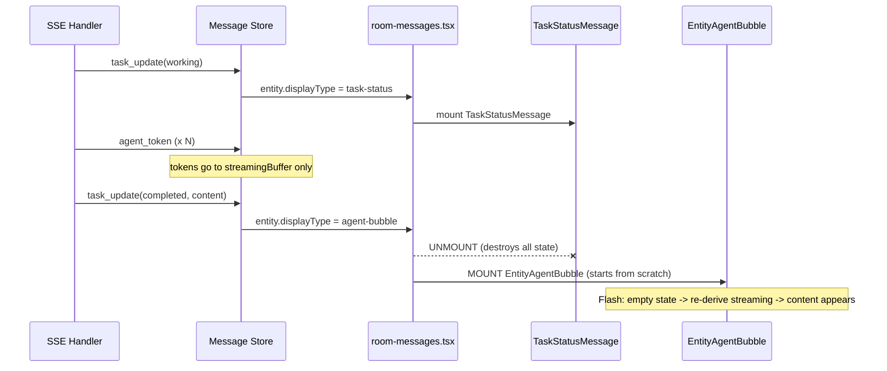

# Streaming Message Rendering Redesign

> **Status: Phases 1, 2, 2.5 Complete; Phase 3 subsumed by `REMOVE_AGENT_TOKEN_DESIGN.md` (Phases 2-3 complete)** | Addresses the recurring "one-token-per-line" and component-remount flash during agent message streaming.

**Supersedes**: Portions of `TOKEN_STREAMING_DESIGN.md` (Sections 4-7, rendering pipeline)
**Superseded by**: `REMOVE_AGENT_TOKEN_DESIGN.md` (Phases 2-3 of REMOVE doc now complete; all dead code deleted)

> ### Post-migration status (after `REMOVE_AGENT_TOKEN_DESIGN.md` Phases 2-3)
>
> This document's **Phases 1, 2, 2.5, and 3 are all completed**. The `agent_token` removal migration has been fully implemented on the frontend:
>
> - **§3.2 (dual state stores)**: The `streamingBuffer` ↔ Zustand timing mismatch is eliminated — `streamingBuffer` is deleted.
> - **§3.4 (artifact-streaming bypass)**: No longer a "bypass" — artifact streaming is now the **only** path for all agents.
> - **§4.2 (derivePhase)**: The `isBufferStreaming` / `streamingText` / `isRevealing` parameters are replaced by `entity.artifacts[].isStreaming` (from `append && !last_chunk`). The REVEALING phase is dropped (Option A per REMOVE doc §4.8).
> - **§4.5 (phase transitions)**: `streamingBuffer.finalize()` references are replaced by `last_chunk=true` → `isStreaming=false`.
> - **§4.7 (retained infrastructure)**: `streaming-buffer.ts`, `useStreamingContent.ts`, `typewriter.ts`, and `streaming-cursor.tsx` are **deleted**.
> - **§8 (open questions)**: Q1, Q3, Q4 are answered by the migration. See REMOVE doc §4.5, §4.8, and Open Question #5.
>
> **Phase 3** of this doc is subsumed by REMOVE doc Phases 2-3, which are now complete.

---

## 1. Problem Statement

When an agent message streams in, users see a brief flash of malformed content -- typically one token per line in a very tall bubble -- before the display settles into its correct form. This has persisted through multiple fix attempts because it stems from structural design flaws, not isolated bugs.

The flash manifests in three distinct scenarios:

1. **Component remount flash**: A message entity's `displayType` changes from `task-status` to `agent-bubble` mid-lifecycle, causing React to unmount `TaskStatusMessage` and mount `EntityAgentBubble`. The new component starts with empty state and must re-derive streaming context from scratch, producing a visible discontinuity.

2. **Dual-renderer content mismatch**: The same raw content string is routed to either `LinkifiedContent` (interprets `\n` as `<br>`) or `MarkdownContent`/Streamdown (interprets `\n` as markdown whitespace). When content passes through the wrong renderer, or when normalization is missing during a phase transition, the layout breaks.

3. **Artifact-streaming one-word-per-line**: Some agents (notably Ollama via A2A adapter) stream content through `artifact_update` SSE events rather than `agent_token` events. Each artifact update appends a new text "part" containing a single token. The artifact merge logic was blindly appending these as separate `ArtifactPart` entries, and each rendered as a separate `<p>` element — producing one word per line. Additionally, the `showIndicator` logic only checked `entity.content` (which stays empty for artifact-based agents), keeping the typing indicator visible even after artifact content arrived.

### Why incremental fixes keep failing

Each fix addresses one symptom (normalize here, guard there) but the underlying design produces new edge cases because:

- Two independent state stores (`streamingBuffer` via rAF + Zustand via synchronous dispatch) update on different timing, creating 1-frame inconsistency windows.
- The `displayType` transition causes a full React tree teardown/rebuild, losing all accumulated component state (refs, animation progress, streaming text cache).
- Content normalization is applied at various ad-hoc points rather than being an explicit contract between data producers and renderers.
- Agents use different SSE event patterns: some stream via `agent_token`, others via `artifact_update`. The rendering pipeline assumed a single content delivery path.

---

## 2. Industry Context

The class of problems is well-documented as **FOIM (Flash of Incomplete Markdown)** -- the streaming equivalent of FOUC (Flash of Unstyled Content).

### How leading products solve it

| Product / Library | Strategy |
|---|---|
| **Streamdown** (Vercel, already in our stack) | Streaming-aware markdown parser with `remend` preprocessor that auto-completes unterminated syntax. Handles arbitrary token chunks without layout shifts when used in `streaming` mode. |
| **ChatGPT / OpenAI Codex** | Newline-delimited streaming: buffer until a complete line before rendering. Single component renders all message phases. |
| **Google Chrome team** | Official guidance: use a streaming markdown parser that calls `appendChild()` incrementally; never re-parse entire content on each chunk. |
| **Vercel AI SDK (`useChat`)** | Single hook manages the full message lifecycle. One growing string, one renderer (Streamdown). No component switching mid-stream. |
| **Streak Engineering** | Buffer incomplete markdown constructs client-side; shorten link syntax to reduce FOIM window. |

### The universal principle

> **One message, one component instance, one renderer for its entire lifecycle.**

No production chat UI switches the React component tree mid-stream for the same logical message.

---

## 3. Current Architecture (What's Wrong)

### 3.1 Message lifecycle with component switching



**Problem**: The unmount/mount destroys component state (streaming refs, animation progress, last-known preview text). The newly mounted `EntityAgentBubble` sees full `entity.content` with no streaming context, producing a raw-content flash before the typewriter kicks in.

### 3.2 Dual state stores with timing mismatch

```
streamingBuffer.finalize(messageId)  // synchronous: clears buffer maps
                                      // rAF pending: React re-render not yet triggered
store.upsertMessage({ content })     // synchronous: Zustand dispatches immediately
                                      // React sees: entity.content = full text
                                      //             streamingBuffer.isStreaming = false
                                      //             streamingBuffer.get = '' (already cleared)
                                      // Result: 1-frame gap with full content, no streaming context
```

### 3.3 Dual renderers with implicit content contract

```
AgentMessageBubbleInner
  ├─ renderStreamingPreviewAsPlainText = true
  │   └─ LinkifiedContent: splits on \n → <br> (one-token-per-line if not normalized)
  └─ renderStreamingPreviewAsPlainText = false
      └─ MarkdownContent/Streamdown: \n = markdown whitespace (safe)
```

The choice of renderer is driven by `isStreaming || isRevealing`, but the content string doesn't carry metadata about which normalization it expects. Ad-hoc `.replace(/\s+/g, ' ')` calls are the only defense.

### 3.4 Artifact-streaming agents bypass the content pipeline

```
artifact_update SSE event (Ollama)
  ├─ mergeArtifacts(append=true): parts=[{text:"The"}, {text:" Sun"}, {text:" is"}, ...]
  ├─ entity.content stays empty (content comes from artifacts, not entity.content)
  ├─ showIndicator checks only entity.content → stays true (typing indicator persists)
  └─ ArtifactList → ArtifactRenderer → PartRenderer: each part = separate <p> element
     → one word per line
```

Agents using the A2A artifact protocol (like Ollama) stream content as `artifact_update` events with `append=true`. Each event adds a new `ArtifactPart` with `kind: 'text'` containing a single token. This completely bypasses `streamingBuffer`, `useStreamingContent`, and the `entity.content` field, making all the Phase 1-2 streaming fixes invisible to these agents.

---

## 4. Proposed Design

### 4.1 Design principles

1. **One message, one component, entire lifecycle** -- A single component instance handles all phases from "working" indicator through streaming to final static display. No `displayType` switching causes remounts.

2. **Streamdown for all agent content** -- Use Streamdown in `streaming` mode during token arrival and typewriter reveal, and `static` mode for final display. Eliminate the `LinkifiedContent` fallback for agent messages entirely.

3. **Single source of streaming truth** -- Derive all streaming state from one place. Eliminate timing gaps between independent stores.

4. **Explicit content contracts** -- Each renderer declares what input format it expects. Transformations happen once, at the boundary.

### 4.2 Unified agent message component

Replace the current two-component dispatch (`TaskStatusMessage` / `EntityAgentBubble`) with a single `AgentMessage` component that renders all phases internally:

```
AgentMessage (single component, never remounts)
  ├─ Phase: WAITING    → typing indicator / task-status card (inline)
  ├─ Phase: STREAMING  → Streamdown(mode=streaming) with line-buffered tokens
  ├─ Phase: REVEALING  → Streamdown(mode=streaming) with typewriter-fed content
  └─ Phase: STATIC     → Streamdown(mode=static) with full entity.content
```

#### Phase derivation (pure function, no external state)

```typescript
type RenderPhase = 'waiting' | 'streaming' | 'revealing' | 'static'

function derivePhase(
  entity: MessageEntity,
  isBufferStreaming: boolean,
  streamingText: string,
  isRevealing: boolean,
): RenderPhase {
  // Entity has final content and nothing is animating
  if (entity.content && !isBufferStreaming && !isRevealing) return 'static'

  // Typewriter is actively revealing
  if (isRevealing) return 'revealing'

  // Buffer has displayable content
  if (isBufferStreaming && streamingText.trim()) return 'streaming'

  // Everything else: waiting for first content
  return 'waiting'
}
```

**Important ordering note**: The `static` check runs first to catch the common case (fully loaded messages). The `isRevealing` parameter is set synchronously during render via the existing `prevIsStreaming` ref pattern (see `EntityAgentBubble` lines 651-660) before `derivePhase` is called. This means on the transition frame where streaming just ended and `entity.content` arrives, `isRevealing` is already `true`, so `derivePhase` returns `revealing` rather than `static`. The typewriter reveal is never skipped.

#### Rendering by phase

```
WAITING:
  ┌──────────────────────────────────────────┐
  │ [Agent Avatar] Agent Name                │
  │ [Spinner] Working on your request...     │
  │ [Clock] 3s elapsed                       │
  └──────────────────────────────────────────┘
  (Embed task metadata: stepNumber, totalSteps, statusMessage, taskContent)

STREAMING / REVEALING:
  ┌──────────────────────────────────────────┐
  │ [Agent Avatar] Agent Name                │
  │                                          │
  │ <Streamdown mode="streaming">            │
  │   {content}                              │
  │ </Streamdown>                            │
  │                                          │
  └──────────────────────────────────────────┘
  (content = streamingText for STREAMING, entity.content.slice(0, n) for REVEALING)

STATIC:
  ┌──────────────────────────────────────────┐
  │ [Agent Avatar] Agent Name                │
  │                                          │
  │ <Streamdown mode="static">              │
  │   {entity.content}                       │
  │ </Streamdown>                            │
  │                                          │
  │ [Artifacts if any]                       │
  └──────────────────────────────────────────┘
```

### 4.3 Eliminate displayType switching for streaming messages

Modify `resolveDisplayType` so that an agent message that will receive streaming tokens is **always** resolved as `agent-bubble` from the moment it's created:

```typescript
// Current: ephemeral + taskStatus(WORKING) → 'task-status'
// Proposed: ephemeral + taskStatus(WORKING) → 'agent-bubble'
//           (the AgentMessage component renders task status UI internally)

export function resolveDisplayType(msg: { ... }): DisplayType {
  if (msg.messageType === 'user') return 'user-bubble'

  // Agent messages always render as agent-bubble.
  // Task metadata (status, errors, HITL) is rendered *within* the agent bubble.
  // TaskStatusMessage is reserved for standalone task-only entities (no message content expected).
  if (msg.isEphemeral) return 'agent-bubble'
  if (!msg.taskStatus) return 'agent-bubble'

  const isTerminal = ['completed', 'failed', 'rejected', 'canceled'].includes(msg.taskStatus)
  const hasContent = !!msg.content?.trim()
  const hasArtifacts = !!msg.artifacts && msg.artifacts.length > 0

  if (isTerminal && (hasContent || hasArtifacts)) return 'agent-bubble'

  // Terminal states WITHOUT content (failed, rejected, canceled with only an error
  // string, or completed with empty content) render as task-status cards because
  // the agent bubble has no meaningful content to display.
  if (isTerminal && !hasContent && !hasArtifacts) return 'task-status'

  // Non-terminal interactive states where no streaming is expected
  // (standalone task cards like auth-required, input-required)
  if (msg.taskStatus === 'input_required' || msg.taskStatus === 'auth_required') {
    return 'task-status'
  }

  // Working/submitted: render as agent-bubble so the unified component handles it
  return 'agent-bubble'
}
```

### 4.4 Feed Streamdown directly (eliminate LinkifiedContent for agents)

The `LinkifiedContent` component was introduced as a workaround for Streamdown's inability to handle single-token chunks from local models. Streamdown has since been improved with its `remend` preprocessor. The line-buffering in `streamingBuffer.deriveRenderableText()` already ensures tokens are delivered in complete-line chunks.

With these two safeguards, Streamdown in `streaming` mode can handle the buffered content directly:

```typescript
// Before: two renderers with normalization workaround
{renderStreamingPreviewAsPlainText ? (
  <LinkifiedContent content={displayContent.replace(/\s+/g, ' ').trimStart()} />
) : (
  <MarkdownContent content={displayContent} isStreaming={isStreaming} />
)}

// After: single renderer for all phases
<MarkdownContent
  content={displayContent}
  isStreaming={phase === 'streaming' || phase === 'revealing'}
/>
```

If Streamdown still produces one-token-per-line for certain models, the fix belongs inside `deriveRenderableText` (buffer more aggressively) rather than at the renderer boundary. This maintains the single-renderer invariant.

### 4.5 Smooth phase transitions (no flash)

The key to eliminating flash is that **all phase transitions happen within the same mounted component instance**. React state (refs, animation progress, cached text) is preserved across transitions:

```
WAITING → STREAMING:
  streamingText goes from '' to first complete line.
  derivePhase returns 'streaming'.
  Streamdown(mode=streaming) mounts with initial content.
  No unmount/remount. Component state preserved.

STREAMING → REVEALING:
  streamingBuffer.finalize() clears buffer.
  entity.content arrives with full text.
  Component detects streaming→done transition (existing prevIsStreaming ref logic).
  Sets isRevealing=true, starts typewriter from last-known streaming length.
  Streamdown stays mounted, mode stays 'streaming', content grows via slice.

REVEALING → STATIC:
  revealedChars reaches entity.content.length.
  isRevealing=false.
  derivePhase returns 'static'.
  Streamdown switches to mode='static'. Single re-render, no flash.
```

### 4.6 Task metadata display within the agent bubble

The `WAITING` phase renders task metadata (step indicator, elapsed time, status message) inline within the agent bubble chrome. This replaces what `TaskStatusMessage` currently shows for `WORKING`/`SUBMITTED` states.

The component needs a local `elapsed` timer (1-second interval via `useEffect`, cleared on phase transition out of `WAITING`) and access to `entity.taskCreatedAt` for the initial value. This replicates the timer logic currently in `TaskStatusMessage` (lines 228-234 of `task-status-message.tsx`).

```typescript
// Inside the unified AgentMessage component
{phase === 'waiting' && (
  <div className="flex items-start gap-2">
    <Loader2 className="w-4 h-4 animate-spin mt-0.5 shrink-0" />
    <span className="text-sm shimmer-text">
      {entity.taskStatusMessage || entity.taskContent || 'Working on your request...'}
    </span>
  </div>
)}
```

`TaskStatusMessage` continues to exist for truly standalone task states that don't involve message content: `input_required` (HITL panel handles this), `auth_required`, and terminal failure states without streaming (`failed`, `rejected`, `canceled` where no `agent_token` events were sent).

### 4.7 Retained infrastructure

> **Post-migration note**: After `REMOVE_AGENT_TOKEN_DESIGN.md` Phases 2-3 implementation, `streaming-buffer.ts`, `useStreamingContent.ts`, `typewriter.ts`, and `streaming-cursor.tsx` are **deleted**. The current streaming infrastructure is:

| Module | Role |
|---|---|
| `message-store/upsert.ts` | `mergeArtifacts` + `mergeTextParts` — core artifact accumulation and text concatenation |
| `part-renderer.tsx` | `TextPartView` renders streaming text via `MarkdownContent` with `isStreaming` prop |
| `artifact-renderer.tsx` | Suppresses card chrome for `-stream` text-only artifacts; threads `isStreaming` to parts |
| `markdown-content.tsx` | Streamdown wrapper (`MarkdownContent`) — used for both main content and artifact text parts |
| `task-status-message.tsx` | Standalone task status cards — scoped to HITL/auth/failure-only states |

---

## 5. Migration Plan

### Phase 1: Unify the agent message component ✅ DONE

**Files changed**: `message-bubble.tsx`, `room-messages.tsx`, `resolve-display-type.ts`, `useRoomWebhook.ts`

1. ~~Add a `WAITING` phase to `EntityAgentBubble` that renders inline task status (spinner, elapsed time, status message) when `entity.content` is empty and no streaming is active.~~ Done.
2. ~~Update `resolveDisplayType` to return `agent-bubble` for `WORKING`/`SUBMITTED` task states (instead of `task-status`).~~ Done.
3. ~~Update `MemoizedMessage` in `room-messages.tsx` to pass task metadata props to `EntityAgentBubble`.~~ Done.
4. ~~Update the processing placeholder guard in `useRoomWebhook.ts` (line 473): the `hasTaskEntities` check currently filters by `displayType === 'task-status'`. Since `WORKING` entities now resolve as `agent-bubble`, change this to filter by `e.taskStatus && PENDING_STATES.includes(e.taskStatus)` to avoid creating duplicate placeholders.~~ Done.

**Result**: Messages no longer switch between `TaskStatusMessage` and `EntityAgentBubble`. The component-remount flash is eliminated.

**Side-effect simplification**: The guard in `useRoomWebhook.ts` that skips non-terminal `task_update` upserts during active streaming was added to prevent `displayType` from flipping back to `task-status`. With `WORKING` now resolving as `agent-bubble`, the displayType flip no longer happens.

### Phase 2: Feed Streamdown directly for all phases ✅ DONE

**Files changed**: `message-bubble.tsx`

1. ~~Remove the `renderStreamingPreviewAsPlainText` prop and the `LinkifiedContent` branch from `AgentMessageBubbleInner`.~~ Done.
2. ~~Pass all `displayContent` through `MarkdownContent` with `isStreaming` set appropriately per phase.~~ Done. `isStreaming` is now `isStreaming || isRevealing` so Streamdown uses streaming mode during both live streaming and typewriter reveal.
3. ~~Remove the `.replace(/\s+/g, ' ').trimStart()` normalization (no longer needed -- Streamdown handles whitespace natively).~~ Done.

**Result**: Single renderer for all content. Eliminates the dual-renderer content contract issue entirely.

### Phase 2.5: Fix artifact-streaming one-word-per-line ✅ DONE

**Files changed**: `message-store/upsert.ts`, `message-bubble.tsx`, `useRoomWebhook.ts`

Discovered that the "one-token-per-line" bug persisted for Ollama because it streams content via `artifact_update` SSE events rather than `agent_token`. This is an entirely different code path that was missed by Phases 1 and 2.

**Root cause analysis** (via diagnostic logging):
- Ollama's SSE event flow: `processing_status` → `task_submitted(working)` → `artifact_update` × N → `task_update(completed)`. No `agent_token` events are sent.
- Each `artifact_update` appends a new text `ArtifactPart` containing a single token/word.
- `mergeArtifacts` (in `upsert.ts`) appended these as separate parts: `[{text:"The"}, {text:" Sun"}, {text:" is"}, ...]`.
- `PartRenderer` → `TextPartView` renders each part as a separate `<p className="whitespace-pre-wrap">` element, producing one word per line.
- The `showIndicator` logic in `EntityAgentBubble` only checked `entity.content` (empty for artifact agents), keeping the typing indicator visible even after artifact content arrived below.

**Changes**:

1. **`src/stores/message-store/upsert.ts`** — Added `mergeTextParts()` helper. When appending artifact parts during streaming, consecutive text parts are concatenated into a single part instead of creating separate elements:
   ```typescript
   function mergeTextParts(existing, incoming) {
     const result = [...existing]
     for (const part of incoming) {
       const last = result[result.length - 1]
       if (part.kind === 'text' && last?.kind === 'text') {
         result[result.length - 1] = { ...last, text: (last.text || '') + (part.text || '') }
       } else {
         result.push(part)
       }
     }
     return result
   }
   ```

2. **`src/components/message-bubble.tsx`** — Updated `showIndicator` to account for artifact-based content:
   ```typescript
   const hasArtifactContent = (entity.artifacts?.length ?? 0) > 0
   const showIndicator =
     ((!isStreaming && !isRevealing && !entity.content) ||
     (isStreaming && !streamingPreviewText.trim())) &&
     !hasArtifactContent
   ```

3. **`src/hooks/useRoomWebhook.ts`** — (Done in earlier fix) The `agent_token` handler now proactively removes the processing placeholder when creating an ephemeral streaming entity, and `task_submitted` handler also removes the placeholder. This prevents dual-bubble display regardless of SSE event ordering.

**Additional fix applied earlier**: Removed the `transition-[grid-template-rows] duration-200` CSS class from the content wrapper div in `AgentMessageBubbleInner`. This 200ms CSS transition was causing a visible height animation from the collapsed indicator to the expanded content, which briefly displayed the raw content in a partially-expanded state for non-streaming agents.

### Phase 3: Clean up dead code ✅ DONE (via REMOVE_AGENT_TOKEN_DESIGN.md Phases 2-3)

**Subsumed by `REMOVE_AGENT_TOKEN_DESIGN.md`**. All dead code from the `agent_token` infrastructure has been deleted:

- `streaming-buffer.ts`, `useStreamingContent.ts`, `typewriter.ts`, `streaming-cursor.tsx` — deleted
- Associated test files (`streaming-lifecycle.test.ts`, `typewriter.test.ts`, `streaming-buffer.test.ts`, `useStreamingContent.test.ts`) — deleted
- `LinkifiedContent` usage for agent messages — removed in Phase 2
- `renderStreamingPreviewAsPlainText` prop — removed in Phase 2
- `displayContent` ternary and `lastStreamingPreviewRef` — simplified in Phase 2
- `TaskStatusMessage` scope narrowed to HITL/auth/failure-only states in Phase 1

---

## 6. Testing Strategy

### Unit tests

- `resolve-display-type.test.ts`: Update assertions for `WORKING`/`SUBMITTED` states. Specifically:
  - "returns task-status for working task" (line 83) -> expect `agent-bubble`
  - "returns task-status for working task with content" (line 90) -> expect `agent-bubble`
  - "returns task-status for working task with artifacts" (line 98) -> expect `agent-bubble`
  - "returns task-status for submitted task" (line 106) -> expect `agent-bubble`
  - "returns task-status for submitted task with content" (line 113) -> expect `agent-bubble`
  - "returns task-status for ephemeral agent with non-terminal taskStatus" (line 167) -> expect `agent-bubble`
  - Tests for `input_required`, `auth_required`, `failed`, `canceled`, `rejected` remain `task-status` (unchanged).
- `streaming-lifecycle.test.ts`: Verify phase transitions produce correct `displayContent` without component remounts.
- `message-bubble` tests: Verify the `WAITING` phase renders task metadata correctly.

### Manual testing matrix

| Scenario | Expected behavior | Status |
|---|---|---|
| Cloud agent (fast, no tokens) | Waiting indicator -> typewriter reveal -> static markdown | ✅ Verified (GPT-5-mini) |
| Cloud agent (streaming tokens) | Waiting indicator -> live streaming via Streamdown -> typewriter reveal -> static | ✅ Verified (GPT-5-mini) |
| Ollama/local agent (artifact streaming) | Waiting indicator -> artifact content flows as paragraphs -> static | ✅ Verified (Ollama llama3.2) |
| Ollama/local agent (slow tokens, \n-heavy) | Waiting indicator -> line-buffered streaming via Streamdown -> typewriter reveal -> static | |
| Failed task (no tokens) | Waiting indicator -> error card (TaskStatusMessage) | |
| HITL input required | Waiting indicator -> HITL panel (TaskStatusMessage) | |
| Agent response without task_update | Typing indicator -> streaming -> typewriter -> static | |

### Regression checks

- No raw markdown flash at any point during message lifecycle.
- No "one-token-per-line" layout at any phase.
- No visible discontinuity (height jump, content reflow) during phase transitions.
- Typewriter animation starts from approximately where streaming left off (no content jump backward or forward).
- Artifacts render correctly after static phase.
- Long messages (>500 chars) still show expand/collapse toggle.

---

## 7. Alternatives Considered

### Alternative A: Keep dual components, synchronize timing

Add a synchronous flush to `streamingBuffer.finalize()` and batch it with the Zustand upsert in a `ReactDOM.flushSync` call to eliminate the 1-frame gap.

**Rejected**: Addresses the timing symptom but not the structural issue. The `displayType` switch still causes unmount/remount, and the dual-renderer content contract issue persists. Each new edge case would require another ad-hoc timing fix.

### Alternative B: Content normalization at the renderer boundary (current state)

Apply `.replace(/\s+/g, ' ').trimStart()` at the `LinkifiedContent` call site to normalize all plain-text content uniformly.

**Partially implemented**: This is what we have today after the Option B fix. It correctly normalizes content for `LinkifiedContent`, but doesn't address the component-remount flash or the dual-renderer complexity. Serves as a stopgap until this redesign is implemented.

### Alternative C: Move all rendering to LinkifiedContent (drop Streamdown)

Render all content as plain text with `<br>` for newlines, abandoning markdown formatting.

**Rejected**: Markdown formatting (headers, code blocks, lists, links) is a core feature of agent responses. Removing it would be a significant UX regression.

---

## 8. Open Questions

1. ~~**Streamdown with local model tokens**: Does Streamdown in `streaming` mode handle the token patterns from Ollama/Llama gracefully when fed line-buffered chunks?~~ **Answered**: Ollama streams via `artifact_update` events (not `agent_token`), so its content bypasses `streamingBuffer` and Streamdown entirely. Artifact text parts are rendered via `PartRenderer` → `TextPartView` (`<p className="whitespace-pre-wrap">`). The fix in `mergeTextParts` ensures consecutive text parts are concatenated, and `showIndicator` checks for artifact presence. Streamdown is not involved in Ollama's rendering path. **Post-migration update**: After `REMOVE_AGENT_TOKEN_DESIGN` implementation, `TextPartView` uses `MarkdownContent`/Streamdown (REMOVE doc §4.5), so Streamdown IS involved for all agents — including Ollama. The `mergeTextParts` concatenation ensures Streamdown receives growing strings rather than single-token parts.

2. **TaskStatusMessage scope**: Should `failed`/`rejected`/`canceled` states without streaming also render inside the unified agent bubble, or remain as standalone `TaskStatusMessage` cards? The current proposal keeps them separate for visual differentiation, but unifying everything would further simplify the component tree.

3. ~~**Typewriter necessity**: If Streamdown's `streaming` mode already provides a progressive reveal effect with a caret, is the custom `TypewriterManager` still needed? It could potentially be replaced by feeding content to Streamdown in `streaming` mode with a client-side timer.~~ **Answered by `REMOVE_AGENT_TOKEN_DESIGN.md` §4.8**: Option A (recommended) drops the typewriter entirely. Option B makes it a component-local `useEffect` in `TextPartView` with no global state. `TypewriterManager` is deleted in both options.

4. ~~**Artifact-streaming agents and the rendering pipeline**: Agents that stream via `artifact_update` follow a fundamentally different data path than `agent_token`-based streaming. The entity's `content` field stays empty; all text lives in `entity.artifacts[].parts[].text`. Should the rendering pipeline be unified so that artifact text content is promoted to `entity.content` during `artifact_update` handling? This would let the standard content rendering (Streamdown, typewriter, etc.) work for all agents without special-casing artifacts.~~ **Answered by `REMOVE_AGENT_TOKEN_DESIGN.md`**: The migration unifies all streaming onto `artifact_update`. The question of promoting artifact text to `entity.content` is captured as REMOVE doc Open Question #5.
