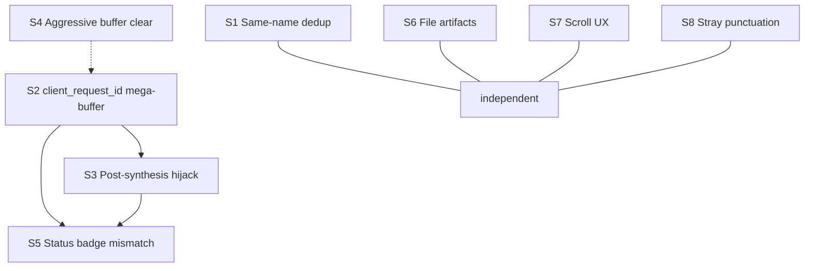

# Streaming UI — Known Issues and Fix Options

**Status:** Investigation complete (browser + unit tests), fixes not yet implemented  
**Last verified:** 2026-06-07  
**Scope:** Live agent streaming in the room UI — activity strip, inline agent bodies, and `AgentResponseDetailPane`

This document records bugs observed while testing multi-agent “Everyone check…” turns (Hermes, Codex, OpenClaw, etc.), their root causes in the frontend streaming pipeline, and recommended fix options.

---

## Summary

| ID | Issue | Severity | Root cause category |
|----|--------|----------|---------------------|
| [S1](#s1-live-stream-shows-only-the-latest-segment-hermes) | Live stream shows only latest segment | **P0** | Same-name artifact dedup in live buffer |
| [S2](#s2-same-stream-text-when-switching-agents-during-parallel-runs) | Same stream when clicking different agents | **P0** | Turn-level buffer merge via `client_request_id` |
| [S3](#s3-agent-detail-regenerates-after-synthesis-completes) | Detail pane “regenerates” after synthesis | **P0** | Same as S2 + synthesis partials on turn key |
| [S4](#s4-per-agent-stream_clear_wipes-sibling-buffers) | Sibling agent buffers cleared on each completion | **P1** | Aggressive `clearByClientRequestId` |
| [S5](#s5-status-badge-mismatch-working-vs-streaming) | Status badge mismatch | **P2** | Wrong buffer drives streaming label |
| [S6](#s6-file-artifacts-hidden-while-streaming) | File artifacts hidden while streaming | **P2** | `resolveDetailArtifacts` suppresses entity artifacts |
| [S7](#s7-detail-pane-scroll--viewport) | Detail pane opens mid-document | **P3** | No scroll-on-update behavior |
| [S8](#s8-stray-leading-punctuation-in-stream) | Stray leading `.` in stream text | **P3** | Empty / punctuation-only artifact chunks |

**Recommended implementation bundle:** Fix S1 (`mergeStreamArtifacts`) + converge ingest on **`message_id` buffers** (S2/S3 + [convergence plan](#should-we-converge-the-two-sse-paths)) + Fix S4 (narrow buffer clear) + tests. S5 largely resolves with S2/S3. S6–S8 are follow-ups.

---

## Architecture context

### Two SSE paths into `streaming-store` (today)

| SSE event | Buffer key (frontend today) | Typical agents | Production usage |
|-----------|----------------------------|----------------|------------------|
| `artifact_update` | `message_id` | Hermes, Codex, OpenClaw, **supervisor synthesis** | **Primary** — all A2A streaming and summary streaming |
| `agent_response_partial` | `client_request_id` | Legacy / delivery-layer abstraction | **Rarely or never** in current room SSE (see [Convergence](#should-we-converge-the-two-sse-paths) below) |

Backend synthesis already streams via `artifact_update` (`stream_summary_to_sse` in `multi-agents-backend`), not `agent_response_partial`. The dual frontend path is mostly historical; the bugs come from **how we key and resolve buffers**, not from an unavoidable protocol split.

All agents in one user turn share the same `client_request_id`.

### Principle: always converge drifting paths

**Do not maintain parallel live-stream pipelines.** When two code paths solve the same problem (accumulate live text for display), they must **converge on one contract** — not coexist with merge/fallback heuristics that hide the split.

**Target live contract (single pipeline):**

> **`artifact_update` (or partial shim) → `append(message_id, …)` → `mergeStreamArtifacts` → `extractStreamTextFromArtifacts` → `buffers[messageId]` → message-scoped lookup only**

Turn-level `client_request_id` is **metadata for correlation and cleanup**, never a buffer key and never a display merge dimension.

---

### Drift inventory (audit 2026-06-07)

| # | Drift | Where | Converge? | Action |
|---|--------|-------|-----------|--------|
| D1 | Two SSE handlers, different buffer keys | `artifact-update.ts` (`message_id`) vs `agent-response.ts` (`client_request_id`) | **Yes — P0** | Partial → shim into same `append(message_id, …)` |
| D2 | Turn-level buffer merge for display | `resolveStreamBuffer` + `pickRicherStreamBuffer` | **Yes — P0** | Lookup `buffers[messageId]` only; delete turn merge loop |
| D3 | Turn-level merge at checkpoint read | `task-update.ts` calls `resolveStreamBuffer(..., client_request_id)` to pick buffer text | **Yes — P0** | Read `buffers[messageId]` only when building checkpoint content |
| D4 | Persisted merge used for live buffer | `streaming-store.append` → `mergeArtifacts` from `message-store/upsert` | **Yes — P0** | `mergeStreamArtifacts` in streaming-store only (S1) |
| D5 | Dual terminal checkpoint events | `task_update` and `agent_response` → `message-store` | **No — intentional** | Both write durable state; both clear message buffer. Keep. |
| D6 | Live concat vs persisted last-only extract | `extractStreamTextFromArtifacts` vs `extractTextFromArtifacts` | **No — intentional** | Different semantics (stream growth vs thinking+answer). Keep. |
| D7 | Transient vs durable stores | `streaming-store` vs `message-store` | **No — intentional** | Live vs checkpoint separation is correct. Keep. |
| D8 | Non-terminal `task_update` writes entity content while buffer active | `task-update.ts` non-terminal branch | **No — OK** | `resolveStreamText` prefers buffer; entity is fallback. No second ingest path. |
| D9 | Backend delivery DTO vs direct SSE | `DeliveryEvent` / `AgentMessagePartial` vs `SSEManager.send_artifact_update` | **Already converged on wire** | Room runtime emits `artifact_update` only; delivery types are optional/future |
| D10 | Hub legacy `agent_token` | `hub_runtime_bridge` tests | **Already converged** | Hub dispatcher emits `artifact_update` |

**Rule of thumb:** If it feeds **live display text**, it must go through **one** append + **one** merge + **one** lookup. If it feeds **durable state**, it goes through `message-store` and clears the message buffer — that is a different layer, not a second live path.

---

### Should we converge the two SSE paths?

**Yes.** D1–D4 are the root of S1–S5. Fixing S1 with `mergeStreamArtifacts` alone is **insufficient** if D2/D3 still merge by turn.

**Why convergence makes sense**

1. **Backend is already converged for room chat.** A2A agents emit `artifact_update` through DirectTransport. Supervisor synthesis emits `artifact_update` via `stream_summary_to_sse`. `AgentMessagePartial` / `agent_response_partial` exists in the delivery DTO and translator but is **not constructed** anywhere in production Python (only tests/docs).

2. **The split causes the P0 bugs.** Partials key by `client_request_id` (see `handleAgentResponsePartial`: `bufferId = correlation.clientReqId ?? …`), then `resolveStreamBuffer` merges all turn-tagged buffers. Synthesis and sibling agents contaminate each other (S2, S3). Same-name dedup in shared `mergeArtifacts` collapses Hermes segments (S1).

3. **Checkpoint read must use the same scope.** `task-update.ts` today uses turn-level `resolveStreamBuffer` — a completed agent could checkpoint synthesis text into Hermes if keys align badly. Message-scoped read converges with display.

**Recommended convergence plan**

| Layer | Action | Priority |
|-------|--------|----------|
| **Frontend handlers** | `agent_response_partial` → **compat shim**: `content_delta` → synthetic artifact, `append(message_id, …)`. Never `append(client_request_id, …)`. | P0 |
| **Frontend lookup** | `resolveStreamBuffer(buffers, messageId)` — drop `clientRequestId` merge. Update `useStreamBuffer`, selectors, **and** `task-update` checkpoint read. | P0 |
| **Frontend merge** | `mergeStreamArtifacts` in streaming-store only; stop importing `mergeArtifacts` for live append. | P0 |
| **Frontend cleanup** | Narrow `clearByClientRequestId` to turn-complete only (S4). Remove `pickRicherStreamBuffer` turn merge once unused. | P1 |
| **Backend** | No room-path change (already `artifact_update`). Optional: document `agent_response_partial` as legacy delivery alias. | — |
| **Long term** | Delete partial handler after prod telemetry shows zero frames, or keep as thin shim permanently. | P2 |

**What not to converge**

- **Terminal persistence** (D5): `task_update` / `agent_response` → `message-store` — correct dual checkpoint path.
- **Extract helpers** (D6): persisted last-only vs live concat — different product semantics.
- **Store separation** (D7): streaming-store is ephemeral; message-store is durable.
- **Backend delivery DTO types** (D9): keep for non-room consumers; room wire is already one event type.

**Net:** Convergence does not mean one SSE type everywhere on the backend. It means **one frontend live ingest contract** — no parallel buffer keys, no turn-level text merge, no shared persisted merge for live buffers.

### Buffer lookup today

`useStreamBuffer(messageId, clientRequestId)` → `resolveStreamBuffer()`:

1. Reads `buffers[messageId]` if present.
2. **Merges every buffer** whose metadata `clientRequestId` matches the turn (all agents + turn-level partial bucket).
3. Returns `pickRicherStreamBuffer(byMessageId, byClientRequestId)` — **prefers longer text**.

Per-agent UI (detail pane, `useResultStreamDisplay`, activity strip bodies) all use this same lookup.

### Live text extraction

`streaming-store.append` → `mergeArtifacts` → `extractStreamTextFromArtifacts` (concat all text-only artifacts).

Persisted entities use `extractTextFromArtifacts` (last text-only artifact only) — intentional for thinking+answer agents.

---

## Issues and fix options

### S1: Live stream shows only the latest segment (Hermes)

**Symptom**

- During **Streaming**, the detail pane shows only the most recent paragraph (e.g. starts at “Good. I have confirmed data:” or “Excellent! Let me extract…”).
- Earlier segments (“Now let me research…”, “Good, I have the skill loaded…”) are missing.
- Text **jumps** between segments; prior text disappears when a new artifact arrives.
- After **Completed** (`task_update`), the full body appears from the checkpoint.

**Observed in**

- Hermes Agent detail pane, multi-artifact streaming.
- Reproduced in browser (2026-06-07) and partially covered by unit tests for concat logic (which pass — concat never runs on a list reduced to one artifact).

**Root cause**

`mergeArtifacts` (used by `streaming-store.append`) **replaces** text-only artifacts that share the same `name`, even when `artifactId` differs:

```typescript
// src/stores/message-store/upsert.ts — same-name dedup
if (sameNameIdx >= 0) {
  list[sameNameIdx] = incoming  // replaces prior segment
}
```

Hermes (via a2a-adapter) emits multiple segments with `name="response"`, new artifact IDs, and `append: false`. The live buffer keeps **one** segment until `task_update` writes the full concatenated content to `message-store`.

`extractStreamTextFromArtifacts` is correct but operates on a list that has already been collapsed.

**Fix options**

| Option | Description | Pros | Cons |
|--------|-------------|------|------|
| **A ★ Recommended** | Add `mergeStreamArtifacts()` used **only** by `streaming-store`. When same `name` but different `artifactId` and texts are **disjoint** (neither is a prefix of the other), **push** a new artifact instead of replacing. Keep replace for prefix/token streams (`"Hello"` → `"Hello world"`). | Fixes Hermes; preserves token-stream dedup intent | Needs heuristic + tests |
| B | `mergeStreamArtifacts`: never apply same-name dedup | Simple | Regresses agents that emit new ID per token with same name |
| C | Backend / adapter: unique artifact names per segment, or one `artifact_id` + `append: true` | Correct at source | Slower rollout; multiple repos |
| D | Separate `StreamBuffer.accumulatedText` append-only field, bypass artifact list for display | Display always grows | Diverges buffer model from artifacts |

**Recommendation:** **Option A** in `streaming-store` only. Do **not** change `mergeArtifacts` for persisted `message-store` upserts.

**Tests to add**

- Multi-segment same-name artifacts with different IDs → concat text in buffer.
- Token stream same-name replace still replaces.
- Integration: Hermes-style `artifact_update` sequence through SSE handler.

---

### S2: Same stream text when switching agents during parallel runs

**Symptom**

- While multiple agents are **Working**, clicking Hermes → Codex → OpenClaw in the activity strip shows the **same streaming body** in the detail pane (often whichever agent has the longest stream, e.g. Hermes).

**Root cause**

`resolveStreamBuffer` builds a **turn-level mega-buffer** by merging **all** buffers tagged with the shared `client_request_id`, then `pickRicherStreamBuffer` prefers the **longer** text for every agent:

```typescript
// src/stores/streaming-store/index.ts
for (const buffer of Object.values(buffers)) {
  if (buffer.clientRequestId !== clientRequestId) continue
  byClientRequestId = pickRicherStreamBuffer(byClientRequestId, buffer)
}
// ...
return pickRicherStreamBuffer(byMessageId, byClientRequestId)
```

Each agent’s own `buffers[messageId]` is overridden when the merged pool is longer.

**Affected surfaces**

- `room-page-shell.tsx` → `useStreamBuffer(selectedMessageId, selectedClientRequestId)`
- `useResultStreamDisplay` → strip / inline `AgentResultContent`
- `selectAgentResponseDetail`

**Fix options**

| Option | Description | Pros | Cons |
|--------|-------------|------|------|
| **A ★ Recommended** | **Message-scoped lookup** for per-agent UI: resolve buffer by `messageId` only. Key `agent_response_partial` by `message_id` (see S3). | Clean isolation per agent | Update partial-buffer tests |
| B | Add `ownerMessageId` on buffers; filter `byClientRequestId` loop to matching owner | Smaller API change | Extra metadata on every buffer |
| C | Detail pane: `useStreamBuffer(messageId)` without `clientRequestId` fallback | One-line shell change | Breaks partial-only agents unless partial key changes |
| D | `pickRicherStreamBuffer` only when buffers share the same storage key | — | Does not fix merge-across-agents in `byClientRequestId` loop |

**Recommendation:** **Option A** — message-scoped lookup + partial key by `message_id` (combined with S3).

**Tests to add**

- Two agents, same `client_request_id`, different `message_id` buffers → each lookup returns its own text.
- Switching selected agent in detail pane does not show sibling text.

---

### S3: Agent detail “regenerates” after synthesis completes

**Symptom**

- HYBRO synthesis finishes (**Completed**, unified Top-3, Sources · N agents).
- Hermes detail pane (still open) flips back to **Streaming** with new or task-prompt-like text.
- Looks like Hermes is generating again; it is not.

**Root cause**

Same as **S2**, with synthesis as the contaminating source:

1. Hermes `task_update` clears `buffers[hermesMessageId]`.
2. Synthesis `artifact_update` (or legacy `agent_response_partial` if present) writes to a buffer tagged with the same turn `client_request_id`; turn-level lookup merges it into other agents’ panes.
3. Detail pane lookup: `byMessageId` empty → falls back to synthesis partial buffer.
4. `resolveEntityStreaming` trusts buffer over terminal `taskStatus` → **Streaming** badge on a **Completed** agent.

**Fix options**

| Option | Description | Pros | Cons |
|--------|-------------|------|------|
| **A ★ Recommended (combo)** | (1) Key partials by `message_id`. (2) Message-scoped lookup (S2). (3) **Terminal guard:** if entity `taskStatus` is terminal, ignore live buffer for content / streaming / artifacts in `selectAgentResponseDetail`. | Fixes hijack + safety net | Touch selector + partial handler |
| B | Terminal guard only | Quick patch | Does not fix wrong buffer while agent still “working” during synthesis |
| C | Clear detail selection when synthesis starts | Avoids stale pane | Poor UX |

**Recommendation:** **Option A** (implements S2 + guard).

**Partial / final message ID mismatch**

Existing test: partial may use `partial-msg-1`, final `agent_response` uses `final-msg-1`. On final response, clear **both** message buffers (and partial key if still on turn bucket). Document in handler comments.

**Tests to add**

- Hermes completed + synthesis partials on turn → Hermes detail shows entity content, not Streaming.
- Open detail during synthesis → synthesis text does not appear on completed agent panes.

---

### S4: Per-agent `stream_clear` wipes sibling buffers

**Symptom**

- When agent A completes, agent B’s live buffer may **flicker** or briefly empty until the next `artifact_update`.

**Root cause**

Terminal `task_update` runs both:

```typescript
{ type: 'stream_clear', messageId },
{ type: 'stream_clear_client_request', clientRequestId },
```

`clearByClientRequestId` removes **all** buffers whose metadata matches the turn — including **sibling agents still streaming** (by design in `streaming-store` tests).

**Fix options**

| Option | Description | Pros | Cons |
|--------|-------------|------|------|
| **A ★ Recommended** | On per-agent `task_update`, only `stream_clear(messageId)`. Clear turn-level / partial bucket on **turn terminal** (`processing_status` complete) or synthesis start. | Stops cross-agent wipe | Requires turn-complete hook |
| B | `clearByClientRequestId` only removes buffer where `bufferKey === clientRequestId` | Smaller change | Message-keyed buffers still tagged with same metadata |
| C | Leave as-is | No code change | Accept flicker for parallel agents |

**Recommendation:** **Option A**, after S2/S3 (partials keyed by `message_id`).

---

### S5: Status badge mismatch (Working vs Streaming)

**Symptom**

- Activity strip card: **Working · 1 file**
- Detail header: **Streaming**
- Or card **Completed** while detail still shows **Streaming**

**Root cause**

- Detail label forced to “Streaming” when `isBufferStreaming(buffer)` (`selectAgentResponseDetail`).
- Buffer may be **foreign** (S2/S3) or stale before clear.
- `resolveEntityStreaming` returns `true` whenever any buffer exists with `!isComplete`, ignoring terminal `taskStatus`.

**Fix options**

| Option | Description |
|--------|-------------|
| **A ★ Recommended** | Resolve with S2/S3 + terminal guard; only label Streaming when buffer is **owned by this message** and entity is non-terminal. |
| B | Always use `mapAgentDisplayProps(taskStatus)` in detail header; ignore buffer for label only. |

**Recommendation:** **Option A** (no separate work if S2/S3 shipped).

---

### S6: File artifacts hidden while streaming

**Symptom**

- Strip shows **Working · 1 file**; detail pane shows text only until completion.

**Root cause**

```typescript
// src/lib/streaming/display.ts
resolveDetailArtifacts(buffer, entityArtifacts) {
  return isBufferStreaming(buffer) ? undefined : entityArtifacts
}
```

**Fix options**

| Option | Description |
|--------|-------------|
| **A ★ Recommended** | While streaming: show **non-text** artifacts from entity (or buffer); text from live buffer. |
| B | Always show entity artifacts; override text only from buffer. |
| C | Leave as-is |

**Recommendation:** Option A (P2 UX follow-up).

---

### S7: Detail pane scroll / viewport

**Symptom**

- Opening completed Hermes detail shows middle of log (“Good. I have confirmed data:” at bottom of viewport); full content requires manual scroll.

**Root cause**

`AgentResponseDetailPane` has no scroll-on-content-update behavior.

**Fix options**

| Option | Description |
|--------|-------------|
| **A ★ Recommended** | Open detail at **top** (read top-down as stream grows). Tail-follow bottom only when user is already near bottom. On complete, **leave scroll position unchanged**. Disable browser scroll anchoring on detail body. |
| B | “Jump to latest” control during stream only. |
| C | Leave as-is |

**Recommendation:** Option A (P3 UX follow-up).

---

### S8: Stray leading punctuation in stream

**Symptom**

- Stream body starts with a lone `.` on its own line before real content.

**Root cause**

Empty or punctuation-only text parts concatenated into stream display.

**Fix options**

| Option | Description |
|--------|-------------|
| A | Skip in `extractStreamTextFromArtifacts` when trimmed text matches `/^[.\s]+$/` or is empty. |
| B | Filter at Markdown render layer. |
| **C ★ Recommended** | A + backend: avoid emitting empty artifact parts (defense in depth). |

**Recommendation:** Option C (P3, low priority).

---

## Recommended implementation plan

### Phase 1 — P0 (core correctness + path convergence) ✅ Implemented 2026-06-07

1. **`mergeStreamArtifacts`** in `streaming-store` only — stop using `mergeArtifacts` for live append (D4 / S1).
   - Heuristic: same `name`, different `artifactId`, both text-only:
     - **prefix relation** (`b.startsWith(a)` or `a.startsWith(b)`) → replace (token stream).
     - **disjoint** → push as new artifact (multi-segment stream).
   - Same `artifactId` → existing append/replace by `append` flag (matches backend `append_artifact_to_task_dict`).
   - Document edge cases: empty text, identical text, common-prefix-then-divergence.
2. **Converge ingest on `message_id` (D1):**
   - `handleAgentResponsePartial` → shim to same `append(message_id, …)` as `artifact-update`.
   - Synthetic artifact contract: `artifactId = "${messageId}-partial-stream"` (stable), `name = "response"`, `append = true` from second chunk on, `append = false` on first chunk.
3. **Message-scoped lookup everywhere live text is read (D2, D3):**
   - `resolveStreamBuffer(buffers, messageId)` — remove turn merge and `pickRicherStreamBuffer` for display.
   - `useStreamBuffer`, selectors, activity strip — message id only.
   - `task-update.ts` checkpoint buffer read — `buffers[messageId]` only, not turn merge.
4. **Strict terminal guard** in `selectAgentResponseDetail` when `taskStatus` is terminal (S3 safety net): ignore live buffer entirely (content, `isStreaming`, artifacts) — terminal entity is the source of truth.
5. **Drop `clientRequestId` from streaming API surface:**
   - Remove parameter from `useStreamBuffer`, `useResultStreamDisplay`.
   - Update call sites: `room-page-shell.tsx`, `AgentIndex.tsx`, `AgentResultContent.tsx`, `FinalAnswerSurface.tsx`, `SynthesisContent.tsx`.
   - Prevents future regression to turn-keyed lookups.
6. **Delete `pickRicherStreamBuffer`** once `resolveStreamBuffer` no longer calls it (dead code).
7. **Tests** — see [Test matrix](#test-matrix) below.

### Phase 2 — P1 (parallel stability + cleanup) ✅ Implemented 2026-06-07

8. **Narrow `stream_clear_client_request` to user-turn terminal** (S4 Option A):
   - **Trigger:** terminal `processing_status` for the user message id (not per-agent task ids).
   - **New code:** add `applyRoomCommands([{ type: 'stream_clear_client_request', clientRequestId }])` in `processing-status.ts` terminal branch.
   - **Idempotent:** safe if all per-agent buffers already cleared.
   - **Remove** per-agent `stream_clear_client_request` from `task-update.ts` terminal commands.
9. **Narrow `agent-response.ts` clears** — replace `clearByClientRequestId` calls with `clear(messageId)` in both branches (duplicate-detection path and final-write path) so legacy `agent_response` cannot wipe sibling buffers.
10. **Test:** `clearByClientRequestId` only fires once per turn, on user-turn terminal `processing_status`.

### Phase 3 — P2/P3 (UX polish)

11. **Mixed artifacts during stream** (S6) ✅ Implemented 2026-06-07 — show non-text entity artifacts (e.g. files) while text streams from buffer.
12. **Detail pane auto-scroll** (S7) ✅ Implemented 2026-06-07 — ChatGPT-aligned: open at top; tail-follow only when pinned near bottom; no jump on complete; `overflow-anchor: none` on detail body.
13. **Main feed focus scroll** ✅ Implemented 2026-06-07 — ChatGPT-aligned send behavior: hydrate scrolls to bottom; on send anchor last user message near top with dynamic spacer; disable primary tail-follow during live turn; `overflow-anchor: none` on `.conversation-frame`. See `useTurnFocusScroll`, `src/lib/conversation/focus-scroll.ts`.
14. **Empty/punctuation chunk filter** (S8) — frontend filter + backend defense in depth.

### Documentation

- After Phase 1 ships, update `docs/System-Architecture.md` § streaming-store to describe **single message-owned buffer ingest** (`artifact_update` primary; `agent_response_partial` shim) and `mergeStreamArtifacts`.
- Add the [architecture invariants](#architecture-invariants) section to `System-Architecture.md`.
- Keep this document; mark issues resolved with PR links.

---

## Architecture invariants

After Phase 1, commit these invariants in `docs/System-Architecture.md`:

| # | Invariant | Where enforced |
|---|-----------|----------------|
| **I1** | One live ingest pipeline. All live streaming text flows through `streaming-store.append(message_id, …)`. | SSE handlers; ESLint rule recommended |
| **I2** | Live buffer key is always `message_id`. `client_request_id` is correlation/cleanup metadata, never a buffer key or display merge dimension. | `useStreamBuffer` signature; `resolveStreamBuffer` signature |
| **I3** | Live text ≡ persisted text. `extractStreamTextFromArtifacts` over the live artifact list must equal backend `extract_parts_from_artifacts` over the persisted artifact list at terminal. | Parity test in `streaming-store` suite |
| **I4** | Detail pane content for terminal entities comes from `message-store`, never from live buffer. | Strict terminal guard in `selectAgentResponseDetail` |
| **I5** | Per-agent terminal SSE clears that message's buffer only. Turn-level clear runs exactly once per turn, on user-turn terminal `processing_status`. | `task-update.ts` + `processing-status.ts` |
| **I6** | `streaming-store/append` must not import `mergeArtifacts` from `message-store/upsert`. Live merge is `mergeStreamArtifacts`. | Dependency direction; codeowners review |

---

## Long-term architecture alignment

This convergence pre-positions the frontend for the medium-term roadmap in [`multi-agents-backend/docs/RECOMMENDED_ARCHITECTURE.md`](../../multi-agents-backend/docs/RECOMMENDED_ARCHITECTURE.md):

| Phase / target | How convergence helps |
|----------------|----------------------|
| **Phase 3 — AG-UI adoption** | AG-UI `TEXT_MESSAGE_CONTENT` is monotonically per-message-id with delta semantics. Our `append(message_id, …)` pipeline is a shape-compatible precursor. Naming the partial shim helper `appendTextDelta(messageId, delta)` makes Phase 3 migration mechanical. |
| **AG-UI `REASONING_*` events** | Splits thinking from answer at the wire layer, which retires the asymmetric live-concat vs persisted-last-only extract (D6). The frontend asymmetry should be marked **intentional today, eliminated by AG-UI migration** — do not lock it in further. |
| **A2UI surfaces (Phase 4)** | Surface payloads carry their own `surface_id` but ride on a backing `message_id`. Message-scoped buffers make A2UI integration additive — no special-case in `streaming-store`. |
| **DBOS (Phase 2 backend)** | DBOS workflows generate deterministic `invocation_id`s; backend will keep using them as `message_id` on `artifact_update`. Frontend convergence on `message_id` is forward-compatible. |
| **Streaming persistence unification (Phase 3 backend)** | Redis buffer + single MongoDB write at completion produces the same SSE wire shape we already consume. No frontend rework required. |
| **Hub streaming latency (Gap 3)** | After Phase 1, segment loss from same-name dedup is gone, so any remaining choppiness is purely network — making the relay WebSocket upgrade the next perceptible improvement, not a blocker. |
| **Hybro frontend `delivery/` typing migration** | Orthogonal to convergence. The two migrations can proceed independently. |

**Net:** Phase 1 of this plan is a **strict prerequisite** for the AG-UI migration. Doing it now reduces Phase 3 (Recommended Architecture) frontend rework substantially.

---

## Test matrix

Cases the Phase 1 + 2 test suite must cover:

| # | Scenario | Layer | Asserts |
|---|----------|-------|---------|
| T1 | Hermes 3 disjoint segments (`name=response`, new IDs, `append=false`) | `mergeStreamArtifacts` | Buffer text concatenates all 3 segments in order |
| T2 | Token stream (same `artifactId`, `append=true`) | `mergeStreamArtifacts` | Parts merge; text grows monotonically |
| T3 | Token stream (same `name`, prefix relation, different IDs) | `mergeStreamArtifacts` | Replaces (legacy token-per-id agents) |
| T4 | Mixed artifact (text + file part) during stream | `streaming-store` + `resolveStreamArtifacts` | Text excluded from concat; artifact returned for non-text rendering |
| T5 | Synthesis stream (stable `${msgid}-stream` artifact, `append=true`) | E2E | Synthesis text grows in synthesis message; never appears on Hermes |
| T6 | Cancel mid-stream | Selector | After `taskStatus = canceled`, detail content equals entity content (may be empty); no `Streaming` badge |
| T7 | Two parallel agents, same `client_request_id`, different `message_id` | `useStreamBuffer` | Each lookup returns its own text |
| T8 | Switch detail Hermes → Codex while both Working | E2E | No buffer leakage between agents |
| T9 | Hermes completed + synthesis streaming on same `client_request_id` | Selector + handler | Hermes detail shows entity content, no Streaming badge, no synthesis text |
| T10 | Partial shim parity vs `artifact_update` | Handler | Same buffer state, same text growth, same final clear behavior |
| T11 | Partial → final message id mismatch (`partial-msg-1` → `final-msg-1`) | Handler | Either drop the legacy test or assert shim creates buffer keyed by partial id; final `agent_response` clears both ids |
| T12 | Live text ≡ persisted concat (I3 parity) | Property test | For any artifact sequence, `extractStreamTextFromArtifacts(merged) === extract_parts_from_artifacts_equivalent(merged)` |
| T13 | Per-agent `task_update` does NOT call `clearByClientRequestId` | Handler | Sibling buffers remain after agent A completes while agent B streams |
| T14 | User-turn terminal `processing_status` clears all turn-tagged buffers exactly once | Handler | `clearByClientRequestId` called once with the turn id |
| T15 | Buffer eviction TTL still works for orphaned buffers | `streaming-store` | 5-min stale buffer evicted on next append |
| T16 | Strict terminal guard: terminal entity ignores stale buffer | Selector | Detail pane reads from entity content even if buffer exists with foreign text |

---

## Verification checklist (browser)

Use turn: *“Everyone check what are the most interesting news on AI agents in the past 7 days.”*

- [ ] Open Hermes detail **during** streaming → text grows from **first** segment, not only latest.
- [ ] Click Hermes → Codex → OpenClaw while all **Working** → **different** stream text per agent.
- [ ] Keep Hermes detail open through synthesis → after HYBRO **Completed**, Hermes detail stays **Completed** with final Hermes body (no synthesis text, no Streaming badge).
- [ ] After all agents complete, synthesis shows once (no duplicate generation in main feed).
- [ ] Completed agent with file artifact → file visible in detail **during stream** (S6) and after completion.
- [ ] Open completed Hermes detail → viewport starts at **top** of response (S7).
- [ ] During stream → content grows downward from top; no forced tail-follow unless user scrolls near bottom.

---

## Related code references

| Area | Path |
|------|------|
| Buffer merge / lookup | `src/stores/streaming-store/index.ts` |
| Artifact merge / extract | `src/stores/message-store/upsert.ts` |
| Display helpers | `src/lib/streaming/display.ts` |
| Detail pane scroll | `src/hooks/useDetailPaneScroll.ts`, `src/lib/streaming/detail-pane-scroll.ts` |
| Detail selector | `src/lib/selectors/select-agent-response-detail.ts` |
| Detail pane shell | `src/components/room-page-shell.tsx`, `src/components/conversation/AgentResponseDetailPane.tsx` |
| Partial SSE handler | `src/hooks/room/sse-handlers/handlers/agent-response.ts` |
| Artifact SSE handler | `src/hooks/room/sse-handlers/handlers/artifact-update.ts` |
| Task checkpoint + clear | `src/hooks/room/sse-handlers/handlers/task-update.ts` |
| Activity strip | `src/components/conversation/AgentIndex.tsx` |
| Stream hook | `src/hooks/useStreamBuffer.ts` |

---

## Issue dependency graph



**S1** and **S2/S3** are independent bugs; both should be fixed for a correct multi-agent streaming experience.
