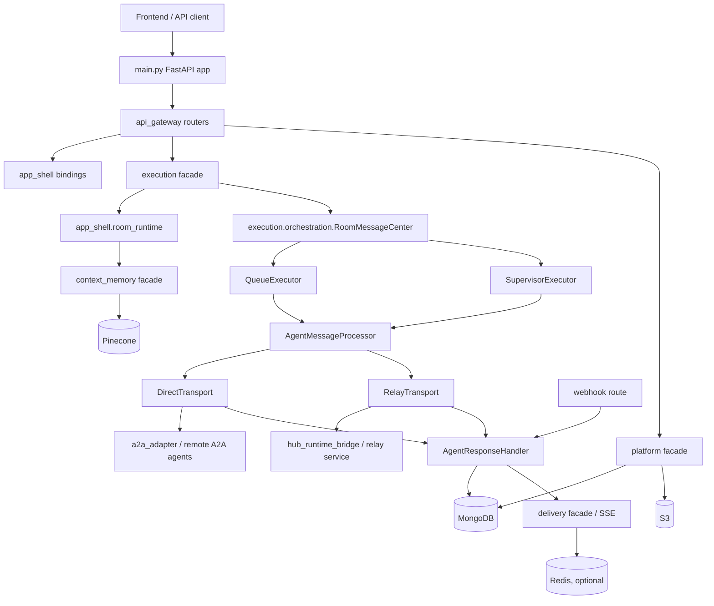

# System Architecture

This document describes the current architecture and core workflows of the
`multi-agents-backend` codebase. It is based on the repository state as of
2026-06-14 and focuses on the code that is currently present, not on older
design documents that may have existed previously.

## High-Level Shape

The backend is a FastAPI monolith that coordinates:

- A web app API for rooms, agents, messages, HITL, files, and SSE.
- A public/API-key gateway for agent discovery and direct agent calls.
- A Hub relay path for locally connected hub agents.
- A2A agent communication, including synchronous, streaming, and webhook-based
  long-running task updates.
- Context memory projection, search, and compaction.
- Cross-instance SSE delivery, cancellation, and background recovery jobs.

The application entry point is `main.py`. Dependency construction is centralized
in `container.py`, while request routers live under `api_gateway/routes`.

At runtime the system follows this broad layering:



## Runtime Entry Point

`main.py` creates the FastAPI app and owns process startup/shutdown through the
lifespan context manager.

Startup has three practical phases:

1. Infrastructure setup:
   - Load settings and auth configuration.
   - Build `MongoDAL`, `VectorDAL`, Redis, object-storage adapters, facades,
     and repositories through `container.py`.
   - Bind route modules and app-shell runtime adapters.

2. Runtime guard and background services:
   - Start Delivery/SSE runtime.
   - Start app-shell Redis runtime services when `REDIS_URL` is configured.
   - Enforce multi-worker safety with `check_multi_worker_safety`.
   - Start background jobs after the guard passes.

3. Serving and normal shutdown:
   - Verify all required bindings in `_assert_startup_bindings_complete`.
   - Serve `/health` and `/api/v1/*`.
   - On shutdown, stop relay, jobs, leader locks, in-flight execution tasks,
     Delivery/SSE connections, Redis, and MongoDB.

The application router is mounted from `api_gateway.router` under the configured
API prefix, defaulting to `/api/v1`.

## Dependency Assembly

`container.py` is the main composition root. It creates strongly typed dependency
groups around protocol interfaces from `common.protocols`:

- `AgentDeps`
- `RoomDeps`
- `ContextMemoryDeps`
- `DeliveryDeps`
- `ExecutionDeps`
- `HubDeps`

The codebase is built around facade/protocol boundaries. Some current entry
points still pass through app-shell adapters, but the preferred direction is:

```text
route -> protocol/facade -> repository/DAL -> external service
```

The current compatibility shape is:

```text
route -> app-shell route owner -> facade -> repository/DAL
```

Examples:

- `app_shell.room_runtime.AppShellRoomCenter` delegates to `app_shell.room_runtime`, which is bound to
  `room.RoomFacade` and an explicit repository-backed app-shell store.
- `app_shell.agent_runtime.AppShellAgentCenter` delegates to `app_shell.agent_service`, which is bound to
  `agent.AgentFacade`.
- `app_shell.relay_service` exposes relay route behavior while delegating
  runtime behavior into `hub_runtime_bridge.HubFacade`.
- `app_shell.a2a_runtime.A2AService` keeps legacy method names while delegating
  task-tracking placeholder creation, tracked-send push configuration, failure
  persistence, terminal response persistence, and HITL reply token/task
  persistence to `execution.task_tracking`; A2A SDK transport/coercion work
  stays in `a2a_adapter`.

## Major Code Areas

### `api_gateway`

`api_gateway/router.py` registers all API route modules; the route modules are
thin FastAPI wrappers that parse requests, run auth checks, and delegate to
bound dependencies.

Important route groups:

- `room_routes.py`: room CRUD, room messages, active runs, `sendMessage`.
- `agent_routes.py`: agent registration, lookup, update, visibility, avatar.
- `agent_group_routes.py`: saved agent groups.
- `sse_routes.py`: room SSE stream, SSE status, message cancellation.
- `hitl_routes.py`: human-in-the-loop request and response APIs.
- `files_routes.py`: file upload for room message attachments.
- `discovery_routes.py`: API-key agent discovery.
- `platform_gateway_routes.py`: API-key gateway send/stream/card endpoints.
- `relay_routes.py`: hub daemon registration, event stream, publish, sync, status.
- `webhook_routes.py`: A2A task webhook callbacks.
- `a2a_task_routes.py`: long-running A2A task inspection.

Most frontend-facing routes use Clerk auth. Discovery, gateway, and relay routes
use API-key auth from `common.api_key_auth`.

### `common`

`common` holds cross-cutting primitives:

- `common.dto`: immutable data transfer objects used across module boundaries.
- `common.protocols`: structural interfaces for facades, repositories, delivery,
  execution, hub, platform, LLM, and DAL dependencies.
- `common.config.settings`: environment-backed settings.
- `common.errors`: typed domain/platform errors.
- `common.utils`: logging, time, A2A helpers, context utilities, and streaming
  helpers.
- `common.observability`: tracing and metrics helpers.

When adding new boundaries, prefer using `common.protocols` instead of importing
concrete runtime singletons.

#### Runtime Configuration

Runtime application code reads environment-backed configuration through
`common/config/settings.py`. Raw `os.getenv()`, `os.environ.get()`, and
`os.environ[...]` reads are reserved for the canonical settings module; the
config unification gate in `tests/test_config_unification_gate.py` scans tracked
production Python files and fails on new raw env reads outside that file.

The gate intentionally excludes `tests/`, `scripts/`, `docs/`, and
`database/migration/`: tests may set env vars to verify settings loading, while
scripts and migration utilities run outside the app runtime. `SERVER_SOFTWARE`
is exposed as the live `Settings.is_gunicorn` property because it is
server-injected runtime metadata, not user application configuration.

### `llm_gateway`

`llm_gateway` owns all LLM provider SDK access and LLM model routing. Provider
adapters under `llm_gateway/providers/` are the only LLM code that imports
OpenAI, Google GenAI, or Bedrock runtime SDKs. The public gateway layer resolves
logical model names through `ModelRegistryImpl`, applies centralized retry and
timeout policy through `LLMGatewayConfig`, and exposes text, structured JSON,
embedding, and streaming operations through protocols in `common.protocols`.
`LLMGatewayConfig.from_settings()` reads typed `LLM_GATEWAY_*` policy fields;
`ModelRegistryImpl` remains responsible for mapping logical routes to concrete
provider model IDs.

Focused workflow services under `llm_gateway/services/` wrap prompt workflows
without importing domain models:

- `SupervisorLLMService`: supervisor JSON/text/stream calls through the
  `supervisor_model` logical route, or Bedrock through the configured Bedrock
  supervisor route.
- `EmbeddingLLMService`: agent and memory embeddings through `embedding_model`.
- `DiscoveryLLMService`: discovery query expansion.
- `SummaryLLMService`: streaming synthesis of multi-agent responses (system prompt includes shared markdown formatting rules from `common/prompts/markdown_response_format.py`).
- `AgentSelectionLLMService`, `MessageParserLLMService`, `RoomMemoryLLMService`,
  and `DebateLLMService`: DTO-backed compatibility workflows for legacy app-shell
  callers while migration continues.

`main.py` constructs one `LLMGatewayImpl` and binds these focused services into
production consumers. Legacy `app_shell.openai_service`,
`app_shell.gemini_service`, and `app_shell.bedrock_service` remain as
side-effect-free compatibility adapters, but they no longer construct provider
SDK clients or read LLM environment variables directly.

### `agent`

`agent.AgentFacade` owns canonical agent registry behavior:

- Resolve and register A2A agent cards.
- Store agent metadata in MongoDB.
- Index agent descriptions in Pinecone.
- Match agents by semantic search and capability scoring.
- Respect visibility rules for public/private agents.
- Merge hub liveness into agent status when hub agents are involved.

Mongo persistence is implemented by `agent.repository.mongo.AgentMongoRepository`.
Route-facing app-shell owners access this through `app_shell.agent_service` and
`app_shell.agent_runtime.AppShellAgentCenter`.

### `room`

`room.RoomFacade` owns canonical room and message persistence behavior:

- Create/update/delete rooms.
- Resolve room membership from explicit agent IDs, saved groups, or all-agent
  seeds.
- Persist user and agent messages.
- Read room history and message threads.
- Verify room ownership and hub publish lineage.

Mongo persistence is implemented by `room.repository.mongo`.

### `execution`

`execution` owns orchestration after a user message has been accepted.

Key components:

- `ExecutionFacade`: external execution API used by routes. It accepts a
  `common.dto.ExecutionRequest`, delegates message creation to RoomCenter, and
  starts orchestration.
- `execution.events.emit_room_processing_status`: compatibility entrypoint for
  room-message processing status. It normalizes legacy string `details` into the
  typed processing-status payload before lifecycle recording and Delivery
  emission.
- `RoomMessageCenter`: orchestrates a single room user message. It handles
  idempotent claims, per-room locks, cancellation tokens, routing between
  queue and supervisor modes, and terminal processing status.
- `execution.orchestration.dispatch_strategy`: owns dispatch strategy selection
  after room agent selection. App-shell keeps a compatibility re-export only
  for legacy imports.
- `execution.ports`: owns the narrow type contracts used inside Execution for
  room runtime, delivery/SSE, rate limit, memory, resolver, health, and
  notification collaborators. Execution modules must not import `app_shell`
  types, including type-only imports. Where execution invokes a collaborator
  method, the port must use named parameters and execution-owned result
  protocols instead of `*args`/`**kwargs` catch-all signatures.
- `QueueExecutor`: sequentially processes pre-created agent messages for
  non-supervisor flows and explicit non-supervisor mention flows.
- `SupervisorExecutor`: adaptive supervisor loop for rooms with
  `extend_info.use_supervisor`.
- `AgentMessageProcessor`: transport router shared by queue and supervisor
  execution. It builds the A2A message, runs dispatch middleware, selects
  `direct` or `relay`, and returns a `ProcessingResult`.
- `DirectTransport`: sends work directly to remote A2A agents.
- `RelayTransport`: sends work through the hub relay path.
- `WebhookTransport`: handles inbound A2A webhook callbacks for long-running
  tasks.
- `AgentResponseHandler`: single place that normalizes agent events, persists
  task/artifact state, handles HITL states, and emits SSE/task updates.
- `TaskStateManager`: owns task state transitions and persistence for agent
  messages.

The main orchestration invariant is that `RoomMessageCenter` serializes
processing per room. It uses a process-local `asyncio.Lock`, and in multi-worker
mode this is supplemented by a Redis distributed lock configured at startup.

### `context_memory`

`context_memory.ContextMemoryFacade` owns room memory projection, assembly,
search, and compaction:

- `project_message_for_event`: updates room memory from persisted message
  history.
- `assemble_context`: builds supervisor or agent context within token budgets.
- `search_memory`: performs memory search using vector and keyword signals.
- `run_compaction`: compacts older turns using pointer-based full-content
  storage.
- `content_repository`: stores full content references for compacted turns.

The facade uses:

- MongoDB for room memory and stored content documents.
- Pinecone for memory search vectors.
- `LLMGatewayImpl` and focused gateway services for embeddings, summary,
  chat-context generation, and turn-note extraction.
- `RoomHistoryReader` from `room.RoomFacade` for source message history.

`main.py` creates the facade before execution orchestration and exposes it
through `ContextMemoryDeps.context_memory_runtime` for supervisor and agent
context assembly. `app_shell.context_assembly_service` and
`app_shell.memory_search_service` remain compatibility shims for tests and
legacy callers; production `RoomServices` and `RoomMessageCenter` use the
injected context-memory protocol instead of importing those app-shell singletons.
Legacy turn-selection and context metric logging helpers live in
`context_memory.legacy_assembly`, leaving the app-shell context assembly shim to
convert result shapes and expose the legacy truncation counter.
`app_shell.compaction_service` and `app_shell.memory_service` are still bound to
the facade during startup while their compatibility surfaces remain in use.

### `delivery`

`delivery.DeliveryFacade` owns SSE delivery and cross-instance event fan-out.
Backend modules emit typed `common.dto.DeliveryEvent` objects; Delivery is the
only layer that translates those DTOs into frontend room SSE frames. The wire
shape is always:

```json
{"type": "event_name", "timestamp": "ISO-8601", "room_id": "room-id", "data": {}}
```

`ProcessingStatusEvent` supports the final status set (`queued`, `processing`,
`awaiting_input`, `completed`, `failed`, `canceled`, `rejected`,
`rate_limited`, `error`) and carries `details` as `dict | null`.
Legacy room-runtime callers may pass string details only through Execution's
room processing-status helper; Delivery receives typed DTO fields.

It is composed from:

- `SSETransportImpl`: local room connection management.
- `EventPublisherImpl`: emits frames/events and handles deduplication.
- `CrossInstanceEventBus`: Redis Pub/Sub based fan-out when Redis is enabled.
- `CancellationWatcher`: tracks cancellation state through Mongo change streams
  and Redis KV when available.
- `TerminalStatusDeduplicator`: prevents duplicate terminal status frames.

`app_shell.delivery_runtime.sse_manager` is the route-facing delivery manager
bound to the Delivery facade during startup. Routes call the manager, while the
runtime implementation lives in `delivery`. Delivery never calls back into
Execution or app-shell business services; lifecycle recording happens before
typed delivery events are emitted.

### `platform_module`

`platform_module.PlatformFacade` groups public platform-facing capabilities:

- `PlatformGateway`: API-key agent discovery, card masking, synchronous calls,
  and streaming calls.
- `PlatformDiscovery`: discovery service abstraction.
- `PlatformFileStorage`: file uploads and presigned URLs.
- `PlatformContentStorage`: binary/full-content storage used by context memory.
- `PlatformObjectStorage`: SDK-free compatibility adapter over
  `ObjectStorageDAL` for uploaded-object reads, writes, presigned URLs, public
  URLs, metadata, and prefix cleanup. Its presigned URL cache is bounded and
  TTL-swept so alternate object-storage DALs do not need to implement their own
  cache to avoid duplicate signing work safely.
- Gateway/discovery/agent rate limiters backed by Mongo collections.

This module is used by:

- `/gateway/*` routes for external agent messaging.
- `/discovery/*` routes for external agent search.
- `/files/upload` for authenticated room file uploads.
- Context memory compaction content storage.

### `hub_runtime_bridge` and Relay

`hub_runtime_bridge.HubFacade` owns hub connection management, relay dispatch,
agent sync, liveness, offline queue behavior, task ownership, and internal hub
response routing. `app_shell.relay_service.RelayService` remains as a
compatibility adapter for legacy route imports and APIKey/request adaptation; it
delegates Hub behavior through facade public methods. Its runtime binding uses
`AppShellRelayHubStore`, `HubMongoRepository`, `AgentRepository`, and an
injected relay offline-failure port instead of the broad legacy Mongo/database
singletons.

Hub relay responsibilities:

- Register hub daemons.
- Maintain hub liveness and heartbeat state.
- Provide an SSE event stream to hub daemons.
- Sync hub-owned agents into the agent registry.
- Dispatch user messages/cancel/reply commands to hub agents.
- Accept published hub agent responses.
- Journal internal responses and replay them if needed.
- Maintain task ownership leases for multi-worker safety.
- Own legacy hub publish authorization and cancellation-reader adapters used by
  relay publish processing; `app_shell.relay_service` wires these adapters into
  `HubFacade` instead of querying room/agent message state directly.
- Own legacy relay lifecycle adapter behavior for hub registration,
  owner/room authorization, heartbeat validation, hub status aggregation, and
  disconnect bookkeeping. The app-shell relay service keeps compatibility
  method names and delegates these operations to HubRuntimeBridge adapters.

When Redis Streams are available, relay events use streams for durable-ish hub
event delivery. Without streams, the facade falls back to in-memory/offline
queues for single-process/degraded operation.

### `a2a_adapter`

`a2a_adapter` isolates A2A protocol details:

- Resolve and validate AgentCards.
- Own all production imports of the upstream A2A SDK.
- Build outbound A2A send, stream, cancellation, HITL, and task-fetch requests.
- Translate internal common models to SDK payloads and normalize SDK responses
  back to SDK-free dictionaries or `common.types` models.
- Own A2A output-mode negotiation and response/task coercion helpers used by
  app-shell compatibility services.
- Normalize task status and artifacts.
- Parse webhook stream response payloads.
- Probe inspection and dry-send flows without leaking SDK clients into app-shell
  services.
- Convert inline binary artifacts to S3-backed references through bound storage.

App-shell services, jobs, execution transports, and room runtime code use
`common.types`, plain DTO dictionaries, and adapter facades instead of importing
`a2a.*` directly. `tests/test_phase9_cleanup_gate.py` enforces that boundary by
failing on direct A2A SDK imports and SDK-shaped adapter helper usage outside
`a2a_adapter/` and tests.

### `dal` and `database`

`dal` owns production database, vector, object-storage, and Redis adapter access.
Business modules use module-scoped repositories built from `MongoDAL`,
`VectorDAL`, and `ObjectStorageDAL`. Adapters:

- `dal.mongo`: generic Mongo collection/DAL adapter.
- `dal.pinecone`: vector adapter.
- `dal.redis`: Redis KV, Pub/Sub, and related support.
- `dal.s3`: object storage adapter and the sole runtime owner of S3-compatible
  SDK calls.
- `dal.index_registry`: startup index registration across modules.

Platform-facing file/content services depend on `ObjectStorageDAL` or the
`PlatformObjectStorage` compatibility adapter instead of importing SDK clients.
Production startup passes `PlatformObjectStorage` directly into runtime
consumers through object-storage-named injection points where they still
require the legacy upload/presign surface. The
`app_shell.s3_service` module remains an SDK-free compatibility shim for tests
and legacy import paths only; it is not imported by `main.py` and must not
become a new dependency target for domain or platform modules.
Startup also configures A2A artifact storage once with the platform object
storage adapter, S3 bucket name, and maximum file size. Direct execution
transports call the shared A2A conversion helper and must not partially rebind
artifact storage at runtime, because doing so would discard bucket and size
settings from startup.

The legacy runtime database files `database/mongodb.py`,
`database/pinecone_db.py`, `database/repository.py`, and
`app_shell/database_service.py` have been removed. Production startup wiring in
`main.py` uses `MongoDAL`, `VectorDAL`, DAL-backed repositories, and narrow
app-shell adapters directly. The remaining `database/` package is limited to
retired migration scripts and is not part of production runtime wiring.

Important Mongo collections include:

- `agents`
- `rooms`
- `room_user_messages`
- `room_agent_messages`
- `room_quotes`
- `room_memories`
- `conversation_content`
- `user_memories`
- `agent_memories`
- `cancelled_messages`
- `runs`
- `file_uploads`
- `api_keys`
- `hubs`
- `runs`
- `run_events`
- `cancelled_messages`
- `agent_requests`
- `discovery_api_requests`
- `gateway_api_requests`
- `agent_capability_issues`

Pinecone is used for agent matching and context memory search. S3 is used for
file uploads and converted binary artifacts.

### `app_shell`

`app_shell` contains route-facing runtime adapters, process-level compatibility
bindings, and fail-fast shims. Business ownership for the P3 focus areas lives
in module facades, services, repositories, adapters, and narrow runtime-store
ports; app-shell modules preserve legacy import and route method names.

Examples:

- `app_shell.room_runtime`: legacy room-center and room-runtime method surface
  over Room, Execution, ContextMemory, Platform, and Delivery ports.
- `app_shell.a2a_runtime`: route/execution compatibility over `a2a_adapter`.
  Runtime settings are injected through `A2ARuntimeConfig`; task tracking and
  call counting are bound as explicit ports rather than read from global
  settings or broad stores during calls.
- `app_shell.agent_service`: route-facing adapter over `AgentFacade`.
- `app_shell.repository_store`: compatibility composite over focused runtime
  store parts in `app_shell.repository_parts`. Startup splits the composite into
  focused agent/room, message, task lifecycle, HITL, and memory ports before
  binding production consumers; only documented compatibility shims still receive
  the composite.
- `app_shell.relay_service`: relay route surface over
  `hub_runtime_bridge`. Hub-owned liveness, stream binding, agent sync,
  legacy push delivery, offline queues, offline failure persistence, heartbeat
  monitoring, command dispatch, ownership, and internal response router setup
  are handled by `HubFacade`; relay runtime settings are injected as
  `HubRuntimeBridgeConfig`, and persistence reaches Mongo through
  repository-backed app-shell adapters.
- `execution.dispatch.task_notifications`: terminal task update notifications.
- `app_shell.hitl_service`: HITL lifecycle and response handling.

A2A-facing API routes bind narrow readers from `common.protocols`:
`A2ATaskStatusReader` for task inspection, `RoomRouteReader` for room ownership
checks, and `SSEStateReader` for SSE status and cancellation lookup. These
replace the older combined room compatibility reader in route modules while
leaving legacy room protocol shims available for non-route migration work.

### `jobs` and App-Shell Infrastructure

Background jobs start only after infrastructure and multi-worker safety checks
pass:

- `stale_task_checker`: recovers stale tasks, orphaned messages, stale HITL,
  and run watchdog events.
- `compaction_sweep`: runs context memory compaction for eligible rooms.
- `orphaned_upload_cleaner`: removes uploaded files that were never attached.
- `app_shell.agent_health_service`: periodic health/liveness support for agents.

App-shell Redis runtime modules contain Redis services, leader election, room
locks, relay streams, and event broker support. Leader election prevents
duplicate job execution in multi-worker deployments.

## Core Workflow: Frontend Room Message

The primary product workflow begins at `POST /api/v1/roomCenter/sendMessage`.

1. The frontend opens `/api/v1/sse/room/{room_id}/stream` to receive live
   room events.

2. The frontend posts a room message to `/roomCenter/sendMessage` with:
   - `room_id`
   - `message`
   - `client_request_id`
   - optional attachments or inline file IDs
   - optional target scope or mentioned agent IDs

3. `api_gateway.routes.room_routes.send_message`:
   - verifies room ownership,
   - extracts attachment references,
   - creates an `ExecutionRequest`,
   - calls `ExecutionFacade.execute`,
   - schedules `ExecutionFacade.start_orchestration` as a FastAPI background
     task if orchestration should start.

4. `ExecutionFacade.execute` delegates to `AppShellRoomCenter.send_message_to_room`,
   which reaches `app_shell.room_runtime.RoomServices.send_message_to_room`.

5. `RoomServices.send_message_to_room`:
   - validates the request and message size,
   - blocks new messages if HITL input is pending,
   - resolves and validates attachments,
   - loads the room and target scope,
   - persists the user message,
   - delegates initial `processing` status to Execution-owned processing-status
     emission,
   - creates a cancellation token,
   - initializes context memory if needed,
   - chooses a dispatch strategy:
     - explicit mentions,
     - room default/saved group,
     - all-agent matching,
     - supervisor if `room.extend_info.use_supervisor` is true,
   - either creates initial agent messages or marks the user message with
     supervisor preparation data.

6. `ExecutionFacade.start_orchestration` builds an `OrchestrationRequest` and
   calls `RoomMessageCenter.process_room_user_message`.

7. `RoomMessageCenter`:
   - claims the user message to prevent duplicate processing,
   - acquires a per-room lock,
   - refreshes the processing claim,
   - loads quoted context when present,
   - creates or reuses a cancellation token,
   - chooses one of two execution paths:
     - Supervisor path for `extend_info.supervisor`.
     - Queue path for pre-created agent messages.

8. Queue path:
   - Fetch agent messages related to the user message.
   - Process them sequentially through `QueueExecutor`.
   - Each item uses `AgentDispatcher` for agent assignment and
     `AgentMessageProcessor` for transport selection and dispatch.
   - On success, emit unified summary and terminal `completed` status.

9. Supervisor path:
   - Build agent registry and room config.
   - Assemble room/conversation context.
   - Run the adaptive `SupervisorExecutor` loop.
   - The supervisor decides when to delegate, ask for clarification, continue,
     synthesize, or finish.
   - Agent messages are created dynamically instead of being pre-generated.
   - Terminal status is emitted after synthesis or final failure/cancellation.

10. Agent responses flow into `AgentResponseHandler`, which:
    - persists artifact updates,
    - updates task state on `room_agent_messages`,
    - handles final responses, errors, cancellations, and HITL states,
    - emits SSE updates through `sse_manager`/Delivery,
    - delegates terminal task notifications through
      `execution.dispatch.task_notifications`.

## Agent Dispatch Workflow

Both queue and supervisor execution use `AgentMessageProcessor`.

1. Load current room memory from the database.
2. Ask `RoomServices.process_agent_message` to build the outbound A2A message.
3. Build a `DispatchContext`.
4. Run pre-dispatch middleware:
   - cloud health checks for direct cloud agents,
   - hub transport selection for hub-backed agents.
5. Select transport:
   - `direct`: call remote A2A agent directly.
   - `relay`: send a command to a connected hub agent.
6. Dispatch the message.
7. Run post-dispatch middleware.
8. Return `ProcessingResult` to the executor.

Direct dispatch can complete synchronously, stream artifacts, or pause for
webhook continuation depending on the agent/task behavior.

## A2A Webhook Workflow

Long-running A2A tasks report back through:

```text
POST /api/v1/webhooks/a2a/{message_id}
```

The route:

1. Extracts the notification token from `X-A2A-Notification-Token` or Bearer
   authorization.
2. Parses the request JSON.
3. Delegates to `WebhookTransport.handle_webhook`.
4. The transport validates the token, parses A2A stream response payloads, and
   sends normalized `AgentEvent` objects into `AgentResponseHandler`.

This keeps all final task state, artifact persistence, and SSE emission logic
in one response handler regardless of whether the response came from direct
transport, relay, or webhook.

Task lifecycle data access for A2A task submission, webhook token validation,
cancellation persistence, HITL lifecycle, task notification persistence, webhook
response handling, and stale-task cleanup is routed through focused runtime-store
ports assembled in `main.py`. `AppShellRepositoryStore` still backs those ports
with module repositories and `MongoDAL` collections, but production bindings use
its scoped `repository_parts` surfaces or focused startup adapters wherever a
narrower port is sufficient. Relay route registration, hub status, and liveness
use explicit repository-backed app-shell adapters. Remaining aggregate-store use
is limited to documented compatibility shims rather than new production
business owners.

**Agent display text:** Terminal `message_text` and artifact text parts are persisted as received from agents. List/section markdown repair runs only in the frontend remark plugin pipeline (`hybro-frontend/src/lib/markdown/conversation-remark-plugins.ts`) at Streamdown render time. Hybro-controlled LLM paths (supervisor synthesis, `SummaryLLMService`) append `HYBRO_MARKDOWN_RESPONSE_FORMAT` so synthesis uses `###` section headers; third-party agent text is still stored as-is. Backend terminal helpers in `common/utils/a2a_helpers.py` (`prepare_terminal_agent_content`, `resolve_terminal_sse_content`, `sync_artifact_dicts_to_canonical_text`) resolve canonical text from artifacts and align artifact payloads without transforming markdown. Terminal resolution is owned by `update_task_state_on_message`; streaming text parts collapse to a single canonical text part while file/data parts are preserved. SSE terminal `content` is authoritative for display text; `parts` carries only non-text payloads.

## Hub Relay Workflow

Hub-connected local agents use API-key authenticated relay endpoints.

1. A hub daemon registers through `/relay/hub/register`.
2. It opens `/relay/hub/{hub_id}/events` as an SSE stream.
3. It periodically calls `/relay/hub/{hub_id}/heartbeat`.
4. It syncs available local agents through `/relay/hub/{hub_id}/agents/sync`.
5. When a room message targets a hub-backed agent, dispatch middleware selects
   `relay` transport.
6. `RelayTransport` sends a `HubDispatchCommand` through `RelayService` and
   `HubFacade`.
7. The hub daemon receives the event, performs local agent work, and publishes
   results to `/relay/hub/{hub_id}/publish`.
8. The publish path validates lineage/cancellation, journals internal response
   events, and routes them into the same `AgentResponseHandler` used by direct
   agents.

This design lets hub agents participate in the normal room execution pipeline
while keeping hub transport details isolated from queue/supervisor orchestration.

## Gateway and Discovery Workflow

The public API-key surface is separate from the frontend room workflow.

Discovery:

```text
POST /api/v1/discovery/agents
POST /api/v1/gateway/agents/discover
```

Messaging:

```text
POST /api/v1/gateway/agents/{agent_id}/message/send
POST /api/v1/gateway/agents/{agent_id}/message/stream
GET  /api/v1/gateway/agents/{agent_id}/card
```

The platform gateway:

1. Authenticates API keys.
2. Applies per-key and global rate limits.
3. Resolves visible/public agents.
4. Masks AgentCard URLs so clients call the gateway, not private backend URLs.
5. Checks per-agent rate limits.
6. Uses `AgentTransport` from `a2a_adapter` to call agents.
7. Returns A2A-shaped responses or SSE stream frames.

## SSE and Cancellation Workflow

Frontend SSE is room-scoped:

```text
GET /api/v1/sse/room/{room_id}/stream
```

Cancellation is message-scoped:

```text
POST /api/v1/sse/message/{message_id}/cancel
```

Cancellation flow:

1. Route verifies the message and room ownership.
2. `ExecutionFacade.cancel` persists cancellation in MongoDB.
3. Delivery/SSE cancellation state is updated and broadcast.
4. Pending HITL requests for the message are cancelled.
5. A terminal typed `ProcessingStatusEvent(status="canceled")` is emitted.
6. Best-effort remote agent task cleanup is attempted.
7. Executors observe cancellation tokens at checkpoints and stop gracefully.

In multi-worker mode, Redis Pub/Sub/KV and Mongo change streams are required so
typed SSE frames and cancellation state cross worker boundaries.

For turn-correlated execution paths, emitters should include `client_request_id`
when available and resolve it from message lineage when the event source does not
provide it directly.

## HITL Workflow

HITL is used when an agent or supervisor needs user input before continuing.

Main responsibilities live in `app_shell.hitl_service` and execution adapters:

- Create HITL requests.
- Broadcast input-required state.
- Block new room messages while a pending request exists.
- Accept user responses through HITL routes.
- Resume paused continuation/orchestration paths.
- Cancel stale or superseded HITL requests.
- Emit HITL request/response frames with `related_message_id` for resume
  correlation when available.

`ExecutionFacade` exposes HITL operations through the `HITLManager` protocol so
routes do not need to know app-shell runtime internals.

HITL storage is exposed through a focused startup adapter over the HITL, message,
and task lifecycle runtime-store parts instead of raw `database_service`, Mongo
access, or the full repository-store aggregate. `HITLService` uses store ports
for request creation, CAS/fenced updates, group routing claims, continuation
persistence, and stale processing iteration.

## Context Memory Workflow

Room memory is updated and used across turns.

1. User and agent messages are persisted in MongoDB.
2. Context memory projection creates or updates room memory documents.
3. Before agent execution, context assembly builds a token-budgeted context
   for the supervisor or the target agent.
4. Memory search can retrieve relevant historical turns with vector and keyword
   scoring.
5. Compaction sweep or direct compaction turns old full-history content into
   compact references while preserving retrievable full content.

The design keeps current task context, recent conversation context, room summary,
memory search results, and quoted reply context separate so each can be bounded
and tested independently.

Memory search is provided by `ContextMemoryFacade` through the injected
context-memory runtime protocol. The app-shell memory-search service is a
compatibility adapter over the same facade, not a production orchestration
dependency. Vector retrieval goes through `VectorDAL`, and keyword
search/hydration goes through the context-memory content repository rather than
private legacy database runtime backends.

## Background Jobs

Background jobs are initialized from `main.py` after Redis/leader election setup.

- `agent_health_service`: health/liveness checks.
- `stale_task_checker`: expires stale task messages, recovers orphaned
  processing, handles stale HITL, and emits watchdog run events.
- `compaction_sweep`: runs context memory compaction for eligible rooms.
- `orphaned_upload_cleaner`: deletes unused uploaded files from object storage.

In multi-worker deployments, leader election is used to avoid duplicate job
execution.

## Deployment Modes

Single-process development:

- `uvicorn main:app`
- Redis is optional.
- SSE/cancellation/relay can operate in local or degraded modes.

Multi-worker production:

- Gunicorn-style multi-worker startup is allowed only when Redis-dependent
  services are connected.
- `check_multi_worker_safety` fails startup if Redis Pub/Sub, Redis KV, relay
  streams, app-shell Redis runtime, or cancellation change streams are missing.

This guard exists because without Redis:

- SSE broadcast is process-local.
- Background jobs would run in every worker.
- Room locks would not coordinate across workers.
- Relay messages could be lost across worker boundaries.

## Error and Recovery Model

The codebase uses several recovery mechanisms:

- User-message processing claims prevent duplicate orchestration.
- Recovery requests can reclaim stale processing messages.
- Per-room locks prevent concurrent room execution.
- Queue cleanup cancels remaining descendants when execution exits early.
- Cancellation state is persisted and broadcast.
- `runs` and `run_events` provide lifecycle tracking and startup healing.
- Hub response journaling and task ownership leases support replay and
  multi-worker safety for relay responses.
- Stale task checker handles expired, orphaned, and stuck task states.

The normal terminal states seen by clients are:

- `completed`
- `failed`
- `canceled`
- `rejected`
- `rate_limited`
- `error`

## Current Architectural Tensions

The current codebase has a mixed architecture:

- Newer modules use explicit facades, protocol interfaces, DTOs, and container
  construction.
- Some app-shell modules still expose singleton-style process runtime objects as
  compatibility shims, but focus-area behavior is bound through fail-fast
  facades, adapters, and narrow ports.
- Legacy database files still exist for the final deletion phase, but
  production startup no longer imports or binds them.
- Room orchestration still has a compatibility store surface, but it is backed
  by module repositories and DAL collections rather than the legacy database
  singleton.
- Some route modules bind dependencies via module-level globals during startup.
- Compatibility layers are intentionally kept so the repo can migrate in phases
  without breaking existing route behavior.

When making new changes, prefer the newer shape:

```text
route -> protocol/facade -> repository/DAL -> external service
```

Avoid adding new direct dependencies on broad app-shell runtime singletons
unless the surrounding module already requires that path.

## API Route Protocol Ownership

API route handlers remain thin adapters: they parse HTTP input, resolve injected
dependencies, call route-facing protocols, and format compatible responses.
Route owner contracts are no longer declared in `app_shell.bound`. Shared,
common-safe contracts live under `common.protocols`, including viewset,
Delivery/SSE, webhook, and JSON-shaped route aliases. Compatibility endpoints
that still expose legacy `models.*` request or response types use module-owned
protocols such as `agent.protocols.AgentCenterCompatibility`,
`agent.protocols.AgentInspection`, `room.protocols.RoomCenterCompatibility`, and
`context_memory.protocols.LegacyChatContextAPI`.

The application shell remains responsible for concrete assembly in `main.py` and
`container.py`; API Gateway route modules should not import app-shell protocol
surfaces or concrete module facades/services directly.

## Testing and Verification

The repository uses `pytest` and `ruff`.

Common commands:

```sh
uv run pytest -q
uv run --with ruff ruff check .
git diff --check
```

Focused tests are organized by module and workflow:

- `tests/test_api_*`: route and API behavior.
- `tests/test_agent_*`: agent registry, matching, facade behavior.
- `tests/test_room_*`: room facade and room membership.
- `tests/test_context_memory_*`: memory projection, assembly, compaction, search.
- `tests/test_delivery_*`: SSE, event bus, cancellation, delivery protocols.
- `tests/test_execution_*` and related orchestration tests: execution flows.
- `tests/test_hub_runtime_bridge_*`: hub relay behavior.
- `tests/test_platform_*`: gateway, files, rate limits, platform protocols.
- `tests/test_service_*`: app-shell runtime compatibility and behavior.

For architecture-sensitive changes, run the closest focused tests first, then
the full suite before merging.
